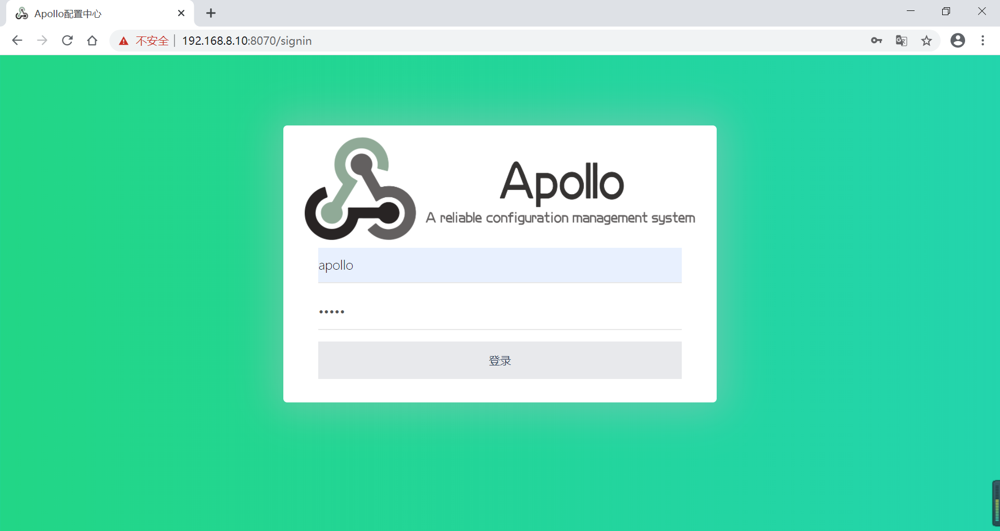
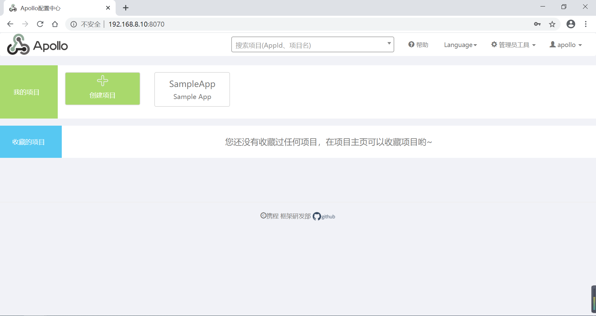
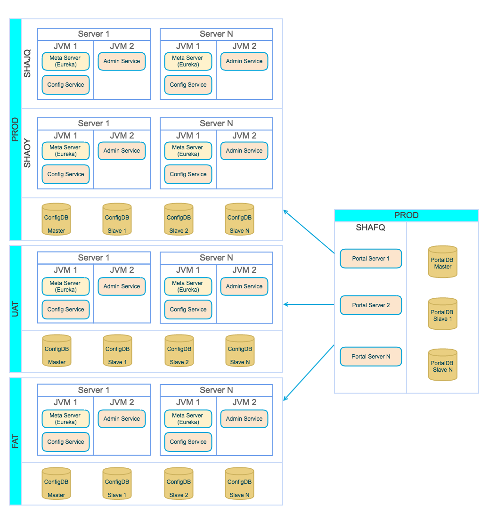
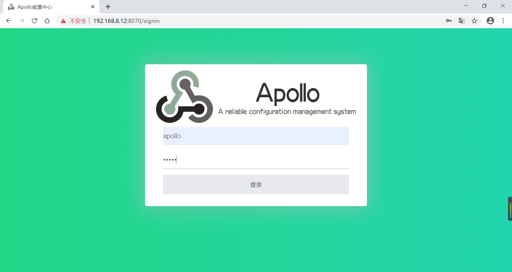
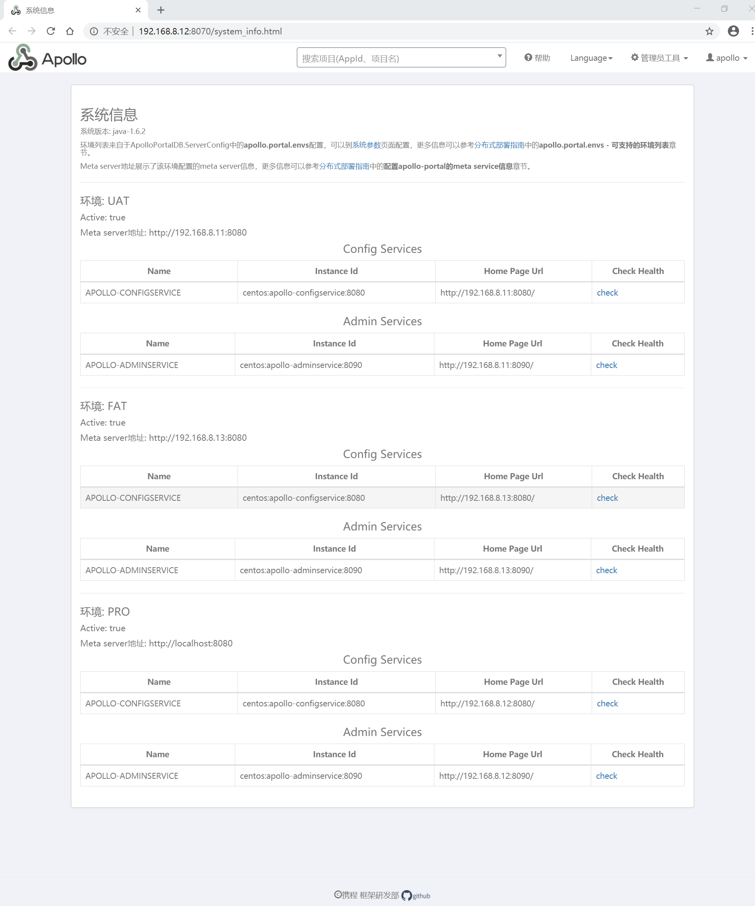

# Apollo 下载与安装

## 前言

版本说明

```properties
apollo=1.6.1
java=1.8.0_251
mysql=8.0.21
```

相关链接：

* Apollo 官方安装教程：https://github.com/ctripcorp/apollo/wiki/Quick-Start
* Apollo 分布式部署官方指南：https://github.com/ctripcorp/apollo/wiki/%E5%88%86%E5%B8%83%E5%BC%8F%E9%83%A8%E7%BD%B2%E6%8C%87%E5%8D%97
* Apollo Github 地址：https://github.com/ctripcorp/apollo
* Apollo 下载地址：https://github.com/ctripcorp/apollo/releases
* Apollo 百度网盘下载地址：https://pan.baidu.com/s/1Ieelw6y3adECgktO0ea0Gg ，提取码: 9wwe

## 前置准备

### 运行环境

* Java 环境：
* MySQL 数据库：

### 创建数据库

Apollo服务端共需要两个数据库：`ApolloPortalDB`和`ApolloConfigDB`

* 创建 `ApolloPortalDB` ，SQL 脚本地址：https://github.com/nobodyiam/apollo-build-scripts/blob/master/sql/apolloportaldb.sql ，脚本内容详细见附录一；
* 创建 `ApolloConfigDB` ， SQL 脚本地址：https://github.com/nobodyiam/apollo-build-scripts/blob/master/sql/apolloconfigdb.sql ，脚本内容详细见附录二；

## 简单部署

### 下载与安装

Apollo 下载地址：https://github.com/ctripcorp/apollo/releases

下载三个文件，解压即安装

* apollo-configservice
* apollo-adminservice
* apollo-portal

### 配置

配置 apollo-configservice 数据库信息并启动

```properties
# 配置信息如下（文件名：application-github.properties）
# DataSource
spring.datasource.url = jdbc:mysql://192.168.8.8:3306/ApolloConfigDB?characterEncoding=utf8&serverTimezone=UTC
spring.datasource.username = root
spring.datasource.password = 123456

# 启动命令如下，进入脚本目录启动
sh scripts/startup.sh
```

配置 apollo-adminservice 数据库信息并启动

```properties
# 配置信息如下（文件名：application-github.properties）
# DataSource
spring.datasource.url = jdbc:mysql://192.168.8.8:3306/ApolloConfigDB?characterEncoding=utf8&serverTimezone=UTC
spring.datasource.username = root
spring.datasource.password = 123456

# 启动命令如下，进入脚本目录启动
sh scripts/startup.sh
```

配置 apollo-portal 环境和数据库信息并启动

```properties
# 配置信息如下（文件名：application-github.properties）
# DataSource
spring.datasource.url = jdbc:mysql://192.168.8.8:3306/ApolloConfigDB?characterEncoding=utf8&serverTimezone=UTC
spring.datasource.username = root
spring.datasource.password = 123456

# 环境信息（文件名：apollo-env.properties）
local.meta=http://localhost:8080
dev.meta=http://localhost:8080
fat.meta=http://localhost:8080
uat.meta=http://localhost:8080
lpt.meta=${lpt_meta}
pro.meta=http://localhost:8080


# 启动命令如下，进入脚本目录启动
sh scripts/startup.sh
```

### 访问测试

默认登录用户/密码：apollo/admin



登录后界面如下：



## 分布式部署

Apollo 分布式部署官方教程：[https://github.com/ctripcorp/apollo/wiki/%E5%88%86%E5%B8%83%E5%BC%8F%E9%83%A8%E7%BD%B2%E6%8C%87%E5%8D%97](https://github.com/ctripcorp/apollo/wiki/分布式部署指南)

### 分布式部署策略



备注：

* DEV：开发环境
* FAT：测试环境，相当于 alpha 环境 (功能测试)
* UAT：集成环境，相当于 beta 环境（回归测试）
* PRO：生产环境

### 数据准备

需要注意的是 `ApolloPortalDB` 只需要在生产环境部署一个即可，而 `ApolloConfigDB` 需要在每个环境部署一套，如 `fat`、`uat` 和 `pro `分别部署 3 套 `ApolloConfigDB` 。

### 调整服务端配置

1. `apollo.portal.envs` ：可支持的环境列表；默认值是 dev，如果 portal 需要管理多个环境的话，以逗号分隔即可（大小写不敏感）例如：`DEV,FAT,UAT,PRO` ；修改 `ApolloPortalDB.ServerConfig` 完需要重启生效。
2. `apollo.portal.meta.servers` ：各环境 Meta Service 列表；Apollo Portal 需要在不同的环境访问不同的 meta service(apollo-configservice) 地址，所以我们需要在配置中提供这些信息。默认情况下，meta service和config service是部署在同一个JVM进程，所以meta service的地址就是config service的地址。
3. `wiki.address` ：portal 上“帮助”链接的地址，默认是 Apollo github 的 wiki 首页，可自行设置。
4. 更多配置查看官方教程

### 下载并安装

Apollo 下载地址：https://github.com/ctripcorp/apollo/releases

下载三个文件，解压即安装

* apollo-configservice
* apollo-adminservice
* apollo-portal

### 配置

* 配置 apollo-configservice 数据库信息并启动

* 配置 apollo-adminservice 数据库信息并启动

* 配置 apollo-portal 环境的 meta service 信息和数据库信息并启动（仅生产环境）

#### FAT 环境

admin

```properties
# DataSource
spring.datasource.url = jdbc:mysql://192.168.8.13:3306/ApolloConfigDB?characterEncoding=utf8
spring.datasource.username = root
spring.datasource.password = 123456
```

config

```properties
# DataSource
spring.datasource.url = jdbc:mysql://192.168.8.13:3306/ApolloConfigDB?characterEncoding=utf8
spring.datasource.username = root
spring.datasource.password = 123456

#apollo.eureka.server.enabled=true
#apollo.eureka.client.enabled=true
```

启动

```shell
# 启动命令如下，进入 configservice 和 adminservice 脚本目录启动
sh scripts/startup.sh
```

#### UAT 环境

admin（application-github.properties）

```properties
# DataSource
spring.datasource.url = jdbc:mysql://192.168.8.11:3306/ApolloConfigDB?characterEncoding=utf8
spring.datasource.username = root
spring.datasource.password = 123456
```

config（application-github.properties）

```properties
# DataSource
spring.datasource.url = jdbc:mysql://192.168.8.11:3306/ApolloConfigDB?characterEncoding=utf8
spring.datasource.username = root
spring.datasource.password = 123456

#apollo.eureka.server.enabled=true
#apollo.eureka.client.enabled=true
```

启动

```shell
# 启动命令如下，进入 configservice 和 adminservice 脚本目录启动
sh scripts/startup.sh
```

#### PRO 环境

admin（application-github.properties）

```properties
# DataSource
spring.datasource.url = jdbc:mysql://192.168.8.12:3306/ApolloConfigDB?characterEncoding=utf8
spring.datasource.username = root
spring.datasource.password = 123456
```

config（application-github.properties）

```properties
# DataSource
spring.datasource.url = jdbc:mysql://192.168.8.12:3306/ApolloConfigDB?characterEncoding=utf8
spring.datasource.username = root
spring.datasource.password = 123456

#apollo.eureka.server.enabled=true
#apollo.eureka.client.enabled=true
```

portal（application-github.properties）

```properties
# DataSource
spring.datasource.url = jdbc:mysql://192.168.8.12:3306/ApolloPortalDB?characterEncoding=utf8
spring.datasource.username = root
spring.datasource.password = 123456
```

portal（apollo-env.properties）

```properties
local.meta=http://localhost:8080
fat.meta=http://192.168.8.13:8080
uat.meta=http://192.168.8.11:8080
pro.meta=http://192.168.8.12:8080
```

启动

```shell
# 启动命令如下，进入 configservice 、 adminservice 和 portal 脚本目录启动
sh scripts/startup.sh
```

### 访问测试

默认登录用户/密码：apollo/admin



分布式部署系统信息



## 附录

### 附录一：ApolloPortalDB

```sql
/*!40101 SET @OLD_CHARACTER_SET_CLIENT=@@CHARACTER_SET_CLIENT */;
/*!40101 SET @OLD_CHARACTER_SET_RESULTS=@@CHARACTER_SET_RESULTS */;
/*!40101 SET @OLD_COLLATION_CONNECTION=@@COLLATION_CONNECTION */;
/*!40101 SET NAMES utf8 */;
/*!40014 SET @OLD_FOREIGN_KEY_CHECKS=@@FOREIGN_KEY_CHECKS, FOREIGN_KEY_CHECKS=0 */;
/*!40101 SET @OLD_SQL_MODE=@@SQL_MODE, SQL_MODE='NO_AUTO_VALUE_ON_ZERO' */;
/*!40111 SET @OLD_SQL_NOTES=@@SQL_NOTES, SQL_NOTES=0 */;

# Create Database
# ------------------------------------------------------------
CREATE DATABASE IF NOT EXISTS ApolloPortalDB DEFAULT CHARACTER SET = utf8mb4;

Use ApolloPortalDB;

# Dump of table app
# ------------------------------------------------------------

DROP TABLE IF EXISTS `App`;

CREATE TABLE `App` (
  `Id` int(10) unsigned NOT NULL AUTO_INCREMENT COMMENT '主键',
  `AppId` varchar(500) NOT NULL DEFAULT 'default' COMMENT 'AppID',
  `Name` varchar(500) NOT NULL DEFAULT 'default' COMMENT '应用名',
  `OrgId` varchar(32) NOT NULL DEFAULT 'default' COMMENT '部门Id',
  `OrgName` varchar(64) NOT NULL DEFAULT 'default' COMMENT '部门名字',
  `OwnerName` varchar(500) NOT NULL DEFAULT 'default' COMMENT 'ownerName',
  `OwnerEmail` varchar(500) NOT NULL DEFAULT 'default' COMMENT 'ownerEmail',
  `IsDeleted` bit(1) NOT NULL DEFAULT b'0' COMMENT '1: deleted, 0: normal',
  `DataChange_CreatedBy` varchar(32) NOT NULL DEFAULT 'default' COMMENT '创建人邮箱前缀',
  `DataChange_CreatedTime` timestamp NOT NULL DEFAULT CURRENT_TIMESTAMP COMMENT '创建时间',
  `DataChange_LastModifiedBy` varchar(32) DEFAULT '' COMMENT '最后修改人邮箱前缀',
  `DataChange_LastTime` timestamp NULL DEFAULT CURRENT_TIMESTAMP ON UPDATE CURRENT_TIMESTAMP COMMENT '最后修改时间',
  PRIMARY KEY (`Id`),
  KEY `AppId` (`AppId`(191)),
  KEY `DataChange_LastTime` (`DataChange_LastTime`),
  KEY `IX_Name` (`Name`(191))
) ENGINE=InnoDB DEFAULT CHARSET=utf8mb4 COMMENT='应用表';


# Dump of table appnamespace
# ------------------------------------------------------------

DROP TABLE IF EXISTS `AppNamespace`;

CREATE TABLE `AppNamespace` (
  `Id` int(10) unsigned NOT NULL AUTO_INCREMENT COMMENT '自增主键',
  `Name` varchar(32) NOT NULL DEFAULT '' COMMENT 'namespace名字，注意，需要全局唯一',
  `AppId` varchar(32) NOT NULL DEFAULT '' COMMENT 'app id',
  `Format` varchar(32) NOT NULL DEFAULT 'properties' COMMENT 'namespace的format类型',
  `IsPublic` bit(1) NOT NULL DEFAULT b'0' COMMENT 'namespace是否为公共',
  `Comment` varchar(64) NOT NULL DEFAULT '' COMMENT '注释',
  `IsDeleted` bit(1) NOT NULL DEFAULT b'0' COMMENT '1: deleted, 0: normal',
  `DataChange_CreatedBy` varchar(32) NOT NULL DEFAULT '' COMMENT '创建人邮箱前缀',
  `DataChange_CreatedTime` timestamp NOT NULL DEFAULT CURRENT_TIMESTAMP COMMENT '创建时间',
  `DataChange_LastModifiedBy` varchar(32) DEFAULT '' COMMENT '最后修改人邮箱前缀',
  `DataChange_LastTime` timestamp NULL DEFAULT CURRENT_TIMESTAMP ON UPDATE CURRENT_TIMESTAMP COMMENT '最后修改时间',
  PRIMARY KEY (`Id`),
  KEY `IX_AppId` (`AppId`),
  KEY `Name_AppId` (`Name`,`AppId`),
  KEY `DataChange_LastTime` (`DataChange_LastTime`)
) ENGINE=InnoDB DEFAULT CHARSET=utf8mb4 COMMENT='应用namespace定义';


# Dump of table consumer
# ------------------------------------------------------------

DROP TABLE IF EXISTS `Consumer`;

CREATE TABLE `Consumer` (
  `Id` int(11) unsigned NOT NULL AUTO_INCREMENT COMMENT '自增Id',
  `AppId` varchar(500) NOT NULL DEFAULT 'default' COMMENT 'AppID',
  `Name` varchar(500) NOT NULL DEFAULT 'default' COMMENT '应用名',
  `OrgId` varchar(32) NOT NULL DEFAULT 'default' COMMENT '部门Id',
  `OrgName` varchar(64) NOT NULL DEFAULT 'default' COMMENT '部门名字',
  `OwnerName` varchar(500) NOT NULL DEFAULT 'default' COMMENT 'ownerName',
  `OwnerEmail` varchar(500) NOT NULL DEFAULT 'default' COMMENT 'ownerEmail',
  `IsDeleted` bit(1) NOT NULL DEFAULT b'0' COMMENT '1: deleted, 0: normal',
  `DataChange_CreatedBy` varchar(32) NOT NULL DEFAULT 'default' COMMENT '创建人邮箱前缀',
  `DataChange_CreatedTime` timestamp NOT NULL DEFAULT CURRENT_TIMESTAMP COMMENT '创建时间',
  `DataChange_LastModifiedBy` varchar(32) DEFAULT '' COMMENT '最后修改人邮箱前缀',
  `DataChange_LastTime` timestamp NULL DEFAULT CURRENT_TIMESTAMP ON UPDATE CURRENT_TIMESTAMP COMMENT '最后修改时间',
  PRIMARY KEY (`Id`),
  KEY `AppId` (`AppId`(191)),
  KEY `DataChange_LastTime` (`DataChange_LastTime`)
) ENGINE=InnoDB DEFAULT CHARSET=utf8mb4 COMMENT='开放API消费者';


# Dump of table consumeraudit
# ------------------------------------------------------------

DROP TABLE IF EXISTS `ConsumerAudit`;

CREATE TABLE `ConsumerAudit` (
  `Id` int(11) unsigned NOT NULL AUTO_INCREMENT COMMENT '自增Id',
  `ConsumerId` int(11) unsigned DEFAULT NULL COMMENT 'Consumer Id',
  `Uri` varchar(1024) NOT NULL DEFAULT '' COMMENT '访问的Uri',
  `Method` varchar(16) NOT NULL DEFAULT '' COMMENT '访问的Method',
  `DataChange_CreatedTime` timestamp NOT NULL DEFAULT CURRENT_TIMESTAMP COMMENT '创建时间',
  `DataChange_LastTime` timestamp NULL DEFAULT CURRENT_TIMESTAMP ON UPDATE CURRENT_TIMESTAMP COMMENT '最后修改时间',
  PRIMARY KEY (`Id`),
  KEY `IX_DataChange_LastTime` (`DataChange_LastTime`),
  KEY `IX_ConsumerId` (`ConsumerId`)
) ENGINE=InnoDB DEFAULT CHARSET=utf8mb4 COMMENT='consumer审计表';


# Dump of table consumerrole
# ------------------------------------------------------------

DROP TABLE IF EXISTS `ConsumerRole`;

CREATE TABLE `ConsumerRole` (
  `Id` int(11) unsigned NOT NULL AUTO_INCREMENT COMMENT '自增Id',
  `ConsumerId` int(11) unsigned DEFAULT NULL COMMENT 'Consumer Id',
  `RoleId` int(10) unsigned DEFAULT NULL COMMENT 'Role Id',
  `IsDeleted` bit(1) NOT NULL DEFAULT b'0' COMMENT '1: deleted, 0: normal',
  `DataChange_CreatedBy` varchar(32) DEFAULT '' COMMENT '创建人邮箱前缀',
  `DataChange_CreatedTime` timestamp NOT NULL DEFAULT CURRENT_TIMESTAMP COMMENT '创建时间',
  `DataChange_LastModifiedBy` varchar(32) DEFAULT '' COMMENT '最后修改人邮箱前缀',
  `DataChange_LastTime` timestamp NULL DEFAULT CURRENT_TIMESTAMP ON UPDATE CURRENT_TIMESTAMP COMMENT '最后修改时间',
  PRIMARY KEY (`Id`),
  KEY `IX_DataChange_LastTime` (`DataChange_LastTime`),
  KEY `IX_RoleId` (`RoleId`),
  KEY `IX_ConsumerId_RoleId` (`ConsumerId`,`RoleId`)
) ENGINE=InnoDB DEFAULT CHARSET=utf8mb4 COMMENT='consumer和role的绑定表';


# Dump of table consumertoken
# ------------------------------------------------------------

DROP TABLE IF EXISTS `ConsumerToken`;

CREATE TABLE `ConsumerToken` (
  `Id` int(11) unsigned NOT NULL AUTO_INCREMENT COMMENT '自增Id',
  `ConsumerId` int(11) unsigned DEFAULT NULL COMMENT 'ConsumerId',
  `Token` varchar(128) NOT NULL DEFAULT '' COMMENT 'token',
  `Expires` datetime NOT NULL DEFAULT '2099-01-01 00:00:00' COMMENT 'token失效时间',
  `IsDeleted` bit(1) NOT NULL DEFAULT b'0' COMMENT '1: deleted, 0: normal',
  `DataChange_CreatedBy` varchar(32) NOT NULL DEFAULT 'default' COMMENT '创建人邮箱前缀',
  `DataChange_CreatedTime` timestamp NOT NULL DEFAULT CURRENT_TIMESTAMP COMMENT '创建时间',
  `DataChange_LastModifiedBy` varchar(32) DEFAULT '' COMMENT '最后修改人邮箱前缀',
  `DataChange_LastTime` timestamp NULL DEFAULT CURRENT_TIMESTAMP ON UPDATE CURRENT_TIMESTAMP COMMENT '最后修改时间',
  PRIMARY KEY (`Id`),
  UNIQUE KEY `IX_Token` (`Token`),
  KEY `DataChange_LastTime` (`DataChange_LastTime`)
) ENGINE=InnoDB DEFAULT CHARSET=utf8mb4 COMMENT='consumer token表';

# Dump of table favorite
# ------------------------------------------------------------

DROP TABLE IF EXISTS `Favorite`;

CREATE TABLE `Favorite` (
  `Id` int(10) unsigned NOT NULL AUTO_INCREMENT COMMENT '主键',
  `UserId` varchar(32) NOT NULL DEFAULT 'default' COMMENT '收藏的用户',
  `AppId` varchar(500) NOT NULL DEFAULT 'default' COMMENT 'AppID',
  `Position` int(32) NOT NULL DEFAULT '10000' COMMENT '收藏顺序',
  `IsDeleted` bit(1) NOT NULL DEFAULT b'0' COMMENT '1: deleted, 0: normal',
  `DataChange_CreatedBy` varchar(32) NOT NULL DEFAULT 'default' COMMENT '创建人邮箱前缀',
  `DataChange_CreatedTime` timestamp NOT NULL DEFAULT CURRENT_TIMESTAMP COMMENT '创建时间',
  `DataChange_LastModifiedBy` varchar(32) DEFAULT '' COMMENT '最后修改人邮箱前缀',
  `DataChange_LastTime` timestamp NULL DEFAULT CURRENT_TIMESTAMP ON UPDATE CURRENT_TIMESTAMP COMMENT '最后修改时间',
  PRIMARY KEY (`Id`),
  KEY `AppId` (`AppId`(191)),
  KEY `IX_UserId` (`UserId`),
  KEY `DataChange_LastTime` (`DataChange_LastTime`)
) ENGINE=InnoDB AUTO_INCREMENT=23 DEFAULT CHARSET=utf8mb4 COMMENT='应用收藏表';

# Dump of table permission
# ------------------------------------------------------------

DROP TABLE IF EXISTS `Permission`;

CREATE TABLE `Permission` (
  `Id` int(11) unsigned NOT NULL AUTO_INCREMENT COMMENT '自增Id',
  `PermissionType` varchar(32) NOT NULL DEFAULT '' COMMENT '权限类型',
  `TargetId` varchar(256) NOT NULL DEFAULT '' COMMENT '权限对象类型',
  `IsDeleted` bit(1) NOT NULL DEFAULT b'0' COMMENT '1: deleted, 0: normal',
  `DataChange_CreatedBy` varchar(32) NOT NULL DEFAULT '' COMMENT '创建人邮箱前缀',
  `DataChange_CreatedTime` timestamp NOT NULL DEFAULT CURRENT_TIMESTAMP COMMENT '创建时间',
  `DataChange_LastModifiedBy` varchar(32) DEFAULT '' COMMENT '最后修改人邮箱前缀',
  `DataChange_LastTime` timestamp NULL DEFAULT CURRENT_TIMESTAMP ON UPDATE CURRENT_TIMESTAMP COMMENT '最后修改时间',
  PRIMARY KEY (`Id`),
  KEY `IX_TargetId_PermissionType` (`TargetId`(191),`PermissionType`),
  KEY `IX_DataChange_LastTime` (`DataChange_LastTime`)
) ENGINE=InnoDB DEFAULT CHARSET=utf8mb4 COMMENT='permission表';


# Dump of table role
# ------------------------------------------------------------

DROP TABLE IF EXISTS `Role`;

CREATE TABLE `Role` (
  `Id` int(11) unsigned NOT NULL AUTO_INCREMENT COMMENT '自增Id',
  `RoleName` varchar(256) NOT NULL DEFAULT '' COMMENT 'Role name',
  `IsDeleted` bit(1) NOT NULL DEFAULT b'0' COMMENT '1: deleted, 0: normal',
  `DataChange_CreatedBy` varchar(32) NOT NULL DEFAULT 'default' COMMENT '创建人邮箱前缀',
  `DataChange_CreatedTime` timestamp NOT NULL DEFAULT CURRENT_TIMESTAMP COMMENT '创建时间',
  `DataChange_LastModifiedBy` varchar(32) DEFAULT '' COMMENT '最后修改人邮箱前缀',
  `DataChange_LastTime` timestamp NULL DEFAULT CURRENT_TIMESTAMP ON UPDATE CURRENT_TIMESTAMP COMMENT '最后修改时间',
  PRIMARY KEY (`Id`),
  KEY `IX_RoleName` (`RoleName`(191)),
  KEY `IX_DataChange_LastTime` (`DataChange_LastTime`)
) ENGINE=InnoDB DEFAULT CHARSET=utf8mb4 COMMENT='角色表';


# Dump of table rolepermission
# ------------------------------------------------------------

DROP TABLE IF EXISTS `RolePermission`;

CREATE TABLE `RolePermission` (
  `Id` int(11) unsigned NOT NULL AUTO_INCREMENT COMMENT '自增Id',
  `RoleId` int(10) unsigned DEFAULT NULL COMMENT 'Role Id',
  `PermissionId` int(10) unsigned DEFAULT NULL COMMENT 'Permission Id',
  `IsDeleted` bit(1) NOT NULL DEFAULT b'0' COMMENT '1: deleted, 0: normal',
  `DataChange_CreatedBy` varchar(32) DEFAULT '' COMMENT '创建人邮箱前缀',
  `DataChange_CreatedTime` timestamp NOT NULL DEFAULT CURRENT_TIMESTAMP COMMENT '创建时间',
  `DataChange_LastModifiedBy` varchar(32) DEFAULT '' COMMENT '最后修改人邮箱前缀',
  `DataChange_LastTime` timestamp NULL DEFAULT CURRENT_TIMESTAMP ON UPDATE CURRENT_TIMESTAMP COMMENT '最后修改时间',
  PRIMARY KEY (`Id`),
  KEY `IX_DataChange_LastTime` (`DataChange_LastTime`),
  KEY `IX_RoleId` (`RoleId`),
  KEY `IX_PermissionId` (`PermissionId`)
) ENGINE=InnoDB DEFAULT CHARSET=utf8mb4 COMMENT='角色和权限的绑定表';


# Dump of table serverconfig
# ------------------------------------------------------------

DROP TABLE IF EXISTS `ServerConfig`;

CREATE TABLE `ServerConfig` (
  `Id` int(10) unsigned NOT NULL AUTO_INCREMENT COMMENT '自增Id',
  `Key` varchar(64) NOT NULL DEFAULT 'default' COMMENT '配置项Key',
  `Value` varchar(2048) NOT NULL DEFAULT 'default' COMMENT '配置项值',
  `Comment` varchar(1024) DEFAULT '' COMMENT '注释',
  `IsDeleted` bit(1) NOT NULL DEFAULT b'0' COMMENT '1: deleted, 0: normal',
  `DataChange_CreatedBy` varchar(32) NOT NULL DEFAULT 'default' COMMENT '创建人邮箱前缀',
  `DataChange_CreatedTime` timestamp NOT NULL DEFAULT CURRENT_TIMESTAMP COMMENT '创建时间',
  `DataChange_LastModifiedBy` varchar(32) DEFAULT '' COMMENT '最后修改人邮箱前缀',
  `DataChange_LastTime` timestamp NULL DEFAULT CURRENT_TIMESTAMP ON UPDATE CURRENT_TIMESTAMP COMMENT '最后修改时间',
  PRIMARY KEY (`Id`),
  KEY `IX_Key` (`Key`),
  KEY `DataChange_LastTime` (`DataChange_LastTime`)
) ENGINE=InnoDB DEFAULT CHARSET=utf8mb4 COMMENT='配置服务自身配置';


# Dump of table userrole
# ------------------------------------------------------------

DROP TABLE IF EXISTS `UserRole`;

CREATE TABLE `UserRole` (
  `Id` int(11) unsigned NOT NULL AUTO_INCREMENT COMMENT '自增Id',
  `UserId` varchar(128) DEFAULT '' COMMENT '用户身份标识',
  `RoleId` int(10) unsigned DEFAULT NULL COMMENT 'Role Id',
  `IsDeleted` bit(1) NOT NULL DEFAULT b'0' COMMENT '1: deleted, 0: normal',
  `DataChange_CreatedBy` varchar(32) DEFAULT '' COMMENT '创建人邮箱前缀',
  `DataChange_CreatedTime` timestamp NOT NULL DEFAULT CURRENT_TIMESTAMP COMMENT '创建时间',
  `DataChange_LastModifiedBy` varchar(32) DEFAULT '' COMMENT '最后修改人邮箱前缀',
  `DataChange_LastTime` timestamp NULL DEFAULT CURRENT_TIMESTAMP ON UPDATE CURRENT_TIMESTAMP COMMENT '最后修改时间',
  PRIMARY KEY (`Id`),
  KEY `IX_DataChange_LastTime` (`DataChange_LastTime`),
  KEY `IX_RoleId` (`RoleId`),
  KEY `IX_UserId_RoleId` (`UserId`,`RoleId`)
) ENGINE=InnoDB DEFAULT CHARSET=utf8mb4 COMMENT='用户和role的绑定表';

# Dump of table Users
# ------------------------------------------------------------

DROP TABLE IF EXISTS `Users`;

CREATE TABLE `Users` (
  `Id` int(10) unsigned NOT NULL AUTO_INCREMENT COMMENT '自增Id',
  `Username` varchar(64) NOT NULL DEFAULT 'default' COMMENT '用户名',
  `Password` varchar(64) NOT NULL DEFAULT 'default' COMMENT '密码',
  `Email` varchar(64) NOT NULL DEFAULT 'default' COMMENT '邮箱地址',
  `Enabled` tinyint(4) DEFAULT NULL COMMENT '是否有效',
  PRIMARY KEY (`Id`)
) ENGINE=InnoDB DEFAULT CHARSET=utf8mb4 COMMENT='用户表';


# Dump of table Authorities
# ------------------------------------------------------------

DROP TABLE IF EXISTS `Authorities`;

CREATE TABLE `Authorities` (
  `Id` int(11) unsigned NOT NULL AUTO_INCREMENT COMMENT '自增Id',
  `Username` varchar(64) NOT NULL,
  `Authority` varchar(50) NOT NULL,
  PRIMARY KEY (`Id`)
) ENGINE=InnoDB DEFAULT CHARSET=utf8mb4;


# Config
# ------------------------------------------------------------
INSERT INTO `ServerConfig` (`Key`, `Value`, `Comment`)
VALUES
    ('apollo.portal.envs', 'dev', '可支持的环境列表'),
    ('organizations', '[{\"orgId\":\"TEST1\",\"orgName\":\"样例部门1\"},{\"orgId\":\"TEST2\",\"orgName\":\"样例部门2\"}]', '部门列表'),
    ('superAdmin', 'apollo', 'Portal超级管理员'),
    ('api.readTimeout', '10000', 'http接口read timeout'),
    ('consumer.token.salt', 'someSalt', 'consumer token salt'),
    ('admin.createPrivateNamespace.switch', 'true', '是否允许项目管理员创建私有namespace'),
    ('configView.memberOnly.envs', 'dev', '只对项目成员显示配置信息的环境列表，多个env以英文逗号分隔');

INSERT INTO `Users` (`Username`, `Password`, `Email`, `Enabled`)
VALUES
	('apollo', '$2a$10$7r20uS.BQ9uBpf3Baj3uQOZvMVvB1RN3PYoKE94gtz2.WAOuiiwXS', 'apollo@acme.com', 1);

INSERT INTO `Authorities` (`Username`, `Authority`) VALUES ('apollo', 'ROLE_user');

# Sample Data
# ------------------------------------------------------------
INSERT INTO `App` (`AppId`, `Name`, `OrgId`, `OrgName`, `OwnerName`, `OwnerEmail`)
VALUES
	('SampleApp', 'Sample App', 'TEST1', '样例部门1', 'apollo', 'apollo@acme.com');

INSERT INTO `AppNamespace` (`Name`, `AppId`, `Format`, `IsPublic`, `Comment`)
VALUES
	('application', 'SampleApp', 'properties', 0, 'default app namespace');

INSERT INTO `Permission` (`Id`, `PermissionType`, `TargetId`)
VALUES
	(1, 'CreateCluster', 'SampleApp'),
	(2, 'CreateNamespace', 'SampleApp'),
	(3, 'AssignRole', 'SampleApp'),
	(4, 'ModifyNamespace', 'SampleApp+application'),
	(5, 'ReleaseNamespace', 'SampleApp+application');

INSERT INTO `Role` (`Id`, `RoleName`)
VALUES
	(1, 'Master+SampleApp'),
	(2, 'ModifyNamespace+SampleApp+application'),
	(3, 'ReleaseNamespace+SampleApp+application');

INSERT INTO `RolePermission` (`RoleId`, `PermissionId`)
VALUES
	(1, 1),
	(1, 2),
	(1, 3),
	(2, 4),
	(3, 5);

INSERT INTO `UserRole` (`UserId`, `RoleId`)
VALUES
	('apollo', 1),
	('apollo', 2),
	('apollo', 3);

/*!40111 SET SQL_NOTES=@OLD_SQL_NOTES */;
/*!40101 SET SQL_MODE=@OLD_SQL_MODE */;
/*!40014 SET FOREIGN_KEY_CHECKS=@OLD_FOREIGN_KEY_CHECKS */;
/*!40101 SET CHARACTER_SET_CLIENT=@OLD_CHARACTER_SET_CLIENT */;
/*!40101 SET CHARACTER_SET_RESULTS=@OLD_CHARACTER_SET_RESULTS */;
/*!40101 SET COLLATION_CONNECTION=@OLD_COLLATION_CONNECTION */;
```

### 附录二：ApolloConfigDB

```sql
/*!40101 SET @OLD_CHARACTER_SET_CLIENT=@@CHARACTER_SET_CLIENT */;
/*!40101 SET @OLD_CHARACTER_SET_RESULTS=@@CHARACTER_SET_RESULTS */;
/*!40101 SET @OLD_COLLATION_CONNECTION=@@COLLATION_CONNECTION */;
/*!40101 SET NAMES utf8 */;
/*!40014 SET @OLD_FOREIGN_KEY_CHECKS=@@FOREIGN_KEY_CHECKS, FOREIGN_KEY_CHECKS=0 */;
/*!40101 SET @OLD_SQL_MODE=@@SQL_MODE, SQL_MODE='NO_AUTO_VALUE_ON_ZERO' */;
/*!40111 SET @OLD_SQL_NOTES=@@SQL_NOTES, SQL_NOTES=0 */;

# Create Database
# ------------------------------------------------------------
CREATE DATABASE IF NOT EXISTS ApolloConfigDB DEFAULT CHARACTER SET = utf8mb4;

Use ApolloConfigDB;

# Dump of table app
# ------------------------------------------------------------

DROP TABLE IF EXISTS `App`;

CREATE TABLE `App` (
  `Id` int(10) unsigned NOT NULL AUTO_INCREMENT COMMENT '主键',
  `AppId` varchar(500) NOT NULL DEFAULT 'default' COMMENT 'AppID',
  `Name` varchar(500) NOT NULL DEFAULT 'default' COMMENT '应用名',
  `OrgId` varchar(32) NOT NULL DEFAULT 'default' COMMENT '部门Id',
  `OrgName` varchar(64) NOT NULL DEFAULT 'default' COMMENT '部门名字',
  `OwnerName` varchar(500) NOT NULL DEFAULT 'default' COMMENT 'ownerName',
  `OwnerEmail` varchar(500) NOT NULL DEFAULT 'default' COMMENT 'ownerEmail',
  `IsDeleted` bit(1) NOT NULL DEFAULT b'0' COMMENT '1: deleted, 0: normal',
  `DataChange_CreatedBy` varchar(32) NOT NULL DEFAULT 'default' COMMENT '创建人邮箱前缀',
  `DataChange_CreatedTime` timestamp NOT NULL DEFAULT CURRENT_TIMESTAMP COMMENT '创建时间',
  `DataChange_LastModifiedBy` varchar(32) DEFAULT '' COMMENT '最后修改人邮箱前缀',
  `DataChange_LastTime` timestamp NULL DEFAULT CURRENT_TIMESTAMP ON UPDATE CURRENT_TIMESTAMP COMMENT '最后修改时间',
  PRIMARY KEY (`Id`),
  KEY `AppId` (`AppId`(191)),
  KEY `DataChange_LastTime` (`DataChange_LastTime`),
  KEY `IX_Name` (`Name`(191))
) ENGINE=InnoDB DEFAULT CHARSET=utf8mb4 COMMENT='应用表';


# Dump of table appnamespace
# ------------------------------------------------------------

DROP TABLE IF EXISTS `AppNamespace`;

CREATE TABLE `AppNamespace` (
  `Id` int(10) unsigned NOT NULL AUTO_INCREMENT COMMENT '自增主键',
  `Name` varchar(32) NOT NULL DEFAULT '' COMMENT 'namespace名字，注意，需要全局唯一',
  `AppId` varchar(32) NOT NULL DEFAULT '' COMMENT 'app id',
  `Format` varchar(32) NOT NULL DEFAULT 'properties' COMMENT 'namespace的format类型',
  `IsPublic` bit(1) NOT NULL DEFAULT b'0' COMMENT 'namespace是否为公共',
  `Comment` varchar(64) NOT NULL DEFAULT '' COMMENT '注释',
  `IsDeleted` bit(1) NOT NULL DEFAULT b'0' COMMENT '1: deleted, 0: normal',
  `DataChange_CreatedBy` varchar(32) NOT NULL DEFAULT '' COMMENT '创建人邮箱前缀',
  `DataChange_CreatedTime` timestamp NOT NULL DEFAULT CURRENT_TIMESTAMP COMMENT '创建时间',
  `DataChange_LastModifiedBy` varchar(32) DEFAULT '' COMMENT '最后修改人邮箱前缀',
  `DataChange_LastTime` timestamp NULL DEFAULT CURRENT_TIMESTAMP ON UPDATE CURRENT_TIMESTAMP COMMENT '最后修改时间',
  PRIMARY KEY (`Id`),
  KEY `IX_AppId` (`AppId`),
  KEY `Name_AppId` (`Name`,`AppId`),
  KEY `DataChange_LastTime` (`DataChange_LastTime`)
) ENGINE=InnoDB DEFAULT CHARSET=utf8mb4 COMMENT='应用namespace定义';


# Dump of table audit
# ------------------------------------------------------------

DROP TABLE IF EXISTS `Audit`;

CREATE TABLE `Audit` (
  `Id` int(10) unsigned NOT NULL AUTO_INCREMENT COMMENT '主键',
  `EntityName` varchar(50) NOT NULL DEFAULT 'default' COMMENT '表名',
  `EntityId` int(10) unsigned DEFAULT NULL COMMENT '记录ID',
  `OpName` varchar(50) NOT NULL DEFAULT 'default' COMMENT '操作类型',
  `Comment` varchar(500) DEFAULT NULL COMMENT '备注',
  `IsDeleted` bit(1) NOT NULL DEFAULT b'0' COMMENT '1: deleted, 0: normal',
  `DataChange_CreatedBy` varchar(32) NOT NULL DEFAULT 'default' COMMENT '创建人邮箱前缀',
  `DataChange_CreatedTime` timestamp NOT NULL DEFAULT CURRENT_TIMESTAMP COMMENT '创建时间',
  `DataChange_LastModifiedBy` varchar(32) DEFAULT '' COMMENT '最后修改人邮箱前缀',
  `DataChange_LastTime` timestamp NULL DEFAULT CURRENT_TIMESTAMP ON UPDATE CURRENT_TIMESTAMP COMMENT '最后修改时间',
  PRIMARY KEY (`Id`),
  KEY `DataChange_LastTime` (`DataChange_LastTime`)
) ENGINE=InnoDB DEFAULT CHARSET=utf8mb4 COMMENT='日志审计表';


# Dump of table cluster
# ------------------------------------------------------------

DROP TABLE IF EXISTS `Cluster`;

CREATE TABLE `Cluster` (
  `Id` int(10) unsigned NOT NULL AUTO_INCREMENT COMMENT '自增主键',
  `Name` varchar(32) NOT NULL DEFAULT '' COMMENT '集群名字',
  `AppId` varchar(32) NOT NULL DEFAULT '' COMMENT 'App id',
  `ParentClusterId` int(10) unsigned NOT NULL DEFAULT '0' COMMENT '父cluster',
  `IsDeleted` bit(1) NOT NULL DEFAULT b'0' COMMENT '1: deleted, 0: normal',
  `DataChange_CreatedBy` varchar(32) NOT NULL DEFAULT '' COMMENT '创建人邮箱前缀',
  `DataChange_CreatedTime` timestamp NOT NULL DEFAULT CURRENT_TIMESTAMP COMMENT '创建时间',
  `DataChange_LastModifiedBy` varchar(32) DEFAULT '' COMMENT '最后修改人邮箱前缀',
  `DataChange_LastTime` timestamp NULL DEFAULT CURRENT_TIMESTAMP ON UPDATE CURRENT_TIMESTAMP COMMENT '最后修改时间',
  PRIMARY KEY (`Id`),
  KEY `IX_AppId_Name` (`AppId`,`Name`),
  KEY `IX_ParentClusterId` (`ParentClusterId`),
  KEY `DataChange_LastTime` (`DataChange_LastTime`)
) ENGINE=InnoDB DEFAULT CHARSET=utf8mb4 COMMENT='集群';


# Dump of table commit
# ------------------------------------------------------------

DROP TABLE IF EXISTS `Commit`;

CREATE TABLE `Commit` (
  `Id` int(10) unsigned NOT NULL AUTO_INCREMENT COMMENT '主键',
  `ChangeSets` longtext NOT NULL COMMENT '修改变更集',
  `AppId` varchar(500) NOT NULL DEFAULT 'default' COMMENT 'AppID',
  `ClusterName` varchar(500) NOT NULL DEFAULT 'default' COMMENT 'ClusterName',
  `NamespaceName` varchar(500) NOT NULL DEFAULT 'default' COMMENT 'namespaceName',
  `Comment` varchar(500) DEFAULT NULL COMMENT '备注',
  `IsDeleted` bit(1) NOT NULL DEFAULT b'0' COMMENT '1: deleted, 0: normal',
  `DataChange_CreatedBy` varchar(32) NOT NULL DEFAULT 'default' COMMENT '创建人邮箱前缀',
  `DataChange_CreatedTime` timestamp NOT NULL DEFAULT CURRENT_TIMESTAMP COMMENT '创建时间',
  `DataChange_LastModifiedBy` varchar(32) DEFAULT '' COMMENT '最后修改人邮箱前缀',
  `DataChange_LastTime` timestamp NULL DEFAULT CURRENT_TIMESTAMP ON UPDATE CURRENT_TIMESTAMP COMMENT '最后修改时间',
  PRIMARY KEY (`Id`),
  KEY `DataChange_LastTime` (`DataChange_LastTime`),
  KEY `AppId` (`AppId`(191)),
  KEY `ClusterName` (`ClusterName`(191)),
  KEY `NamespaceName` (`NamespaceName`(191))
) ENGINE=InnoDB DEFAULT CHARSET=utf8mb4 COMMENT='commit 历史表';

# Dump of table grayreleaserule
# ------------------------------------------------------------

DROP TABLE IF EXISTS `GrayReleaseRule`;

CREATE TABLE `GrayReleaseRule` (
  `Id` int(11) unsigned NOT NULL AUTO_INCREMENT COMMENT '主键',
  `AppId` varchar(32) NOT NULL DEFAULT 'default' COMMENT 'AppID',
  `ClusterName` varchar(32) NOT NULL DEFAULT 'default' COMMENT 'Cluster Name',
  `NamespaceName` varchar(32) NOT NULL DEFAULT 'default' COMMENT 'Namespace Name',
  `BranchName` varchar(32) NOT NULL DEFAULT 'default' COMMENT 'branch name',
  `Rules` varchar(16000) DEFAULT '[]' COMMENT '灰度规则',
  `ReleaseId` int(11) unsigned NOT NULL DEFAULT '0' COMMENT '灰度对应的release',
  `BranchStatus` tinyint(2) DEFAULT '1' COMMENT '灰度分支状态: 0:删除分支,1:正在使用的规则 2：全量发布',
  `IsDeleted` bit(1) NOT NULL DEFAULT b'0' COMMENT '1: deleted, 0: normal',
  `DataChange_CreatedBy` varchar(32) NOT NULL DEFAULT 'default' COMMENT '创建人邮箱前缀',
  `DataChange_CreatedTime` timestamp NOT NULL DEFAULT CURRENT_TIMESTAMP COMMENT '创建时间',
  `DataChange_LastModifiedBy` varchar(32) DEFAULT '' COMMENT '最后修改人邮箱前缀',
  `DataChange_LastTime` timestamp NULL DEFAULT CURRENT_TIMESTAMP ON UPDATE CURRENT_TIMESTAMP COMMENT '最后修改时间',
  PRIMARY KEY (`Id`),
  KEY `DataChange_LastTime` (`DataChange_LastTime`),
  KEY `IX_Namespace` (`AppId`,`ClusterName`,`NamespaceName`)
) ENGINE=InnoDB DEFAULT CHARSET=utf8mb4 COMMENT='灰度规则表';


# Dump of table instance
# ------------------------------------------------------------

DROP TABLE IF EXISTS `Instance`;

CREATE TABLE `Instance` (
  `Id` int(11) unsigned NOT NULL AUTO_INCREMENT COMMENT '自增Id',
  `AppId` varchar(32) NOT NULL DEFAULT 'default' COMMENT 'AppID',
  `ClusterName` varchar(32) NOT NULL DEFAULT 'default' COMMENT 'ClusterName',
  `DataCenter` varchar(64) NOT NULL DEFAULT 'default' COMMENT 'Data Center Name',
  `Ip` varchar(32) NOT NULL DEFAULT '' COMMENT 'instance ip',
  `DataChange_CreatedTime` timestamp NOT NULL DEFAULT CURRENT_TIMESTAMP COMMENT '创建时间',
  `DataChange_LastTime` timestamp NOT NULL DEFAULT CURRENT_TIMESTAMP ON UPDATE CURRENT_TIMESTAMP COMMENT '最后修改时间',
  PRIMARY KEY (`Id`),
  UNIQUE KEY `IX_UNIQUE_KEY` (`AppId`,`ClusterName`,`Ip`,`DataCenter`),
  KEY `IX_IP` (`Ip`),
  KEY `IX_DataChange_LastTime` (`DataChange_LastTime`)
) ENGINE=InnoDB DEFAULT CHARSET=utf8mb4 COMMENT='使用配置的应用实例';


# Dump of table instanceconfig
# ------------------------------------------------------------

DROP TABLE IF EXISTS `InstanceConfig`;

CREATE TABLE `InstanceConfig` (
  `Id` int(11) unsigned NOT NULL AUTO_INCREMENT COMMENT '自增Id',
  `InstanceId` int(11) unsigned DEFAULT NULL COMMENT 'Instance Id',
  `ConfigAppId` varchar(32) NOT NULL DEFAULT 'default' COMMENT 'Config App Id',
  `ConfigClusterName` varchar(32) NOT NULL DEFAULT 'default' COMMENT 'Config Cluster Name',
  `ConfigNamespaceName` varchar(32) NOT NULL DEFAULT 'default' COMMENT 'Config Namespace Name',
  `ReleaseKey` varchar(64) NOT NULL DEFAULT '' COMMENT '发布的Key',
  `ReleaseDeliveryTime` timestamp NULL DEFAULT NULL COMMENT '配置获取时间',
  `DataChange_CreatedTime` timestamp NOT NULL DEFAULT CURRENT_TIMESTAMP COMMENT '创建时间',
  `DataChange_LastTime` timestamp NOT NULL DEFAULT CURRENT_TIMESTAMP ON UPDATE CURRENT_TIMESTAMP COMMENT '最后修改时间',
  PRIMARY KEY (`Id`),
  UNIQUE KEY `IX_UNIQUE_KEY` (`InstanceId`,`ConfigAppId`,`ConfigNamespaceName`),
  KEY `IX_ReleaseKey` (`ReleaseKey`),
  KEY `IX_DataChange_LastTime` (`DataChange_LastTime`),
  KEY `IX_Valid_Namespace` (`ConfigAppId`,`ConfigClusterName`,`ConfigNamespaceName`,`DataChange_LastTime`)
) ENGINE=InnoDB DEFAULT CHARSET=utf8mb4 COMMENT='应用实例的配置信息';


# Dump of table item
# ------------------------------------------------------------

DROP TABLE IF EXISTS `Item`;

CREATE TABLE `Item` (
  `Id` int(10) unsigned NOT NULL AUTO_INCREMENT COMMENT '自增Id',
  `NamespaceId` int(10) unsigned NOT NULL DEFAULT '0' COMMENT '集群NamespaceId',
  `Key` varchar(128) NOT NULL DEFAULT 'default' COMMENT '配置项Key',
  `Value` longtext NOT NULL COMMENT '配置项值',
  `Comment` varchar(1024) DEFAULT '' COMMENT '注释',
  `LineNum` int(10) unsigned DEFAULT '0' COMMENT '行号',
  `IsDeleted` bit(1) NOT NULL DEFAULT b'0' COMMENT '1: deleted, 0: normal',
  `DataChange_CreatedBy` varchar(32) NOT NULL DEFAULT 'default' COMMENT '创建人邮箱前缀',
  `DataChange_CreatedTime` timestamp NOT NULL DEFAULT CURRENT_TIMESTAMP COMMENT '创建时间',
  `DataChange_LastModifiedBy` varchar(32) DEFAULT '' COMMENT '最后修改人邮箱前缀',
  `DataChange_LastTime` timestamp NULL DEFAULT CURRENT_TIMESTAMP ON UPDATE CURRENT_TIMESTAMP COMMENT '最后修改时间',
  PRIMARY KEY (`Id`),
  KEY `IX_GroupId` (`NamespaceId`),
  KEY `DataChange_LastTime` (`DataChange_LastTime`)
) ENGINE=InnoDB DEFAULT CHARSET=utf8mb4 COMMENT='配置项目';


# Dump of table namespace
# ------------------------------------------------------------

DROP TABLE IF EXISTS `Namespace`;

CREATE TABLE `Namespace` (
  `Id` int(10) unsigned NOT NULL AUTO_INCREMENT COMMENT '自增主键',
  `AppId` varchar(500) NOT NULL DEFAULT 'default' COMMENT 'AppID',
  `ClusterName` varchar(500) NOT NULL DEFAULT 'default' COMMENT 'Cluster Name',
  `NamespaceName` varchar(500) NOT NULL DEFAULT 'default' COMMENT 'Namespace Name',
  `IsDeleted` bit(1) NOT NULL DEFAULT b'0' COMMENT '1: deleted, 0: normal',
  `DataChange_CreatedBy` varchar(32) NOT NULL DEFAULT 'default' COMMENT '创建人邮箱前缀',
  `DataChange_CreatedTime` timestamp NOT NULL DEFAULT CURRENT_TIMESTAMP COMMENT '创建时间',
  `DataChange_LastModifiedBy` varchar(32) DEFAULT '' COMMENT '最后修改人邮箱前缀',
  `DataChange_LastTime` timestamp NULL DEFAULT CURRENT_TIMESTAMP ON UPDATE CURRENT_TIMESTAMP COMMENT '最后修改时间',
  PRIMARY KEY (`Id`),
  KEY `AppId_ClusterName_NamespaceName` (`AppId`(191),`ClusterName`(191),`NamespaceName`(191)),
  KEY `DataChange_LastTime` (`DataChange_LastTime`),
  KEY `IX_NamespaceName` (`NamespaceName`(191))
) ENGINE=InnoDB DEFAULT CHARSET=utf8mb4 COMMENT='命名空间';


# Dump of table namespacelock
# ------------------------------------------------------------

DROP TABLE IF EXISTS `NamespaceLock`;

CREATE TABLE `NamespaceLock` (
  `Id` int(11) unsigned NOT NULL AUTO_INCREMENT COMMENT '自增id',
  `NamespaceId` int(10) unsigned NOT NULL DEFAULT '0' COMMENT '集群NamespaceId',
  `DataChange_CreatedBy` varchar(32) NOT NULL DEFAULT 'default' COMMENT '创建人邮箱前缀',
  `DataChange_CreatedTime` timestamp NOT NULL DEFAULT CURRENT_TIMESTAMP COMMENT '创建时间',
  `DataChange_LastModifiedBy` varchar(32) DEFAULT 'default' COMMENT '最后修改人邮箱前缀',
  `DataChange_LastTime` timestamp NULL DEFAULT CURRENT_TIMESTAMP ON UPDATE CURRENT_TIMESTAMP COMMENT '最后修改时间',
  `IsDeleted` bit(1) DEFAULT b'0' COMMENT '软删除',
  PRIMARY KEY (`Id`),
  UNIQUE KEY `IX_NamespaceId` (`NamespaceId`),
  KEY `DataChange_LastTime` (`DataChange_LastTime`)
) ENGINE=InnoDB DEFAULT CHARSET=utf8mb4 COMMENT='namespace的编辑锁';


# Dump of table release
# ------------------------------------------------------------

DROP TABLE IF EXISTS `Release`;

CREATE TABLE `Release` (
  `Id` int(10) unsigned NOT NULL AUTO_INCREMENT COMMENT '自增主键',
  `ReleaseKey` varchar(64) NOT NULL DEFAULT '' COMMENT '发布的Key',
  `Name` varchar(64) NOT NULL DEFAULT 'default' COMMENT '发布名字',
  `Comment` varchar(256) DEFAULT NULL COMMENT '发布说明',
  `AppId` varchar(500) NOT NULL DEFAULT 'default' COMMENT 'AppID',
  `ClusterName` varchar(500) NOT NULL DEFAULT 'default' COMMENT 'ClusterName',
  `NamespaceName` varchar(500) NOT NULL DEFAULT 'default' COMMENT 'namespaceName',
  `Configurations` longtext NOT NULL COMMENT '发布配置',
  `IsAbandoned` bit(1) NOT NULL DEFAULT b'0' COMMENT '是否废弃',
  `IsDeleted` bit(1) NOT NULL DEFAULT b'0' COMMENT '1: deleted, 0: normal',
  `DataChange_CreatedBy` varchar(32) NOT NULL DEFAULT 'default' COMMENT '创建人邮箱前缀',
  `DataChange_CreatedTime` timestamp NOT NULL DEFAULT CURRENT_TIMESTAMP COMMENT '创建时间',
  `DataChange_LastModifiedBy` varchar(32) DEFAULT '' COMMENT '最后修改人邮箱前缀',
  `DataChange_LastTime` timestamp NULL DEFAULT CURRENT_TIMESTAMP ON UPDATE CURRENT_TIMESTAMP COMMENT '最后修改时间',
  PRIMARY KEY (`Id`),
  KEY `AppId_ClusterName_GroupName` (`AppId`(191),`ClusterName`(191),`NamespaceName`(191)),
  KEY `DataChange_LastTime` (`DataChange_LastTime`),
  KEY `IX_ReleaseKey` (`ReleaseKey`)
) ENGINE=InnoDB DEFAULT CHARSET=utf8mb4 COMMENT='发布';


# Dump of table releasehistory
# ------------------------------------------------------------

DROP TABLE IF EXISTS `ReleaseHistory`;

CREATE TABLE `ReleaseHistory` (
  `Id` int(11) unsigned NOT NULL AUTO_INCREMENT COMMENT '自增Id',
  `AppId` varchar(32) NOT NULL DEFAULT 'default' COMMENT 'AppID',
  `ClusterName` varchar(32) NOT NULL DEFAULT 'default' COMMENT 'ClusterName',
  `NamespaceName` varchar(32) NOT NULL DEFAULT 'default' COMMENT 'namespaceName',
  `BranchName` varchar(32) NOT NULL DEFAULT 'default' COMMENT '发布分支名',
  `ReleaseId` int(11) unsigned NOT NULL DEFAULT '0' COMMENT '关联的Release Id',
  `PreviousReleaseId` int(11) unsigned NOT NULL DEFAULT '0' COMMENT '前一次发布的ReleaseId',
  `Operation` tinyint(3) unsigned NOT NULL DEFAULT '0' COMMENT '发布类型，0: 普通发布，1: 回滚，2: 灰度发布，3: 灰度规则更新，4: 灰度合并回主分支发布，5: 主分支发布灰度自动发布，6: 主分支回滚灰度自动发布，7: 放弃灰度',
  `OperationContext` longtext NOT NULL COMMENT '发布上下文信息',
  `IsDeleted` bit(1) NOT NULL DEFAULT b'0' COMMENT '1: deleted, 0: normal',
  `DataChange_CreatedBy` varchar(32) NOT NULL DEFAULT 'default' COMMENT '创建人邮箱前缀',
  `DataChange_CreatedTime` timestamp NOT NULL DEFAULT CURRENT_TIMESTAMP COMMENT '创建时间',
  `DataChange_LastModifiedBy` varchar(32) DEFAULT '' COMMENT '最后修改人邮箱前缀',
  `DataChange_LastTime` timestamp NULL DEFAULT CURRENT_TIMESTAMP ON UPDATE CURRENT_TIMESTAMP COMMENT '最后修改时间',
  PRIMARY KEY (`Id`),
  KEY `IX_Namespace` (`AppId`,`ClusterName`,`NamespaceName`,`BranchName`),
  KEY `IX_ReleaseId` (`ReleaseId`),
  KEY `IX_DataChange_LastTime` (`DataChange_LastTime`)
) ENGINE=InnoDB DEFAULT CHARSET=utf8mb4 COMMENT='发布历史';


# Dump of table releasemessage
# ------------------------------------------------------------

DROP TABLE IF EXISTS `ReleaseMessage`;

CREATE TABLE `ReleaseMessage` (
  `Id` int(11) unsigned NOT NULL AUTO_INCREMENT COMMENT '自增主键',
  `Message` varchar(1024) NOT NULL DEFAULT '' COMMENT '发布的消息内容',
  `DataChange_LastTime` timestamp NOT NULL DEFAULT CURRENT_TIMESTAMP ON UPDATE CURRENT_TIMESTAMP COMMENT '最后修改时间',
  PRIMARY KEY (`Id`),
  KEY `DataChange_LastTime` (`DataChange_LastTime`),
  KEY `IX_Message` (`Message`(191))
) ENGINE=InnoDB DEFAULT CHARSET=utf8mb4 COMMENT='发布消息';


# Dump of table serverconfig
# ------------------------------------------------------------

DROP TABLE IF EXISTS `ServerConfig`;

CREATE TABLE `ServerConfig` (
  `Id` int(10) unsigned NOT NULL AUTO_INCREMENT COMMENT '自增Id',
  `Key` varchar(64) NOT NULL DEFAULT 'default' COMMENT '配置项Key',
  `Cluster` varchar(32) NOT NULL DEFAULT 'default' COMMENT '配置对应的集群，default为不针对特定的集群',
  `Value` varchar(2048) NOT NULL DEFAULT 'default' COMMENT '配置项值',
  `Comment` varchar(1024) DEFAULT '' COMMENT '注释',
  `IsDeleted` bit(1) NOT NULL DEFAULT b'0' COMMENT '1: deleted, 0: normal',
  `DataChange_CreatedBy` varchar(32) NOT NULL DEFAULT 'default' COMMENT '创建人邮箱前缀',
  `DataChange_CreatedTime` timestamp NOT NULL DEFAULT CURRENT_TIMESTAMP COMMENT '创建时间',
  `DataChange_LastModifiedBy` varchar(32) DEFAULT '' COMMENT '最后修改人邮箱前缀',
  `DataChange_LastTime` timestamp NULL DEFAULT CURRENT_TIMESTAMP ON UPDATE CURRENT_TIMESTAMP COMMENT '最后修改时间',
  PRIMARY KEY (`Id`),
  KEY `IX_Key` (`Key`),
  KEY `DataChange_LastTime` (`DataChange_LastTime`)
) ENGINE=InnoDB DEFAULT CHARSET=utf8mb4 COMMENT='配置服务自身配置';

# Dump of table accesskey
# ------------------------------------------------------------

DROP TABLE IF EXISTS `AccessKey`;

CREATE TABLE `AccessKey` (
  `Id` int(10) unsigned NOT NULL AUTO_INCREMENT COMMENT '自增主键',
  `AppId` varchar(500) NOT NULL DEFAULT 'default' COMMENT 'AppID',
  `Secret` varchar(128) NOT NULL DEFAULT '' COMMENT 'Secret',
  `IsEnabled` bit(1) NOT NULL DEFAULT b'0' COMMENT '1: enabled, 0: disabled',
  `IsDeleted` bit(1) NOT NULL DEFAULT b'0' COMMENT '1: deleted, 0: normal',
  `DataChange_CreatedBy` varchar(32) NOT NULL DEFAULT 'default' COMMENT '创建人邮箱前缀',
  `DataChange_CreatedTime` timestamp NOT NULL DEFAULT CURRENT_TIMESTAMP COMMENT '创建时间',
  `DataChange_LastModifiedBy` varchar(32) NOT NULL DEFAULT '' COMMENT '最后修改人邮箱前缀',
  `DataChange_LastTime` timestamp NOT NULL DEFAULT CURRENT_TIMESTAMP ON UPDATE CURRENT_TIMESTAMP COMMENT '最后修改时间',
  PRIMARY KEY (`Id`),
  KEY `AppId` (`AppId`(191)),
  KEY `DataChange_LastTime` (`DataChange_LastTime`)
) ENGINE=InnoDB DEFAULT CHARSET=utf8mb4 COMMENT='访问密钥';

# Config
# ------------------------------------------------------------
INSERT INTO `ServerConfig` (`Key`, `Cluster`, `Value`, `Comment`)
VALUES
    ('eureka.service.url', 'default', 'http://localhost:8080/eureka/', 'Eureka服务Url，多个service以英文逗号分隔'),
    ('namespace.lock.switch', 'default', 'false', '一次发布只能有一个人修改开关'),
    ('item.value.length.limit', 'default', '20000', 'item value最大长度限制'),
    ('config-service.cache.enabled', 'default', 'false', 'ConfigService是否开启缓存，开启后能提高性能，但是会增大内存消耗！'),
    ('item.key.length.limit', 'default', '128', 'item key 最大长度限制');

# Sample Data
# ------------------------------------------------------------
INSERT INTO `App` (`AppId`, `Name`, `OrgId`, `OrgName`, `OwnerName`, `OwnerEmail`)
VALUES
	('SampleApp', 'Sample App', 'TEST1', '样例部门1', 'apollo', 'apollo@acme.com');

INSERT INTO `AppNamespace` (`Name`, `AppId`, `Format`, `IsPublic`, `Comment`)
VALUES
	('application', 'SampleApp', 'properties', 0, 'default app namespace');

INSERT INTO `Cluster` (`Name`, `AppId`)
VALUES
	('default', 'SampleApp');

INSERT INTO `Namespace` (`Id`, `AppId`, `ClusterName`, `NamespaceName`)
VALUES
	(1, 'SampleApp', 'default', 'application');


INSERT INTO `Item` (`NamespaceId`, `Key`, `Value`, `Comment`, `LineNum`)
VALUES
	(1, 'timeout', '100', 'sample timeout配置', 1);

INSERT INTO `Release` (`ReleaseKey`, `Name`, `Comment`, `AppId`, `ClusterName`, `NamespaceName`, `Configurations`)
VALUES
	('20161009155425-d3a0749c6e20bc15', '20161009155424-release', 'Sample发布', 'SampleApp', 'default', 'application', '{\"timeout\":\"100\"}');

INSERT INTO `ReleaseHistory` (`AppId`, `ClusterName`, `NamespaceName`, `BranchName`, `ReleaseId`, `PreviousReleaseId`, `Operation`, `OperationContext`, `DataChange_CreatedBy`, `DataChange_LastModifiedBy`)
VALUES
  ('SampleApp', 'default', 'application', 'default', 1, 0, 0, '{}', 'apollo', 'apollo');

INSERT INTO `ReleaseMessage` (`Message`)
VALUES
  ('SampleApp+default+application');

/*!40111 SET SQL_NOTES=@OLD_SQL_NOTES */;
/*!40101 SET SQL_MODE=@OLD_SQL_MODE */;
/*!40014 SET FOREIGN_KEY_CHECKS=@OLD_FOREIGN_KEY_CHECKS */;
/*!40101 SET CHARACTER_SET_CLIENT=@OLD_CHARACTER_SET_CLIENT */;
/*!40101 SET CHARACTER_SET_RESULTS=@OLD_CHARACTER_SET_RESULTS */;
/*!40101 SET COLLATION_CONNECTION=@OLD_COLLATION_CONNECTION */;
```


