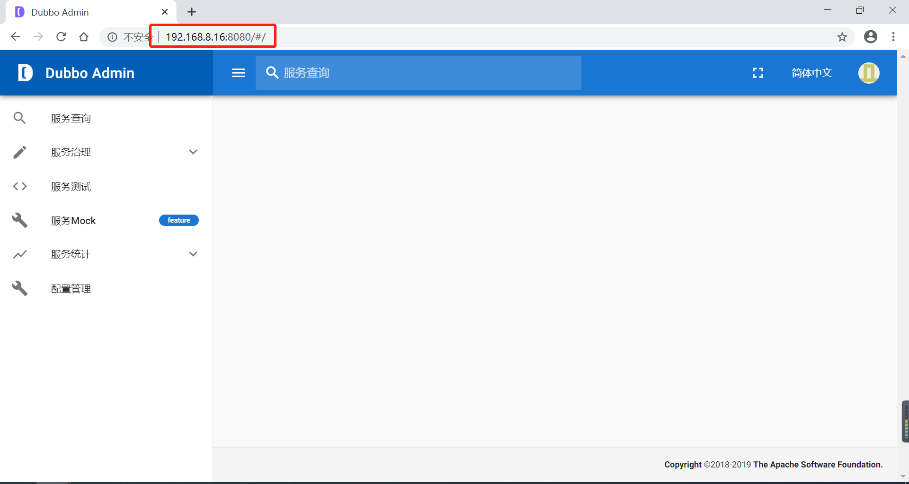

# Dubbo-Admin构建与访问

## 前言

版本说明

```properties
dubbo-admin=dubbo-admin-0.2.0-SNAPSHOT
```

相关链接

* Dubbo 官网：https://dubbo.apache.org/zh-cn/
* Dubbo Github 官网：https://github.com/apache/dubbo
* Dubbo 官网介绍 Dubbo-Admin 安装：https://dubbo.apache.org/zh-cn/docs/admin/introduction.html
* Dubbo-Admin Github 地址：https://github.com/apache/dubbo-admin
* Duboo-Admin DockerHub 地址：https://hub.docker.com/r/apache/dubbo-admin
* Zookeeper DockerHub 地址：https://hub.docker.com/_/zookeeper

## 源码构建

1. 在 `dubbo-admin-ui` 的 `pom `文件添加 `npm `的国内镜像地址，配置内容如下：

   ```xml
   <!-- 需要在 dubbo-admin-ui 的 pom 添加 npm 的国内镜像地址：http://npm.taobao.org/mirrors/node/ -->
   <configuration>
       <nodeVersion>v9.11.1</nodeVersion>
       <!-- 添加国内的镜像地址 -->
       <downloadRoot>http://npm.taobao.org/mirrors/node/</downloadRoot>
   </configuration>
   ```

2. 在 `dubbo-admin-server`  的 `application.properties` 文件配置 `Zookeeer `地址，配置内容如下：

   ```properties
   admin.registry.address=zookeeper://192.168.8.15:2181
   admin.config-center=zookeeper://192.168.8.15:2181
   admin.metadata-report.address=zookeeper://192.168.8.15:2181
   ```

3. 在 `dubbo-admin` 目录进行构建，构建命令如下：

   ```shell
   # 推荐跳过测试
   mvn clean compile package -Dmaven.test.skip=true
   ```

4. 进入 `dubbo-admin-distribution/target` 目录，运行 `dubbo-admin-0.2.0-SNAPSHOT.jar` 即可

   ```shell
   setsid java -jar dubbo-admin-0.2.0-SNAPSHOT.jar
   ```

5. 访问测试，访问 `8080` 端口，账号和密码在 `dubbo-admin-server`  的 `application.properties` 文件中，默认为账号/密码（root/root）

   


## Dubbo-Admin-UI 源码构建失败解决方案

### 问题详情

```
[INFO] ---------------------< org.apache:dubbo-admin-ui >----------------------
[INFO] Building dubbo-admin-ui 0.2.0-SNAPSHOT                             [2/5]
[INFO] --------------------------------[ jar ]---------------------------------
[INFO]
[INFO] --- maven-clean-plugin:3.0.0:clean (default-clean) @ dubbo-admin-ui ---
[INFO] Deleting D:\IDE\IDEA\workspace\github\dubbo-admin\dubbo-admin-ui\target
[INFO]
[INFO] --- maven-enforcer-plugin:1.4.1:enforce (enforce-maven-version) @ dubbo-admin-ui ---
[INFO]
[INFO] --- maven-checkstyle-plugin:3.0.0:check (checkstyle-validation) @ dubbo-admin-ui ---
[INFO]
[INFO] --- jacoco-maven-plugin:0.8.2:prepare-agent (default) @ dubbo-admin-ui ---
[INFO] argLine set to -javaagent:D:\\Maven\\repository\\org\\jacoco\\org.jacoco.agent\\0.8.2\\org.jacoco.agent-0.8.2-runtime.jar=destfile=D:\\IDE\\IDEA\\workspace\\github\\dubbo-admin\\dubbo-admin-ui\\target\\jacoco.exec
[INFO]
[INFO] --- maven-remote-resources-plugin:1.5:process (process-resource-bundles) @ dubbo-admin-ui ---
[INFO]
[INFO] --- frontend-maven-plugin:1.6:install-node-and-npm (install node and npm) @ dubbo-admin-ui ---
[INFO] Installing node version v9.11.1
[INFO] Downloading https://nodejs.org/dist/v9.11.1/node-v9.11.1-win-x64.zip to D:\Maven\repository\com\github\eirslett\node\9.11.1\node-9.11.1-win-x64.zip
[INFO] No proxies configured
[INFO] No proxy was configured, downloading directly
[INFO] ------------------------------------------------------------------------
[INFO] Reactor Summary for dubbo-admin 0.2.0-SNAPSHOT:
[INFO]
[INFO] dubbo-admin ........................................ SUCCESS [  2.509 s]
[INFO] dubbo-admin-ui ..................................... FAILURE [ 44.139 s]
[INFO] dubbo-admin-server ................................. SKIPPED
[INFO] dubbo-admin-distribution ........................... SKIPPED
[INFO] dubbo-admin-test ................................... SKIPPED
[INFO] ------------------------------------------------------------------------
[INFO] BUILD FAILURE
[INFO] ------------------------------------------------------------------------
[INFO] Total time:  47.030 s
[INFO] Finished at: 2020-07-27T13:45:36+08:00
[INFO] ------------------------------------------------------------------------
[ERROR] Failed to execute goal com.github.eirslett:frontend-maven-plugin:1.6:install-node-and-npm (install node and npm) on project dubbo-admin-ui: Could not download Node.js: Could not download https://nodejs.org/dist/v9.11.1/node-v9.11.1-win-x64.zip: Connect to nodejs.org:443 [nodejs.org/104.20.23.46, nodejs.org/104.20.22.46] failed: Connection timed out: connect -> [Help 1]
[ERROR]
[ERROR] To see the full stack trace of the errors, re-run Maven with the -e switch.
[ERROR] Re-run Maven using the -X switch to enable full debug logging.
[ERROR]
[ERROR] For more information about the errors and possible solutions, please read the following articles:
[ERROR] [Help 1] http://cwiki.apache.org/confluence/display/MAVEN/MojoFailureException
[ERROR]
[ERROR] After correcting the problems, you can resume the build with the command
[ERROR]   mvn <args> -rf :dubbo-admin-ui
```

### 解决方案

需要在 `dubbo-admin-ui` 的 pom 添加 npm 的国内镜像地址：

```xml
<configuration>
    <nodeVersion>v9.11.1</nodeVersion>
    <!-- 添加国内的镜像地址 -->
    <downloadRoot>http://npm.taobao.org/mirrors/node/</downloadRoot>
</configuration>
```

详细配置如下：

```xml
<build>
        <plugins>
            <plugin>
                <groupId>com.github.eirslett</groupId>
                <artifactId>frontend-maven-plugin</artifactId>
                <version>${frontend-maven-plugin.version}</version>
                <executions>
                    <execution>
                        <id>install node and npm</id>
                        <goals>
                            <goal>install-node-and-npm</goal>
                        </goals>
                        <configuration>
                            <nodeVersion>v9.11.1</nodeVersion>
                            <!-- 添加国内的镜像地址 -->
                            <downloadRoot>http://npm.taobao.org/mirrors/node/</downloadRoot>
                        </configuration>
                    </execution>
                    <!-- Install all project dependencies -->
                    <execution>
                        <id>npm install</id>
                        <goals>
                            <goal>npm</goal>
                        </goals>
                        <!-- optional: default phase is "generate-resources" -->
                        <phase>generate-resources</phase>
                        <!-- Optional configuration which provides for running any npm command -->
                        <configuration>
                            <arguments>install</arguments>
                        </configuration>
                    </execution>
                    <!-- Build and minify static files -->
                    <execution>
                        <id>npm run build</id>
                        <goals>
                            <goal>npm</goal>
                        </goals>
                        <configuration>
                            <arguments>run build</arguments>
                        </configuration>
                    </execution>
                </executions>
            </plugin>
        </plugins>
    </build>
```

