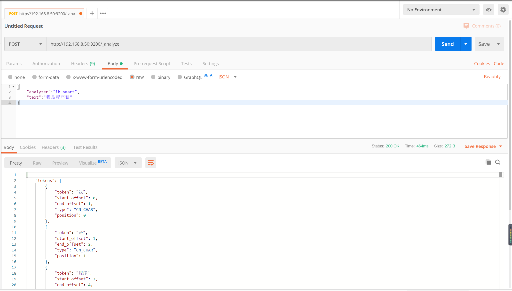

# elasticsearch-analysis-ik 分词器下载与安装

## 前言

github 链接：https://github.com/medcl/elasticsearch-analysis-ik

github 下载地址：https://github.com/medcl/elasticsearch-analysis-ik/releases

## IK 分词器分词

### 分类

* ik_smart ： ik 智能分词
* ik_max_word ： ik 最细分词

### 自定义分词 & 自定义停用词汇

修改 `IKAnalyzer.cfg.xml` 配置文件，添加自定义分词文件，和添加停用分词文件

```xml
<?xml version="1.0" encoding="UTF-8"?>
<!DOCTYPE properties SYSTEM "http://java.sun.com/dtd/properties.dtd">
<properties>
	<comment>IK Analyzer 扩展配置</comment>
	<!--用户可以在这里配置自己的扩展字典 -->
	<entry key="ext_dict">custom/mydict.dic;custom/single_word_low_freq.dic</entry>
	 <!--用户可以在这里配置自己的扩展停止词字典-->
	<entry key="ext_stopwords">custom/ext_stopword.dic</entry>
 	<!--用户可以在这里配置远程扩展字典 -->
	<entry key="remote_ext_dict">location</entry>
 	<!--用户可以在这里配置远程扩展停止词字典-->
	<entry key="remote_ext_stopwords">http://xxx.com/xxx.dic</entry>
</properties>
```

### dic 示例

只需要把词汇添加对应扩展字典即可

```dic
八面圆通
八面威风
八面张罗
八面来风
八面玲珑
八面莹澈
八面见光
```

## 安装

安装到 docker 中 的 elasticsearch 

```shell
# 上传 elasticsearch-analysis-ik-7.4.2.zip 文件，并解压
unzip elasticsearch-analysis-ik-7.4.2.zip -d elasticsearch-analysis-ik-7.4.2
# 拷贝到 docker 容器中的 elasticsearch/plugins 目录下
docker cp elasticsearch-analysis-ik-7.4.2 454244b9aa0c:/usr/share/elasticsearch/plugins
```

## 访问测试

