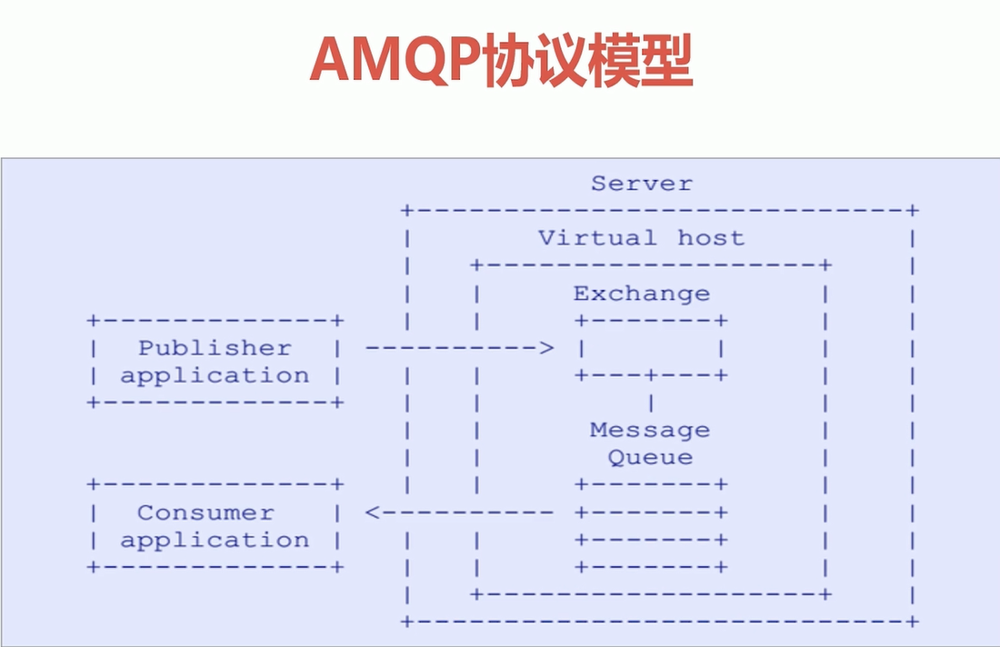
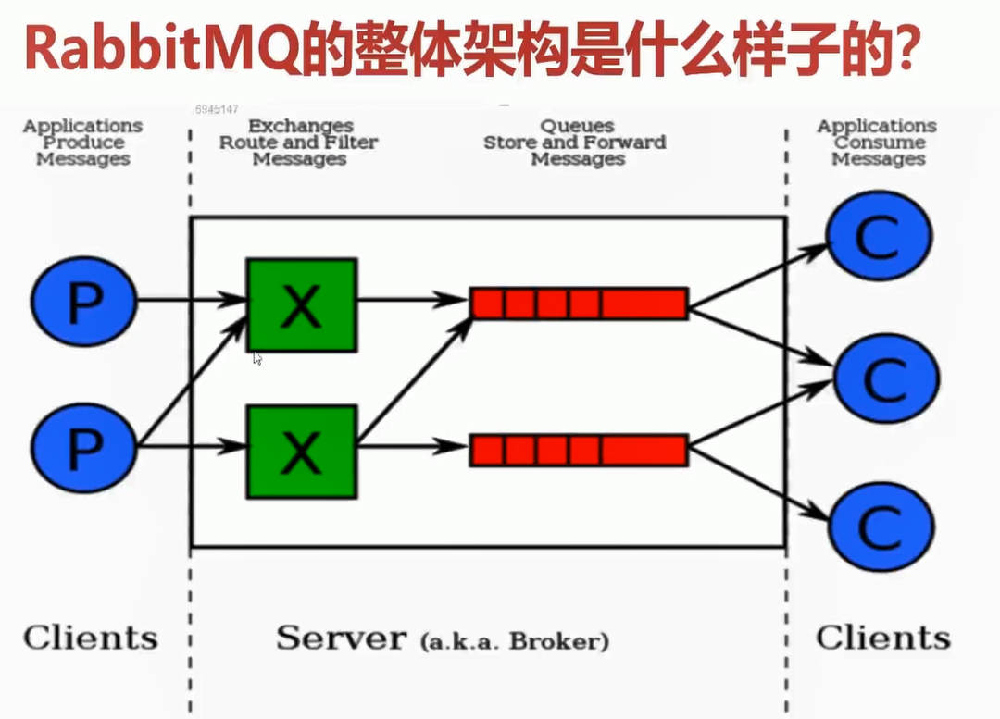
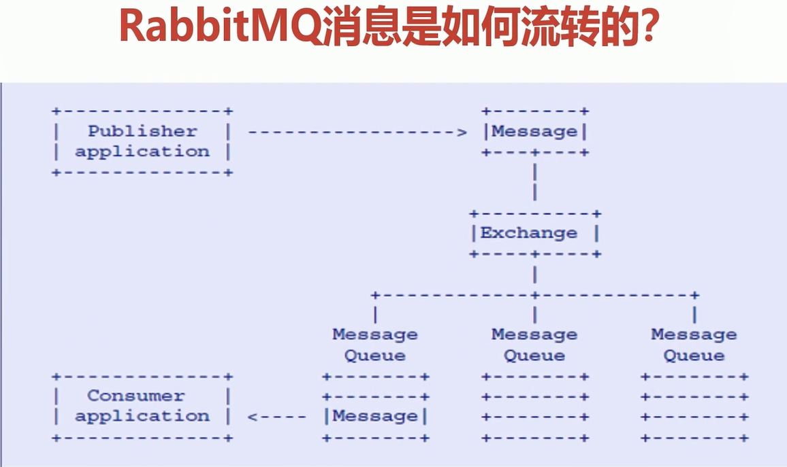
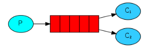
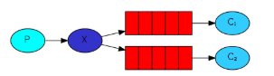
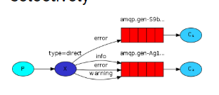
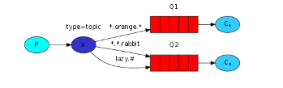
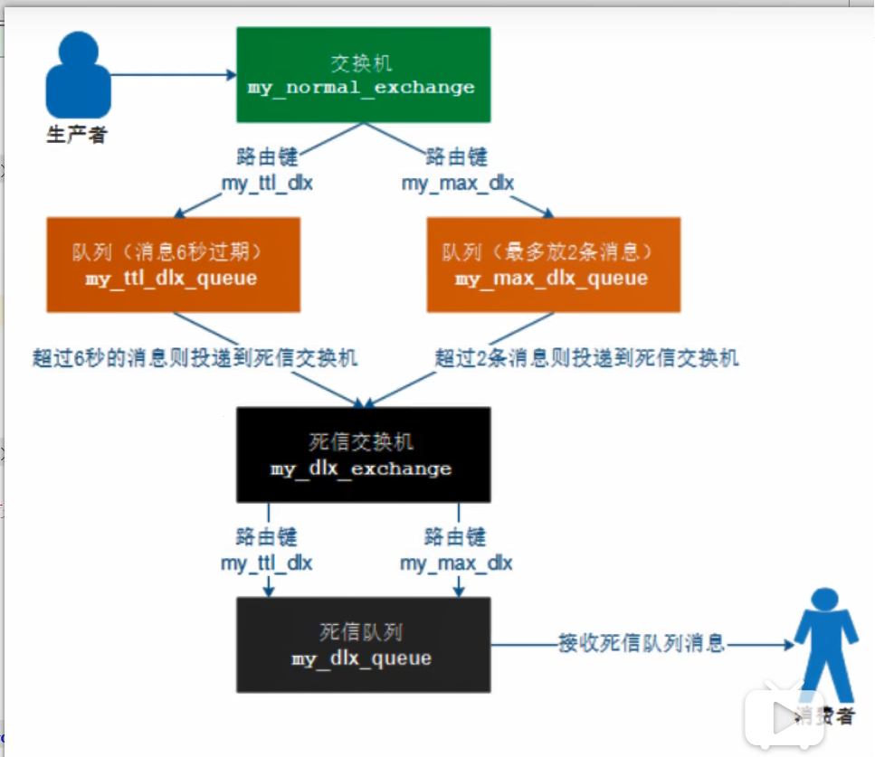

# RabbitMQ核心概念及AMQP协议

## 前言

版本说明

```properties
rabbitmq=3.8.4
```

相关链接

* RabbitMQ 官网文档：https://www.rabbitmq.com/getstarted.html
* SpringBoot 整合 RabbitMQ maven 官网地址：https://mvnrepository.com/artifact/org.springframework.boot/spring-boot-starter-amqp

```xml
<!-- https://mvnrepository.com/artifact/org.springframework.boot/spring-boot-starter-amqp -->
<dependency>
    <groupId>org.springframework.boot</groupId>
    <artifactId>spring-boot-starter-amqp</artifactId>
</dependency>
```

## AMQP

`AMQP（Advanced Message Queuing Protocol）` ：高级消息队列协议，是具有现代特征的二进制协议。是一个提供统一消息服务的应用层标准高级消息队列协议，是应用层协议的一个开放标准，为面向消息的中间件设计。

现代特征特点：多信道、协商式、异步、安全、可扩展、中立、高效。

### AMQP 协议模型



### AMQP 核心概念

* `Server` ：又称 `Broker` ，接收客户端的连接，实现 AMQP 实体服务；
* `Connection` ：连接，应用程序与 `Broker` 的网络连接；
* `Channel` ：网络信道，几乎所有的操作都在 `Channel` 中进行，`Channel` 是进行消息读写的通道。客户端可以建立多个 `Channel` ，每个 `Channel` 代表一个会话任务；
* `Message` ：消息，服务器和应用程序之间传送的数据，由 `Properties` 和 `Body` 组成。`Properties` 可以对消息进行修饰，比如消息的优先级、延迟等高级特性；`Body` 则就是消息体的内容；
* `Virtual Host` ：虚拟地址，用于进行逻辑隔离，最上层的消息路由。一个 `Virtual Host` 里面可以有若干个 `Exchange` 和 `Queue` ，同一个 `Virtual Host` 里面不能有相同名称的 `Exchange` 或者 `Queue` ；
* `Exchange` ：交换机，接收消息，根据路由键转发消息到绑定的队列中；
* `Binding` ：`Exchange` 和 `Queue` 之间的虚拟连接，`Binding` 中可以包含 `routing key` ；
* `Routing Key` ：一个路由规则，虚拟机可以用它来确定如何路由一个特定消息；
* `Queue` ：也称为 `Message Queue` ，消息队列，保存消息并将它们转发给消费者；

## RabbitMQ

### RabbitMQ 优势

* 与 `SpringAMQP` 完美的整合，`API` 丰富；
* 集群模式丰富，表达式配置，HA 模式，镜像队列模型；
* 保证数据不丢失的前提做到高可靠性、高可用性；

### RabbitMQ 高性能原因

* `Erlang` 语言最初在与交换机领域的架构模式，这样使得 `RabbitMQ` 在 `Broker` 之间进行数据交互的性能是非常优秀的；
* `Erlang` 语言有着和原生 `Socket` 一样的延迟；

### RabbitMQ 整体架构



### RabbitMQ 消息流转



### RabbitMQ 角色说明

* 超级管理员（Administrator）：可登录管理控制台，并且可以对用户，策略进行操作；
* 监控者（Monitoring）：可登录管理控制台，同时可以查看节点的相关信息（进程数、内存使用情况、磁盘使用情况等）；
* 策略制定者（Policymaker）：可登录管理控制台，同时可以对策略进行管理，但无法查看节点相关信息；
* 普通管理员（Management）：仅可以登录管理控制台，无法看到节点相关信息，也无法对策略进行管理；
* 其他：无法登录管理控制台，通常就是普通的生产者和消费者；

## 命令行与管控台操作

### 基础操作

```shell
# 关闭应用
rabbitmqctl stop_app
# 启动应用
rabbitmqctl start_app
# 节点状态
rabbitmqctl status

# 添加用户
rabbitmqctl add_user username password
# 列出所有用户
rabbitmqctl list_users
# 删除用户
rabbitmqctl delete_user username
# 清除用户权限
rabbitmqctl clear_permissions -p vhostpath username
# 列出用户权限
rabbitmqctl list_user_permissions username
# 修改密码
rabbitmqctl change_password username password
# 设置用户权限
rabbitmqctl set_permissions -p vhostpath username ".*" ".*" ".*" 

# 创建虚拟主机
rabbitmqctl add_vhost vhostpath
# 列出所有的虚拟主机
rabbitmqctl list_vhosts
# 列出虚拟主机上所有权限
rabbitmqctl list_permissions -p vhostpath
# 删除虚拟主机
rabbitmqctl delete_vhost vhostpath

# 查看所有队列信息
rabbitmqctl list_queues
# 清除队列里的消息
rabbitmqctl -p vhostpath purge_queue blue
```

### 高级操作

```shell
# 移除所有数据，要在 rabbitmqctl stop_app 之后使用 
rabbitmqctl reset
# 组成集群命令
rabbitmqctl join_cluster <clusternode> 
# 查看集群状态
rabbitmqctl cluster_status
# 修改集群节点的存储形式
rabbitmqctl change_cluster_node_type disc|ram
# 忘记节点（摘除节点）
rabbitmqctl forget_cluster_node [--offline]
# 修改节点名称
rabbitmqctl rename_cluster_node oldnode1 newnode1 oldnode2 newnode2...
```

## RabbitMQ 工作模式

* P：生产者
* C：消费者
* Queue：红色部分
* X：exchange 交换机，深蓝色部分。交换机一方面，接收生产者发送的消息；另一方面，知道如何处理消息，例如如何递交给某个特定的队列、递交给所有的队列、或者是将消息丢弃。**Exchange只负责转发消息，不具备存储消息的能力；**Exchange 常见类型
  1. Fanout ：广播，将消息交给所有绑定到交换机的队列；
  2. Direct：定向，把消息交给符合指定 routing key 规则的队列；
  3. Topic：通配符，把消息交给符合 routing pattern （路由模式）的队列；
  4. headers：首部交换机

### SimpleQueue 简单模式

#### 原理

The simplest thing that does something


#### 生产者代码

```java
package top.simba1949.simple;

import com.rabbitmq.client.Channel;
import com.rabbitmq.client.Connection;
import com.rabbitmq.client.ConnectionFactory;

import java.io.IOException;
import java.util.concurrent.TimeoutException;

/**
 * @author Theodore
 * @date 2020/6/15 17:52
 */
public class Producer {

    public static final String SIMPLE_QUEUE_NAME = "simple_queue";

    public static void main(String[] args) throws IOException, TimeoutException {
        // 1.创建连接工厂
        ConnectionFactory connectionFactory = new ConnectionFactory();
        connectionFactory.setHost("192.168.8.9");
        connectionFactory.setPort(5672);
        connectionFactory.setVirtualHost("/");
        connectionFactory.setUsername("guest");
        connectionFactory.setPassword("guest");
        // 2.通过连接工厂创建连接
        Connection connection = connectionFactory.newConnection();
        // 3.通过 connection 创建 channel
        Channel channel = connection.createChannel();
        // 4.声明队列
        // 参数一：队列名称
        // 参数二：是否定义持久化队列
        // 参数三：是否独占本次连接
        // 参数四：是否在不使用的使用自动删除队列
        // 参数五：队列其他参数
        channel.queueDeclare(SIMPLE_QUEUE_NAME, true, false, false, null);
        // 发送消息
        String msg = "Hello RabbitMQ";
        // 参数一：交换机名称，如果没有指定则使用 Default Exchange;
        // 参数二：路由 key，如果是简单模式，可以直接传递队列名称
        // 参数三：消息其他属性
        // 参数四：消息内容
        channel.basicPublish("", SIMPLE_QUEUE_NAME, null, msg.getBytes());
        // 释放资源
        channel.close();
        connection.close();
    }
}
```

#### 消费者代码

```java
package top.simba1949.simple;

import com.rabbitmq.client.*;

import java.io.IOException;
import java.util.concurrent.TimeoutException;

/**
 * @author Theodore
 * @date 2020/6/15 17:49
 */
public class Consumer {
    public static void main(String[] args) throws IOException, TimeoutException {
        // 1.创建连接工厂
        ConnectionFactory connectionFactory = new ConnectionFactory();
        connectionFactory.setHost("192.168.8.9");
        connectionFactory.setPort(5672);
        connectionFactory.setVirtualHost("/");
        connectionFactory.setUsername("guest");
        connectionFactory.setPassword("guest");
        // 2.通过连接工厂创建连接
        Connection connection = connectionFactory.newConnection();
        // 3.通过 connection 创建 channel
        Channel channel = connection.createChannel();
        // 4.声明一个队列
        // 参数一：队列名称
        // 参数二：是否定义持久化队列
        // 参数三：是否独占本次连接
        // 参数四：是否在不使用的使用自动删除队列
        // 参数五：队列其他参数
        channel.queueDeclare(Producer.SIMPLE_QUEUE_NAME, true, false, false, null);
        // 5.监听消息
        DefaultConsumer defaultConsumer = new DefaultConsumer(channel) {
            /**
             * @param consumerTag 消费标签，在 channel.basicConsume 时候可以指定
             * @param envelope 消息包内容，可从中获取消息id、消息routingKey、交换机和重转标记（收到消息失败后是否需要重新发送该消息）
             * @param properties 消息属性
             * @param body 消息
             * @throws IOException
             */
            @Override
            public void handleDelivery(String consumerTag, Envelope envelope, AMQP.BasicProperties properties, byte[] body) throws IOException {
                super.handleDelivery(consumerTag, envelope, properties, body);
                System.out.println("路由 key ：" + envelope.getRoutingKey());
                System.out.println("交换机 ：" + envelope.getExchange());
                System.out.println("消息id ：" + envelope.getDeliveryTag());
                System.out.println("接收到的消息 ：" + new String(body, "UTF-8"));
                System.out.println("-----------------");
            }
        };
        // 监听消息
        // 参数一：队列名称
        // 参数二：是否自动确认，设置为true表示消息接收到自动向mq回复接收到了，mq接收到消息之后会删除消息，设置为false则需要手动确认
        channel.basicConsume(Producer.SIMPLE_QUEUE_NAME, true, defaultConsumer);
        // 不关闭资源，会一直监听
        // channel.close();
        // connection.close();
    }
}
```

### WorkQueues 工作队列模式

#### 原理

Distributing tasks among workers (the competing consumers pattern)



#### 工具类

```java
package top.simba1949;

import com.rabbitmq.client.Channel;
import com.rabbitmq.client.Connection;
import com.rabbitmq.client.ConnectionFactory;

import java.io.IOException;
import java.util.concurrent.TimeoutException;

/**
 * @author Theodore
 * @date 2020/6/16 16:20
 */
public class RabbitMQUtil {
    /**
     * 获取连接
     * @return
     * @throws IOException
     * @throws TimeoutException
     */
    public static Connection getConnection() throws IOException, TimeoutException {
        // 1.创建连接工厂
        ConnectionFactory connectionFactory = new ConnectionFactory();
        connectionFactory.setHost("192.168.8.9");
        connectionFactory.setPort(5672);
        connectionFactory.setVirtualHost("/");
        connectionFactory.setUsername("guest");
        connectionFactory.setPassword("guest");
        // 2.通过连接工厂创建连接
        Connection connection = connectionFactory.newConnection();

        return connection;
    }

    /**
     * 关闭连接
     * @param channel
     * @param connection
     * @throws IOException
     * @throws TimeoutException
     */
    public static void close(Channel channel, Connection connection) throws IOException, TimeoutException {
        channel.close();
        connection.close();
    }
}
```

#### 生产者代码

```java
package top.simba1949.work;

import com.rabbitmq.client.Channel;
import com.rabbitmq.client.Connection;
import top.simba1949.RabbitMQUtil;

import java.io.IOException;
import java.util.concurrent.TimeoutException;

/**
 * @author Theodore
 * @date 2020/6/15 17:52
 */
public class Producer {

    public static final String QUEUE_NAME = "work_queue";

    public static void main(String[] args) throws IOException, TimeoutException {
        Connection connection = RabbitMQUtil.getConnection();
        // 通过 connection 创建 channel
        Channel channel = connection.createChannel();
        // 声明队列
        // 参数一：队列名称
        // 参数二：是否定义持久化队列
        // 参数三：是否独占本次连接
        // 参数四：是否在不使用的使用自动删除队列
        // 参数五：队列其他参数
        channel.queueDeclare(QUEUE_NAME, true, false, false, null);
        // 发送消息
        for (int i = 1; i <= 30; i++){
            String msg = "你好：小兔子！ work 模式————" + i;
            // 参数一：交换机名称，如果没有指定则使用 Default Exchange;
            // 参数二：路由 key，简单模式可以传递队列名称
            // 参数三：消息其他属性
            // 参数四：消息内容
            channel.basicPublish("", QUEUE_NAME, null, msg.getBytes());
        }
        // 释放资源
        RabbitMQUtil.close(channel, connection);
    }
}
```

#### 消费者1代码

```java
package top.simba1949.work;

import com.rabbitmq.client.*;
import lombok.SneakyThrows;
import top.simba1949.RabbitMQUtil;

import java.io.IOException;
import java.util.concurrent.TimeoutException;

/**
 * @author Theodore
 * @date 2020/6/15 17:49
 */
public class Consumer1 {

    public static void main(String[] args) throws IOException, TimeoutException {
        // 创建连接
        Connection connection = RabbitMQUtil.getConnection();
        // 创建信道
        Channel channel = connection.createChannel();
        // 声明一个队列
        // 参数一：队列名称
        // 参数二：是否定义持久化队列
        // 参数三：是否独占本次连接
        // 参数四：是否在不使用的使用自动删除队列
        // 参数五：队列其他参数
        channel.queueDeclare(Producer.QUEUE_NAME, true, false, false, null);
        // 监听消息
        DefaultConsumer defaultConsumer = new DefaultConsumer(channel) {
            /**
             * @param consumerTag 消费标签，在 channel.basicConsume 时候可以指定
             * @param envelope 消息包内容，可从中获取消息id、消息routingKey、交换机和重转标记（收到消息失败后是否需要重新发送该消息）
             * @param properties 消息属性
             * @param body 消息
             * @throws IOException
             */
            @SneakyThrows
            @Override
            public void handleDelivery(String consumerTag, Envelope envelope, AMQP.BasicProperties properties, byte[] body) throws IOException {
                super.handleDelivery(consumerTag, envelope, properties, body);
                System.out.println("============消费者1 start =============");
                System.out.println("路由 key ：" + envelope.getRoutingKey());
                System.out.println("交换机 ：" + envelope.getExchange());
                System.out.println("消息id ：" + envelope.getDeliveryTag());
                System.out.println("接收到的消息 ：" + new String(body, "UTF-8"));
                Thread.sleep(1000L);
                // 客户端自己确认消息收到ack
                channel.basicAck(envelope.getDeliveryTag(), false);
                System.out.println("============消费者1 end =============");
            }
        };
        // 监听消息
        // 参数一：队列名称
        // 参数二：是否自动确认，设置为true表示消息接收到自动向mq回复接收到了，mq接收到消息之后会删除消息，设置为false则需要手动确认
        channel.basicConsume(Producer.QUEUE_NAME, false, defaultConsumer);
        // 不关闭资源，会一直监听
        // channel.close();
        // connection.close();
    }
}
```

#### 消费者2代码

```java
package top.simba1949.work;

import com.rabbitmq.client.*;
import lombok.SneakyThrows;
import top.simba1949.RabbitMQUtil;

import java.io.IOException;
import java.util.concurrent.TimeoutException;

/**
 * @author Theodore
 * @date 2020/6/15 17:49
 */
public class Consumer2 {

    public static void main(String[] args) throws IOException, TimeoutException {
        // 创建连接
        Connection connection = RabbitMQUtil.getConnection();
        // 创建信道
        Channel channel = connection.createChannel();
        // 声明一个队列
        // 参数一：队列名称
        // 参数二：是否定义持久化队列
        // 参数三：是否独占本次连接
        // 参数四：是否在不使用的使用自动删除队列
        // 参数五：队列其他参数
        channel.queueDeclare(Producer.QUEUE_NAME, true, false, false, null);
        // 监听消息
        DefaultConsumer defaultConsumer = new DefaultConsumer(channel) {
            /**
             * @param consumerTag 消费标签，在 channel.basicConsume 时候可以指定
             * @param envelope 消息包内容，可从中获取消息id、消息routingKey、交换机和重转标记（收到消息失败后是否需要重新发送该消息）
             * @param properties 消息属性
             * @param body 消息
             * @throws IOException
             */
            @SneakyThrows
            @Override
            public void handleDelivery(String consumerTag, Envelope envelope, AMQP.BasicProperties properties, byte[] body) throws IOException {
                super.handleDelivery(consumerTag, envelope, properties, body);
                System.out.println("============消费者2 start =============");
                System.out.println("路由 key ：" + envelope.getRoutingKey());
                System.out.println("交换机 ：" + envelope.getExchange());
                System.out.println("消息id ：" + envelope.getDeliveryTag());
                System.out.println("接收到的消息 ：" + new String(body, "UTF-8"));
                Thread.sleep(1000L);
                // 客户端自己确认消息收到ack
                channel.basicAck(envelope.getDeliveryTag(), false);
                System.out.println("============消费者2 end =============");
            }
        };
        // 监听消息
        // 参数一：队列名称
        // 参数二：是否自动确认，设置为true表示消息接收到自动向mq回复接收到了，mq接收到消息之后会删除消息，设置为false则需要手动确认
        channel.basicConsume(Producer.QUEUE_NAME, false, defaultConsumer);
        // 不关闭资源，会一直监听
        // channel.close();
        // connection.close();
    }
}
```

### Publish/Subscribe

#### 原理

Sending messages to many consumers at once



#### 工具类代码

```java
package top.simba1949;

import com.rabbitmq.client.Channel;
import com.rabbitmq.client.Connection;
import com.rabbitmq.client.ConnectionFactory;

import java.io.IOException;
import java.util.concurrent.TimeoutException;

/**
 * @author Theodore
 * @date 2020/6/16 16:20
 */
public class RabbitMQUtil {
    /**
     * 获取连接
     * @return
     * @throws IOException
     * @throws TimeoutException
     */
    public static Connection getConnection() throws IOException, TimeoutException {
        // 1.创建连接工厂
        ConnectionFactory connectionFactory = new ConnectionFactory();
        connectionFactory.setHost("192.168.8.9");
        connectionFactory.setPort(5672);
        connectionFactory.setVirtualHost("/");
        connectionFactory.setUsername("guest");
        connectionFactory.setPassword("guest");
        // 2.通过连接工厂创建连接
        Connection connection = connectionFactory.newConnection();

        return connection;
    }

    /**
     * 关闭连接
     * @param channel
     * @param connection
     * @throws IOException
     * @throws TimeoutException
     */
    public static void close(Channel channel, Connection connection) throws IOException, TimeoutException {
        channel.close();
        connection.close();
    }
}
```

#### 生产者代码

```java
package top.simba1949.publish.subscribe;

import com.rabbitmq.client.BuiltinExchangeType;
import com.rabbitmq.client.Channel;
import com.rabbitmq.client.Connection;
import top.simba1949.RabbitMQUtil;

import java.io.IOException;
import java.util.concurrent.TimeoutException;

/**
 * @author Theodore
 * @date 2020/6/15 17:52
 */
public class Producer {

    public static final String FANOUT_EXCHANGE = "fanout_exchange";
    public static final String FANOUT_QUEUE_1 = "fanout_queue_1";
    public static final String FANOUT_QUEUE_2 = "fanout_queue_2";

    public static void main(String[] args) throws IOException, TimeoutException {
        Connection connection = RabbitMQUtil.getConnection();
        // 通过 connection 创建 channel
        Channel channel = connection.createChannel();
        // 声明交换机
        // 参数一：交换机名称
        // 参数二：交换机类型： DIRECT("direct"), FANOUT("fanout"), TOPIC("topic"), HEADERS("headers");
        channel.exchangeDeclare(FANOUT_EXCHANGE, BuiltinExchangeType.FANOUT);
        // 声明队列
        // 参数一：队列名称
        // 参数二：是否定义持久化队列
        // 参数三：是否独占本次连接
        // 参数四：是否在不使用的使用自动删除队列
        // 参数五：队列其他参数
        channel.queueDeclare(FANOUT_QUEUE_1, true, false, false, null);
        channel.queueDeclare(FANOUT_QUEUE_2, true, false, false, null);

        // 队列绑定交换机
        // 参数一：队列名称
        // 参数二：交换机名称
        // 参数三：路由key
        channel.queueBind(FANOUT_QUEUE_1, FANOUT_EXCHANGE, "");
        channel.queueBind(FANOUT_QUEUE_2, FANOUT_EXCHANGE, "");

        // 发送消息
        for (int i = 1; i <= 30; i++){
            String msg = "你好：小兔子！ Publish/Subscribe模式(" + i;
            // 参数一：交换机名称，如果没有指定则使用 Default Exchange;
            // 参数二：路由 key，如果是简单模式，可以直接传递队列名称
            // 参数三：消息其他属性
            // 参数四：消息内容
            channel.basicPublish(FANOUT_EXCHANGE, "", null, msg.getBytes());
        }
        // 释放资源
        RabbitMQUtil.close(channel, connection);
    }
}
```

#### 消费者1订阅队列1代码

```java
package top.simba1949.publish.subscribe;

import com.rabbitmq.client.*;
import lombok.SneakyThrows;
import top.simba1949.RabbitMQUtil;

import java.io.IOException;
import java.util.concurrent.TimeoutException;

/**
 * @author Theodore
 * @date 2020/6/15 17:49
 */
public class Consumer1 {

    public static void main(String[] args) throws IOException, TimeoutException {
        // 创建连接
        Connection connection = RabbitMQUtil.getConnection();
        // 创建信道
        Channel channel = connection.createChannel();
        // 声明一个队列
        // 参数一：队列名称
        // 参数二：是否定义持久化队列
        // 参数三：是否独占本次连接
        // 参数四：是否在不使用的使用自动删除队列
        // 参数五：队列其他参数
        channel.queueDeclare(Producer.FANOUT_QUEUE_1, true, false, false, null);
        // 监听消息
        DefaultConsumer defaultConsumer = new DefaultConsumer(channel) {
            /**
             * @param consumerTag 消费标签，在 channel.basicConsume 时候可以指定
             * @param envelope 消息包内容，可从中获取消息id、消息routingKey、交换机和重转标记（收到消息失败后是否需要重新发送该消息）
             * @param properties 消息属性
             * @param body 消息
             * @throws IOException
             */
            @SneakyThrows
            @Override
            public void handleDelivery(String consumerTag, Envelope envelope, AMQP.BasicProperties properties, byte[] body) throws IOException {
                super.handleDelivery(consumerTag, envelope, properties, body);
                System.out.println("============Publish/Subscribe 消费者1 start =============");
                System.out.println("路由 key ：" + envelope.getRoutingKey());
                System.out.println("交换机 ：" + envelope.getExchange());
                System.out.println("消息id ：" + envelope.getDeliveryTag());
                System.out.println("接收到的消息 ：" + new String(body, "UTF-8"));
                Thread.sleep(1000L);
                // 客户端自己确认消息收到ack
                channel.basicAck(envelope.getDeliveryTag(), false);
                System.out.println("============Publish/Subscribe 消费者1 end =============");
            }
        };
        // 监听消息
        // 参数一：队列名称
        // 参数二：是否自动确认，设置为true表示消息接收到自动向mq回复接收到了，mq接收到消息之后会删除消息，设置为false则需要手动确认
        channel.basicConsume(Producer.FANOUT_QUEUE_1, false, defaultConsumer);
        // 不关闭资源，会一直监听
        // channel.close();
        // connection.close();
    }
}
```

#### 消费者2订阅队列2代码

```java
package top.simba1949.publish.subscribe;

import com.rabbitmq.client.*;
import lombok.SneakyThrows;
import top.simba1949.RabbitMQUtil;

import java.io.IOException;
import java.util.concurrent.TimeoutException;

/**
 * @author Theodore
 * @date 2020/6/15 17:49
 */
public class Consumer2 {

    public static void main(String[] args) throws IOException, TimeoutException {
        // 创建连接
        Connection connection = RabbitMQUtil.getConnection();
        // 创建信道
        Channel channel = connection.createChannel();
        // 4.声明一个队列
        channel.queueDeclare(Producer.FANOUT_QUEUE_2, true, false, false, null);
        // 5.监听消息
        DefaultConsumer defaultConsumer = new DefaultConsumer(channel) {
            /**
             * @param consumerTag 消费标签，在 channel.basicConsume 时候可以指定
             * @param envelope 消息包内容，可从中获取消息id、消息routingKey、交换机和重转标记（收到消息失败后是否需要重新发送该消息）
             * @param properties 消息属性
             * @param body 消息
             * @throws IOException
             */
            @SneakyThrows
            @Override
            public void handleDelivery(String consumerTag, Envelope envelope, AMQP.BasicProperties properties, byte[] body) throws IOException {
                super.handleDelivery(consumerTag, envelope, properties, body);
                System.out.println("============Publish/Subscribe 消费者2 start =============");
                System.out.println("路由 key ：" + envelope.getRoutingKey());
                System.out.println("交换机 ：" + envelope.getExchange());
                System.out.println("消息id ：" + envelope.getDeliveryTag());
                System.out.println("接收到的消息 ：" + new String(body, "UTF-8"));
                Thread.sleep(1000L);
                // 客户端自己确认消息收到ack
                channel.basicAck(envelope.getDeliveryTag(), false);
                System.out.println("============ Publish/Subscribe消费者2 end =============");
            }
        };
        // 监听消息
        // 参数一：队列名称
        // 参数二：是否自动确认，设置为true表示消息接收到自动向mq回复接收到了，mq接收到消息之后会删除消息，设置为false则需要手动确认
        channel.basicConsume(Producer.FANOUT_QUEUE_2, false, defaultConsumer);
        // 不关闭资源，会一直监听
        // channel.close();
        // connection.close();
    }
}
```

### Routing

#### 原理

Receiving messages selectively



路由模式特点

* 队列与交换机的绑定，不能是任意绑定了，而是要指定一个 `Routing Key`
* 消息的发送方在向 `Exchange` 发送消息时，也必须指定消息的 `Routing Key` 
* `Exchange` 不再把消息交给每一个绑定的队列，而是根据消息的 `Routing Key` 进行判断，只有队列的 `Routing Key` 与消息 `Routing Key` 完全一致，才会接收到消息；

#### 工具类代码

```java
package top.simba1949;

import com.rabbitmq.client.Channel;
import com.rabbitmq.client.Connection;
import com.rabbitmq.client.ConnectionFactory;

import java.io.IOException;
import java.util.concurrent.TimeoutException;

/**
 * @author Theodore
 * @date 2020/6/16 16:20
 */
public class RabbitMQUtil {
    /**
     * 获取连接
     * @return
     * @throws IOException
     * @throws TimeoutException
     */
    public static Connection getConnection() throws IOException, TimeoutException {
        // 1.创建连接工厂
        ConnectionFactory connectionFactory = new ConnectionFactory();
        connectionFactory.setHost("192.168.8.9");
        connectionFactory.setPort(5672);
        connectionFactory.setVirtualHost("/");
        connectionFactory.setUsername("guest");
        connectionFactory.setPassword("guest");
        // 2.通过连接工厂创建连接
        Connection connection = connectionFactory.newConnection();

        return connection;
    }

    /**
     * 关闭连接
     * @param channel
     * @param connection
     * @throws IOException
     * @throws TimeoutException
     */
    public static void close(Channel channel, Connection connection) throws IOException, TimeoutException {
        channel.close();
        connection.close();
    }
}
```

#### 生产者代码

```java
package top.simba1949.routing;

import com.rabbitmq.client.BuiltinExchangeType;
import com.rabbitmq.client.Channel;
import com.rabbitmq.client.Connection;
import top.simba1949.RabbitMQUtil;

import java.io.IOException;
import java.util.concurrent.TimeoutException;

/**
 * 路由模式的交换机类型为：direct
 * @author Theodore
 * @date 2020/6/15 17:52
 */
public class Producer {

    public static final String DIRECT_EXCHANGE = "direct_exchange";
    public static final String DIRECT_QUEUE_INSERT = "direct_queue_insert";
    public static final String DIRECT_QUEUE_UPDATE = "direct_queue_update";
    public static final String ROUTING_KEY_INSERT = "insert";
    public static final String ROUTING_KEY_UPDATE = "update";

    public static void main(String[] args) throws IOException, TimeoutException {
        Connection connection = RabbitMQUtil.getConnection();
        // 通过 connection 创建 channel
        Channel channel = connection.createChannel();
        // 声明交换机
        // 参数一：交换机名称
        // 参数二：交换机类型： DIRECT("direct"), FANOUT("fanout"), TOPIC("topic"), HEADERS("headers");
        channel.exchangeDeclare(DIRECT_EXCHANGE, BuiltinExchangeType.DIRECT);
        // 声明队列
        // 参数一：队列名称
        // 参数二：是否定义持久化队列
        // 参数三：是否独占本次连接
        // 参数四：是否在不使用的使用自动删除队列
        // 参数五：队列其他参数
        channel.queueDeclare(DIRECT_QUEUE_INSERT, true, false, false, null);
        channel.queueDeclare(DIRECT_QUEUE_UPDATE, true, false, false, null);

        // 队列绑定交换机
        // 参数一：队列名称
        // 参数二：交换机名称
        // 参数三：路由key
        channel.queueBind(DIRECT_QUEUE_INSERT, DIRECT_EXCHANGE, ROUTING_KEY_INSERT);
        channel.queueBind(DIRECT_QUEUE_UPDATE, DIRECT_EXCHANGE, ROUTING_KEY_UPDATE);

        // 发送消息
        String msgInsert = "新增了商品，路由模式：routing key 为 insert";
        // 参数一：交换机名称，如果没有指定则使用 Default Exchange;
        // 参数二：路由 key，如果是简单模式，可以直接传递队列名称
        // 参数三：消息其他属性
        // 参数四：消息内容
        channel.basicPublish(DIRECT_EXCHANGE, ROUTING_KEY_INSERT, null, msgInsert.getBytes());

        // 发送消息
        String msgUpdate = "新增了商品，路由模式：routing key 为 update";
        // 参数一：交换机名称，如果没有指定则使用 Default Exchange;
        // 参数二：路由 key，如果是简单模式，可以直接传递队列名称
        // 参数三：消息其他属性
        // 参数四：消息内容
        channel.basicPublish(DIRECT_EXCHANGE, ROUTING_KEY_UPDATE, null, msgUpdate.getBytes());

        // 释放资源
        RabbitMQUtil.close(channel, connection);
    }
}
```

#### 消费者 insert 代码

```java
package top.simba1949.routing;

import com.rabbitmq.client.*;
import lombok.SneakyThrows;
import top.simba1949.RabbitMQUtil;

import java.io.IOException;
import java.util.concurrent.TimeoutException;

/**
 * @author Theodore
 * @date 2020/6/15 17:49
 */
public class ConsumerInsert {

    public static void main(String[] args) throws IOException, TimeoutException {
        // 创建连接
        Connection connection = RabbitMQUtil.getConnection();
        // 创建信道
        Channel channel = connection.createChannel();
        // 声明一个队列
        // 参数一：队列名称
        // 参数二：是否定义持久化队列
        // 参数三：是否独占本次连接
        // 参数四：是否在不使用的使用自动删除队列
        // 参数五：队列其他参数
        channel.queueDeclare(Producer.DIRECT_QUEUE_INSERT, true, false, false, null);
        // 监听消息
        DefaultConsumer defaultConsumer = new DefaultConsumer(channel) {
            /**
             * @param consumerTag 消费标签，在 channel.basicConsume 时候可以指定
             * @param envelope 消息包内容，可从中获取消息id、消息routingKey、交换机和重转标记（收到消息失败后是否需要重新发送该消息）
             * @param properties 消息属性
             * @param body 消息
             * @throws IOException
             */
            @SneakyThrows
            @Override
            public void handleDelivery(String consumerTag, Envelope envelope, AMQP.BasicProperties properties, byte[] body) throws IOException {
                super.handleDelivery(consumerTag, envelope, properties, body);
                System.out.println("============Routing insert start =============");
                System.out.println("路由 key ：" + envelope.getRoutingKey());
                System.out.println("交换机 ：" + envelope.getExchange());
                System.out.println("消息id ：" + envelope.getDeliveryTag());
                System.out.println("接收到的消息 ：" + new String(body, "UTF-8"));
                Thread.sleep(1000L);
                // 客户端自己确认消息收到ack
                channel.basicAck(envelope.getDeliveryTag(), false);
                System.out.println("============Routing insert end =============");
            }
        };
        // 监听消息
        // 参数一：队列名称
        // 参数二：是否自动确认，设置为true表示消息接收到自动向mq回复接收到了，mq接收到消息之后会删除消息，设置为false则需要手动确认
        channel.basicConsume(Producer.DIRECT_QUEUE_INSERT, false, defaultConsumer);
        // 不关闭资源，会一直监听
        // channel.close();
        // connection.close();
    }
}
```

#### 消费者 update 代码

```java
package top.simba1949.routing;

import com.rabbitmq.client.*;
import lombok.SneakyThrows;
import top.simba1949.RabbitMQUtil;

import java.io.IOException;
import java.util.concurrent.TimeoutException;

/**
 * @author Theodore
 * @date 2020/6/15 17:49
 */
public class ConsumerUpdate {

    public static void main(String[] args) throws IOException, TimeoutException {
        // 创建连接
        Connection connection = RabbitMQUtil.getConnection();
        // 创建信道
        Channel channel = connection.createChannel();
        // 4.声明一个队列
        channel.queueDeclare(Producer.DIRECT_QUEUE_UPDATE, true, false, false, null);
        // 5.监听消息
        DefaultConsumer defaultConsumer = new DefaultConsumer(channel) {
            /**
             * @param consumerTag 消费标签，在 channel.basicConsume 时候可以指定
             * @param envelope 消息包内容，可从中获取消息id、消息routingKey、交换机和重转标记（收到消息失败后是否需要重新发送该消息）
             * @param properties 消息属性
             * @param body 消息
             * @throws IOException
             */
            @SneakyThrows
            @Override
            public void handleDelivery(String consumerTag, Envelope envelope, AMQP.BasicProperties properties, byte[] body) throws IOException {
                super.handleDelivery(consumerTag, envelope, properties, body);
                System.out.println("============Routing update start =============");
                System.out.println("路由 key ：" + envelope.getRoutingKey());
                System.out.println("交换机 ：" + envelope.getExchange());
                System.out.println("消息id ：" + envelope.getDeliveryTag());
                System.out.println("接收到的消息 ：" + new String(body, "UTF-8"));
                Thread.sleep(1000L);
                // 客户端自己确认消息收到ack
                channel.basicAck(envelope.getDeliveryTag(), false);
                System.out.println("===========Routing update end =============");
            }
        };
        // 监听消息
        // 参数一：队列名称
        // 参数二：是否自动确认，设置为true表示消息接收到自动向mq回复接收到了，mq接收到消息之后会删除消息，设置为false则需要手动确认
        channel.basicConsume(Producer.DIRECT_QUEUE_UPDATE, false, defaultConsumer);
        // 不关闭资源，会一直监听
        // channel.close();
        // connection.close();
    }
}
```

### Topics 通配符模式

#### 原理

Receiving messages based on a pattern (topics)



`Topic` 类型与 `Direct` 相比，都是可以根据 `Routing Key` 把消息路由到不同的队列。只不过 `Topic` 类型的 `Exchange`  可以让队列在绑定 `Routing Key` 的时候可以使用**通配符**。

`Routing Key` 一般都是有一个或者多个单词组成，多个单词以“`.`” 分割，例如：`item.insert`

通配符规则

* `#` ：匹配一个或者多个词；eg ：`item.#` 能够匹配 `item.insert` 或者 `item.insert.abc` ;
* `*` ：匹配一个词；`item.*` 能够匹配 `item.insert`;

#### 工具类代码

```java
package top.simba1949;

import com.rabbitmq.client.Channel;
import com.rabbitmq.client.Connection;
import com.rabbitmq.client.ConnectionFactory;

import java.io.IOException;
import java.util.concurrent.TimeoutException;

/**
 * @author Theodore
 * @date 2020/6/16 16:20
 */
public class RabbitMQUtil {
    /**
     * 获取连接
     * @return
     * @throws IOException
     * @throws TimeoutException
     */
    public static Connection getConnection() throws IOException, TimeoutException {
        // 1.创建连接工厂
        ConnectionFactory connectionFactory = new ConnectionFactory();
        connectionFactory.setHost("192.168.8.9");
        connectionFactory.setPort(5672);
        connectionFactory.setVirtualHost("/");
        connectionFactory.setUsername("guest");
        connectionFactory.setPassword("guest");
        // 2.通过连接工厂创建连接
        Connection connection = connectionFactory.newConnection();

        return connection;
    }

    /**
     * 关闭连接
     * @param channel
     * @param connection
     * @throws IOException
     * @throws TimeoutException
     */
    public static void close(Channel channel, Connection connection) throws IOException, TimeoutException {
        channel.close();
        connection.close();
    }
}
```

#### 生产者代码

```java
package top.simba1949.topic;

import com.rabbitmq.client.BuiltinExchangeType;
import com.rabbitmq.client.Channel;
import com.rabbitmq.client.Connection;
import top.simba1949.RabbitMQUtil;

import java.io.IOException;
import java.util.concurrent.TimeoutException;

/**
 * 路由模式的交换机类型为：topic
 * @author Theodore
 * @date 2020/6/15 17:52
 */
public class Producer {

    public static final String TOPIC_EXCHANGE = "topic_exchange";
    public static final String TOPIC_QUEUE_1 = "topic_queue_1";
    public static final String TOPIC_QUEUE_2 = "topic_queue_2";

    public static final String ROUTING_KEY_TOPIC_1 = "item.#";
    public static final String ROUTING_KEY_TOPIC_2 = "item.*";

    public static final String ROUTING_KEY_INSERT = "item.insert";
    public static final String ROUTING_KEY_UPDATE = "item.update";
    public static final String ROUTING_KEY_DELETE = "item.delete.abc";

    public static void main(String[] args) throws IOException, TimeoutException {
        Connection connection = RabbitMQUtil.getConnection();
        // 通过 connection 创建 channel
        Channel channel = connection.createChannel();
        // 声明交换机
        // 参数一：交换机名称
        // 参数二：交换机类型： DIRECT("direct"), FANOUT("fanout"), TOPIC("topic"), HEADERS("headers");
        channel.exchangeDeclare(TOPIC_EXCHANGE, BuiltinExchangeType.TOPIC);
        // 声明队列
        // 参数一：队列名称
        // 参数二：是否定义持久化队列
        // 参数三：是否独占本次连接
        // 参数四：是否在不使用的使用自动删除队列
        // 参数五：队列其他参数
        channel.queueDeclare(TOPIC_QUEUE_1, true, false, false, null);
        channel.queueDeclare(TOPIC_QUEUE_2, true, false, false, null);

        // 队列绑定交换机
        // 参数一：队列名称
        // 参数二：交换机名称
        // 参数三：路由key
        channel.queueBind(TOPIC_QUEUE_1, TOPIC_EXCHANGE, ROUTING_KEY_TOPIC_1);
        channel.queueBind(TOPIC_QUEUE_2, TOPIC_EXCHANGE, ROUTING_KEY_TOPIC_2);

        // 发送消息
        String msgInsert = "新增了商品，Topic模式：routing key 为 item.insert";
        // 参数一：交换机名称，如果没有指定则使用 Default Exchange;
        // 参数二：路由 key，如果是简单模式，可以直接传递队列名称
        // 参数三：消息其他属性
        // 参数四：消息内容
        channel.basicPublish(TOPIC_EXCHANGE, ROUTING_KEY_INSERT, null, msgInsert.getBytes());

        // 发送消息
        String msgUpdate = "更新了商品，Topic模式：routing key 为 item.update";
        // 参数一：交换机名称，如果没有指定则使用 Default Exchange;
        // 参数二：路由 key，如果是简单模式，可以直接传递队列名称
        // 参数三：消息其他属性
        // 参数四：消息内容
        channel.basicPublish(TOPIC_EXCHANGE, ROUTING_KEY_UPDATE, null, msgUpdate.getBytes());

        // 发送消息
        String msgDelete = "删除了商品，Topic模式：routing key 为 item.delete.abc";
        // 参数一：交换机名称，如果没有指定则使用 Default Exchange;
        // 参数二：路由 key，如果是简单模式，可以直接传递队列名称
        // 参数三：消息其他属性
        // 参数四：消息内容
        channel.basicPublish(TOPIC_EXCHANGE, ROUTING_KEY_DELETE, null, msgDelete.getBytes());

        // 释放资源
        RabbitMQUtil.close(channel, connection);
    }
}
```

#### 消费者1代码

```java
package top.simba1949.topic;

import com.rabbitmq.client.*;
import lombok.SneakyThrows;
import top.simba1949.RabbitMQUtil;

import java.io.IOException;
import java.util.concurrent.TimeoutException;

/**
 * @author Theodore
 * @date 2020/6/15 17:49
 */
public class Consumer1 {

    public static void main(String[] args) throws IOException, TimeoutException {
        // 创建连接
        Connection connection = RabbitMQUtil.getConnection();
        // 创建信道
        Channel channel = connection.createChannel();
        // 声明一个队列
        // 参数一：队列名称
        // 参数二：是否定义持久化队列
        // 参数三：是否独占本次连接
        // 参数四：是否在不使用的使用自动删除队列
        // 参数五：队列其他参数
        channel.queueDeclare(Producer.TOPIC_QUEUE_1, true, false, false, null);
        // 监听消息
        DefaultConsumer defaultConsumer = new DefaultConsumer(channel) {
            /**
             * @param consumerTag 消费标签，在 channel.basicConsume 时候可以指定
             * @param envelope 消息包内容，可从中获取消息id、消息routingKey、交换机和重转标记（收到消息失败后是否需要重新发送该消息）
             * @param properties 消息属性
             * @param body 消息
             * @throws IOException
             */
            @SneakyThrows
            @Override
            public void handleDelivery(String consumerTag, Envelope envelope, AMQP.BasicProperties properties, byte[] body) throws IOException {
                super.handleDelivery(consumerTag, envelope, properties, body);
                System.out.println("============start =============");
                System.out.println("路由 key ：" + envelope.getRoutingKey());
                System.out.println("交换机 ：" + envelope.getExchange());
                System.out.println("消息id ：" + envelope.getDeliveryTag());
                System.out.println("接收到的消息 ：" + new String(body, "UTF-8"));
                Thread.sleep(1000L);
                // 客户端自己确认消息收到ack
                channel.basicAck(envelope.getDeliveryTag(), false);
                System.out.println("============end =============");
            }
        };
        // 监听消息
        // 参数一：队列名称
        // 参数二：是否自动确认，设置为true表示消息接收到自动向mq回复接收到了，mq接收到消息之后会删除消息，设置为false则需要手动确认
        channel.basicConsume(Producer.TOPIC_QUEUE_1, false, defaultConsumer);
        // 不关闭资源，会一直监听
        // channel.close();
        // connection.close();
    }
}
```

#### 消费者2代码

```java
package top.simba1949.topic;

import com.rabbitmq.client.*;
import lombok.SneakyThrows;
import top.simba1949.RabbitMQUtil;

import java.io.IOException;
import java.util.concurrent.TimeoutException;

/**
 * @author Theodore
 * @date 2020/6/15 17:49
 */
public class Consumer2 {

    public static void main(String[] args) throws IOException, TimeoutException {
        // 创建连接
        Connection connection = RabbitMQUtil.getConnection();
        // 创建信道
        Channel channel = connection.createChannel();
        // 4.声明一个队列
        channel.queueDeclare(Producer.TOPIC_QUEUE_2, true, false, false, null);
        // 5.监听消息
        DefaultConsumer defaultConsumer = new DefaultConsumer(channel) {
            /**
             * @param consumerTag 消费标签，在 channel.basicConsume 时候可以指定
             * @param envelope 消息包内容，可从中获取消息id、消息routingKey、交换机和重转标记（收到消息失败后是否需要重新发送该消息）
             * @param properties 消息属性
             * @param body 消息
             * @throws IOException
             */
            @SneakyThrows
            @Override
            public void handleDelivery(String consumerTag, Envelope envelope, AMQP.BasicProperties properties, byte[] body) throws IOException {
                super.handleDelivery(consumerTag, envelope, properties, body);
                System.out.println("============start =============");
                System.out.println("路由 key ：" + envelope.getRoutingKey());
                System.out.println("交换机 ：" + envelope.getExchange());
                System.out.println("消息id ：" + envelope.getDeliveryTag());
                System.out.println("接收到的消息 ：" + new String(body, "UTF-8"));
                Thread.sleep(1000L);
                // 客户端自己确认消息收到ack
                channel.basicAck(envelope.getDeliveryTag(), false);
                System.out.println("===========end =============");
            }
        };
        // 监听消息
        // 参数一：队列名称
        // 参数二：是否自动确认，设置为true表示消息接收到自动向mq回复接收到了，mq接收到消息之后会删除消息，设置为false则需要手动确认
        channel.basicConsume(Producer.TOPIC_QUEUE_2, false, defaultConsumer);
        // 不关闭资源，会一直监听
        // channel.close();
        // connection.close();
    }
}
```

## RabbitMQ 高级

### 过期时间TTL

过期时间TTL表示可以对消息设置预期的时间，在这个时间内都可以被消费者接受获取；过了之后消息将自动被删除。

RabbitMQ 可以对消息和队列设置 TTL。

1. 通过队列属性设置 TTL，队列中所有消息都有相同的过期时间；
2. 对消息进行单独设置，每条消息 TTL 可以不同；

如果上述两种方法同时使用，则消息的过期时间以两者之间 TTL 较小的那个数值为准。消息在队列的生存时间一旦超过设置的 TTL 值，就称为 dead message 被投递到死信队列，消费者将无法接收到消息。

### 死信队列

DLX，全称为 Dead-Letter-Exchange ，可以称之为死信交换机。当消息在一个队列中变成死信之后，它能被重新发送到另一个交换机中，这个交换机就是 DLX，绑定 DLX 的队列就称之为死信队列；

消息变成死信，可能是由于以下的原因：

* 消息被拒绝
* 消息过期
* 队列达到最大长度

DLX 也是一个正常的交换机，和一般的交换机没有区别，它能在任何的队列上被指定，实际上就是设置某一个队列的属性。当这个队列中存在死信时，RabbitMQ 就会自动的将这个消息重新发布到设置的 DLX 上去，进而被路由到另一个队列，即死信队列。

要想使用死信队列，只需要在定义队列的时候设置队列参数 `x-dead-letter-exchange` 指定交换机即可；



### 延迟队列

延迟队列存储的对象是对应的延迟消息；所谓“延迟消息”是指当消息被发送以后，并不想让消费者立刻拿到消息，而是等待特定时间后，消费者才能拿到这个消息进行消费；

在 RabbitMQ 中延迟队列可以通过 **过期时间和死信队列** 来实现；

### 消息确认机制

确认并且保证消息被送达，提供两种方式：发布确认和事务；（两者不可同时使用）在 channel 为事务时，不可引入确认模式；通用 channel 为确认模式下，不可使用事务。

#### 发布确认

有两种方式：消息发送成功确认和消息发送失败回调；

#### 事务支持

场景：业务处理伴随着消息的发送，业务处理失败（事务回滚）后要求消息不发送。RabbitMQ 使用调用者的外部事务，通常是首选，因为它是非入侵的（低耦合）；

```xml
<!--定义rabbitTemplate对象操作可以在代码中方便发送消息-->
<!--confirm-callback="confirmCallback"表示消息发送失败回调-->
<!--return-callback="returnCallback"表示消息失败回调，同时需要配置mandatory="true"，否则消息则丢失-->
<!--channel-transacted="true"表示支持事务操作-->
<rabbit:template id="rabbitTemplate" connection-factory="connectionFactory"
                 confirm-callback="confirmCallback"
                 return-callback="returnCallback"
                 mandatory="true"
                 channel-transacted="true"/>
<!--平台事务管理器-->
<bean id="rabbitTransactionManager" class="org.springframework.amqp.rabbit.transaction.RabbitTransactionManager">
    <property name="connectionFactory" ref="connectionFactory"/>
</bean>
```

### 消息追踪

消息中心的消息追踪需要使用 Trace 实现，Trace 是 RabbitMQ 用于记录每次发送的消息，方便使用 RabbitMQ 的开发者调试、排错。可通过插件形式提供可视化界面。Trace 启动后会自动创建系统 Exchange：amq.rabbitmq.trace，每一个队列会自动绑定该 Exchange ，绑定后发送到该队列的消息会记录到 Trace 日志。

|                     命令集                     |                   描述                    |
| :--------------------------------------------: | :---------------------------------------: |
|             rabbitmq-plugins list              |               查看插件列表                |
|    rabbitmq-plugins enable rabbitmq_tracing    |           rabbitmq启动trace插件           |
|              rabbitmqctl trace_on              |              打开 trace 开关              |
|       rabbitmqctl trace_on `vhost-path`        | 打开 trace 的开关，追踪 `vhost-path` 日志 |
|             rabbitmqctl trace_off              |             关闭 trace 的开关             |
|  rabbitmqctl-plugins disable rabbitmq_tracing  |         rabbitmq 关闭 trace 插件          |
| rabbitmqctl set_user_tags 用户名 administrator | 只有 administrator 的角色才能查看日志界面 |

安装插件并开启 `trace_on` 之后，会发现多了个 `exchange : amq.rabbitmq.trace `，类型为 `topic` 。

## RabbitMQ 高可用集群

1. **主备模式**：用来实现 RabbitMQ 的高可用集群，一般是在并发和数据不是特别多的时候使用，当主节点挂点以后会从备份节点中选择一个节点出来作为主节点对外提供服务；消费者通过 `HAProxy` 访问；`HAProxy` 可以切换主备节点；
2. **远程模式：** 主要用来实现双活，简称为 “Shovel模式” ，就是把消息复制到不同的数据中心，让两个跨地域的集群互联；
3. **镜像队列模式：** 也别称为 `Mirror` 队列，主要是用来保证 MQ 消息的可靠性，通过消息复制的方式能够保证消息 100% 不丢失，同时该集群模式也是企业中使用最多的模式；
4. **多活模式：** 主要用来实现异地数据复制，Shovel 模式其实也可以实现，但是Shovel配置比较繁琐，而且还受版本限制；使用多活模式需要借助 **federation** 插件来实现集群与集群之间或者节点与节点之间的消息复制。

