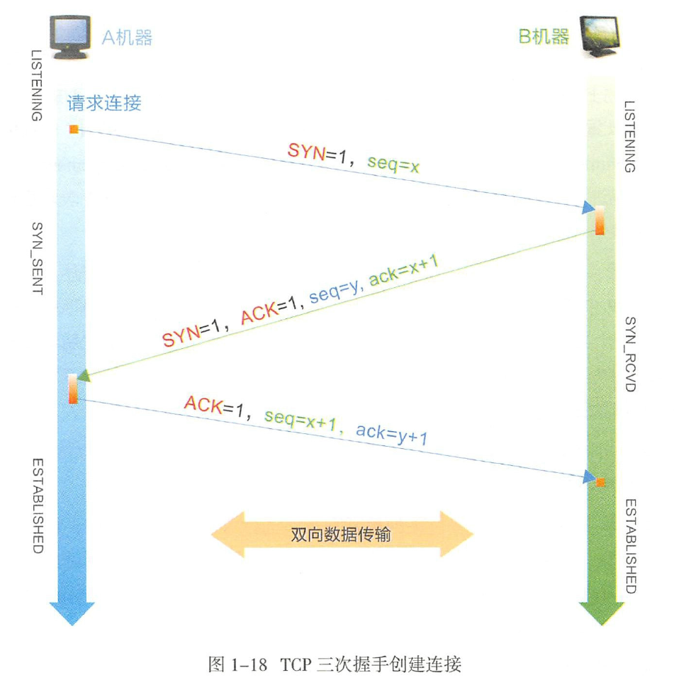
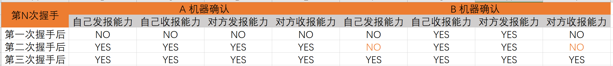
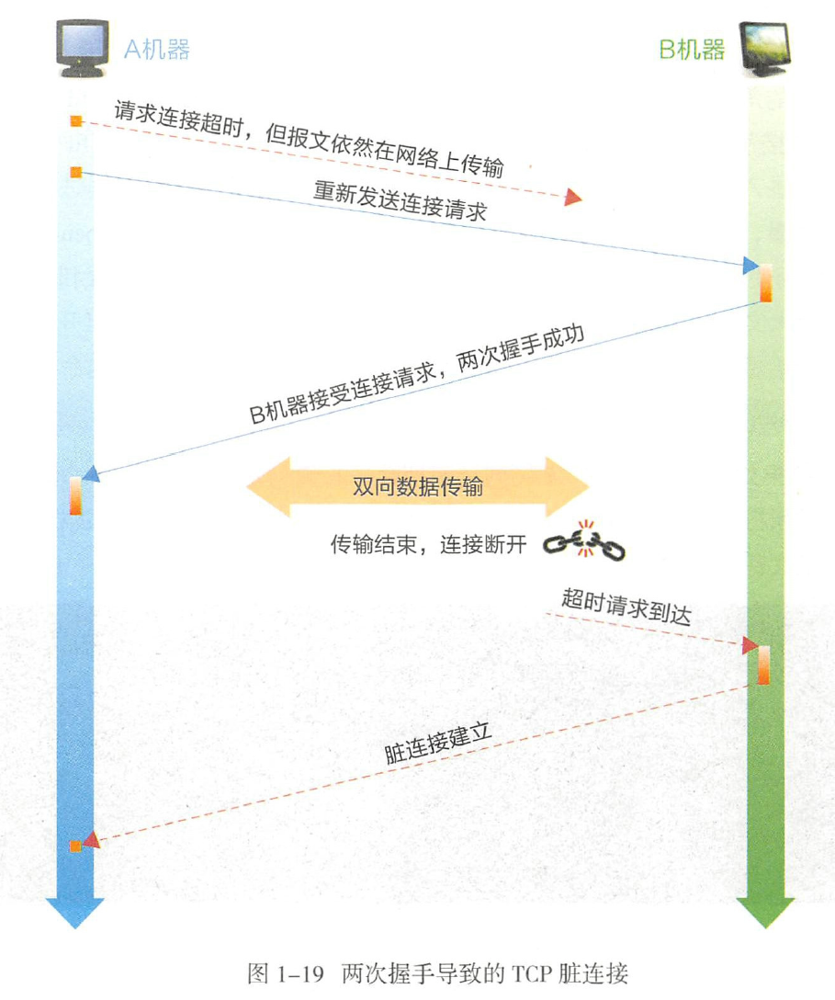
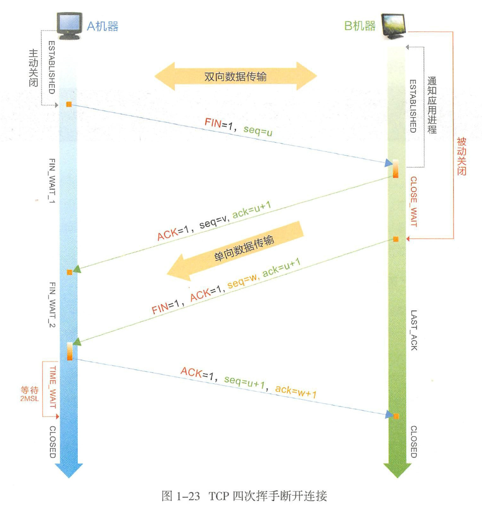

# TCP / IP三次握手四次挥手

> SYN : Sychronize Sequence Numbers
>
> ACK : Acknowledgement
>
> FIN : Finish

## 三次握手原理

图展示了正常情形下通过三次握手建立连接的过程。B 机器代表服务器端角色，A 机器是客户端角色，前者需要在后者发送连接建立请求时先打开某个端口等待数据传输，否则将无法建立正常连接。

三次握手指的是建立连接的三个步骤：

1. A 机器发送一个数据包并将 **SYN 置为 1，表示希望建立连接**。这个包中包含**随机序列 seq = x**；
2. B 机器收到 A 机器发过来的数据包后，通过 **SYN = 1** 得知这是一个建立连接的请求，于是发送一个响应包并将 **SYN 和 ACK 置为 1**。这个包中包含随机序列 **seq = y** ，而**确认序列 ack = x + 1**表示收到 A 机器发过来的 SYN。
3. A 机器收到 B 机器响应包后需要确认，确认包中将 **ACK 置为 1**，并将确认序列设置为 **seq = y + 1**，表示收到了来自 B 机器的 SYN。

## 为什么需要三次握手

有两个主要目的：信息对等和防止超时。

### 信息对等

先从信息对等角度来看，如表所示，双方只有确认 4 类信息，才能建立连接。

### 防止超时

建立连接三次握手也是为了防止超时导致脏连接。TTL 网络报文的生存时间往往都会超过TCP 请求超时时间，如果两次握手就可以创建连接，传输数据并释放连接后，第一个超时的连接请求才到达 B 机器的话， B 机器会以为 A 创建新连接的请求，然后确认同意创建连接。因为 A 机器的状态不是 SYN_SENT ，所以直接丢弃了 B 的确认数据，以致最后只是 B 单方面创建连接完毕。

## 四次挥手原理

> TIME_WAIT 和 CLOSE_WAIT 表示主动关闭和被动关闭产生的阶段性状态。
>
> 在 TIME_WAIT 等待的 2MSL 是报文在网络上生存的最长时间，超过阈值变将报文丢弃。

1. A 机器想要关闭连接，则需要等待本方数据发送完毕后，传递 FIN = 1 信号给 B 机器，A 机器进入 FIN_WAIT_1 状态。
2. B 机器应答 ACK ，告诉 A 机器可以断开，但是需要等 B 机器处理完数据，再主动给 A 机器发送 FIN 信号。这时， A 机器处于半关闭状态（ FIN_WAIT_2 ），无法再发送新的数据。
3. B 机器做好连接关闭前的准备工作后，发送 FIN = 1 信号给 A 机器，此时 B 机器也进入半关闭状态（ CLOSE_ WAIT）。
4. A 机器发送针对 B 机器 FIN 的 ACK 后，进入 TIME-WAIT 状态，经过 2MSL ( Maximum Segment Lifetime ）后，没有收到 B 机器传来的报文，则确定 B 机器已经收到 A 机器最后发送的 ACK 指令，此时 TCP 连接正式释放。

