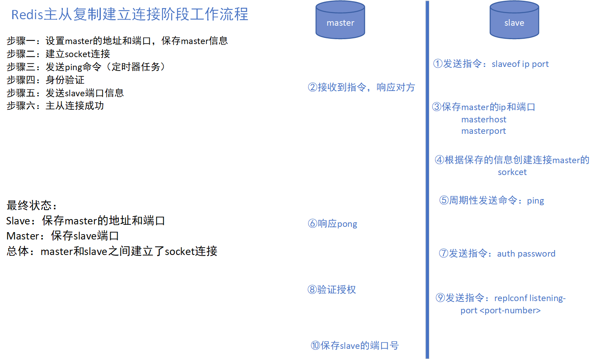
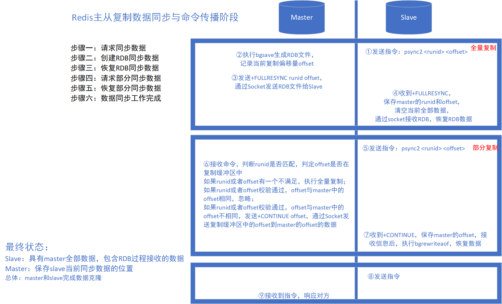

# Redis主从复制&哨兵&集群

## 前言

参考链接：https://www.bilibili.com/video/BV1CJ411m7Gc

## 主从复制工作流程



## 数据同步与命令传播阶段工作流程

复制缓冲区：又名复制积压缓冲区，是一个先进先出的队列，用于存储服务器执行过的命令，每次传播命令，master 都会讲传播的命令记录下来，并存储在复制缓冲区；



## 主从复制配置

* 方式一：通过 `slave` 的 `redis-cli` 客户端发送命令

  ```shell
  slaveof <masterip> <masterport>
  ```

* 方式二：启动服务器参数

  ```shell
  redis-server redis.conf --slaveof <masterip> <masterport>
  ```

* 方式三：在 slave 服务器配置文件(`redis.conf`)配置

  ```conf
  # 开启了该配置的Redis服务器在启动后成为从节点。
  slaveof <masterip> <masterport>
  # 连接建立阶段的身份验证
  masterauth <master-password>
  # 从节点是否只读；默认是只读的。由于从节点开启写操作容易导致主从节点的数据不一致，因此该配置尽量不要修改。
  slave-read-only yes
  ```

## 主从复制注意

### master 注意

1. 数据同步阶段应避免流量高峰期，避免造成 master 阻塞；

2. 复制缓冲区大小设置不合理，会导致数据溢出。如进行全量复制周期太长，进行部分复制时发现数据已经存在丢失的情况，必须进行二次全量复制，致使 slave 陷入死循环状态

   ```shell
   repl-backlog-size 1mb
   ```

3. master 单机内存占用主机内存比例不应过大，建议使用50% ~70%，留下 30%~50% 的内存用于执行 bgsave 命令和创建复制缓存区

### slave 注意

1. 为避免slave进行全量复制、增量复制时服务器响应阻塞或者数据不同步，建议关闭此期间的对外服务

   ```conf
   slave-serve-stale-data yes|no
   ```

2. 多个 slave 同时对 master 请求数据同步，master 发送的 RDB 文件增多，会对带宽造成巨大冲击；

3. slave 过多是，建议调整拓扑结构，由一主多从结构变为树状结构，中间的节点既是 master，也是 slave。注意使用树状结构时，由于层级深度，导致深度越高的 slave 与最顶层的 master 件数据同步延迟较大，数据一致性较差，应谨慎选择；

### 心跳阶段注意

当 slave 多数掉线，或者延迟过高时， master 为保障数据稳定性，将拒绝所有信息同步操作

```
# 当 slaves 小于 2 时不再写
min-slaves-to-write 2
#
min-slaves-max-lag 8
```

slave 数量有 slave 发送 REPLCONF ACK 命令做确认；

slave 延迟有 slave 发送 REPLCONF ACK命令做确认；

## 哨兵模式

主机宕机，需要从 slave 选举当 master

哨兵：是一个分布式系统，用于对主从结构的每台服务器进行监控，当出现故障时通过投票机制选择新的 master ，并将所有 slave 连接到新的 master；

### 哨兵作用

1. 监控：不断的检查 master 和 slave 是否正常运行，master 存活监测、master 与 slave 运行情况监测；
2. 通知：当被监控的服务器出现问题，向其他（哨兵间、客户端）发送通知；
3. 自动故障转移：断开 master 和 slave 连接，选取一个 slave 作为 master，将其他的 slave 连接到新的 master，并告知客户端新的服务器地址；

注意：哨兵也是一台redis服务器，只是不提供数据服务，通常哨兵配置数量为单数，一般3个起；

### 哨兵搭建

* 配置一拖二的主从结构

* 配置三个哨兵（参考 sentinel.conf）

* 启动哨兵

  ```shell
  redis-sentinel sentinel.conf
  # 进入 sentinel 服务器
  ./redis-cli -h 127.0.0.1 -p 26379
  ```

***需要开放对应的端口***

### 哨兵配置说明

```conf
# 端口，通常默认为 26379
port 26379
# 后台启动
daemonize yes
# pid 目录
pidfile /var/run/redis-sentinel.pid
# 日志目录/日志文件名
logfile /usr/local/redis/bin/logs/log-sentinel.log
loglevel debug
# 工作目录
dir /tmp
# 监控master，quorum（设置哨兵数/2 + 1，即多少哨兵认为 master 宕机）
sentinel monitor <master-name> <ip> <redis-port> <quorum>
# master 权限认证
sentinel auth-pass <master-name> <password>
# 认定连接 master 多少时间，认定 master 宕机
sentinel down-after-milliseconds <master-name> <milliseconds>
# 新master，一次有多少slave开始同步
sentinel parallel-syncs <master-name> <numreplicas>
# 多长时间同步完成算是同步有效，多长时间同步算超时
sentinel failover-timeout <master-name> <milliseconds>
```

多个哨兵启动的时候会修改哨兵的配置文件

### 哨兵工作原理

#### 阶段一：监控阶段

* 获取各个 sentinel 的状态（是否在线）
* 获取 master 的状态
  * master 属性：runid、role（master）
  * 各个 slave 的详细信息
* 获取所有 slave 的状态（根据master中的slave信息）
  * slave 属性：runid、role（slave）、master_host、master_port、offset

#### 阶段二：通知阶段

* 保持连通

#### 阶段三：故障转移阶段

* 发现问题
* 竞选负责人
* 优选新 master
* 新 master 上任，其他 slave 切换 master，原 master 作为 slave 故障回复后连接；

## 集群*

### 集群搭建

#### 配置文件

```conf
# 启动集群
cluster-enabled yes
#
cluster-config-file nodes-6379.conf
# 
cluster-node-timeout 15000
# 集群下密码设置，每个节点密码需要一致
masterauth redis#$%
requirepass redis#$%
```

#### 执行命令配置

```shell
# --replicas 1 表示一个 master 连接 1 个 slave，创建成功后会自动分配主从关系；后面的redis地址数量需要和配置master和slave的数量一致，-a 后面是redis密码
./redis-cli --cluster create 192.168.8.26:6379 192.168.8.27:6379 192.168.8.28:6379 192.168.8.29:6379 192.168.8.30:6379 192.168.8.31:6379 --cluster-replicas 1 -a redis#$%
```

#### 客户端访问

```shell
./redis-cli -c -h 192.168.8.27 -p 6379
```

## 缓存预热

## 缓存雪崩

* 在一个较短时间内，缓存中较多的key集中过期
* 大量请求访问过期数据，redis 为命中，redis 向数据库获取数据，数据库接收大量请求而无法处理
* Redis 大量请求被积压，出现超时现象
* 数据库流量激增，数据库崩溃
* Redis 服务器资源严重被占用，Redis 服务器崩溃
* Redis 集群呈现崩溃，集群瓦解

### 根源

短时间内大量的key集中过期

### 解决方案

* 页面静态化
* 多级缓存架构（cdn缓存+nginx缓存+redis缓存+服务缓存）
* 数据库读写优化
* 灾难预警机制：监控CPU占用和使用率、内存容量
* 限流
* 降级
* 超热数据使用永久 key
* 使用 LRU和 LFU缓存算法

> - LRU (Least recently used) 最近最少使用，如果数据最近被访问过，那么将来被访问的几率也更高。
> - LFU (Least frequently used) 最不经常使用，如果一个数据在最近一段时间内使用次数很少，那么在将来一段时间内被使用的可能性也很小。
> - FIFO (Fist in first out) 先进先出， 如果一个数据最先进入缓存中，则应该最早淘汰掉。

## 缓存击穿

### 根源

单个key访问量巨大

### 特征

1. Redis 中某个 key 过期，该 key 访问量巨大
2. 多个数据请求服务器直接压到 Redis 后，均为命中
3. Redis 在短时间内发起大量对数据库中同一数据的访问

### 解决方案

1. 预先设定（预先缓存）
2. 现场调整（可以暂时设置为永久数据）
3. 定时刷新数据到缓存中
4. 二级缓存

## 缓存穿透

### 特征

* Redis 中大面积出现未命中数据
* 出现非正常 URL 访问

### 解决方案

1. 白名单策略
2. 布隆过滤（先查看key是否在缓存，在获取缓存）
3. key 加密


