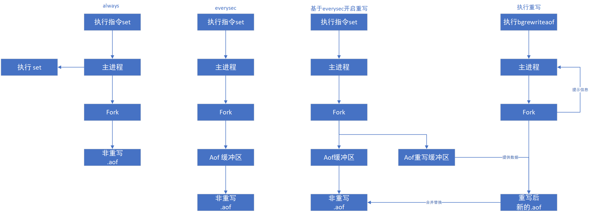
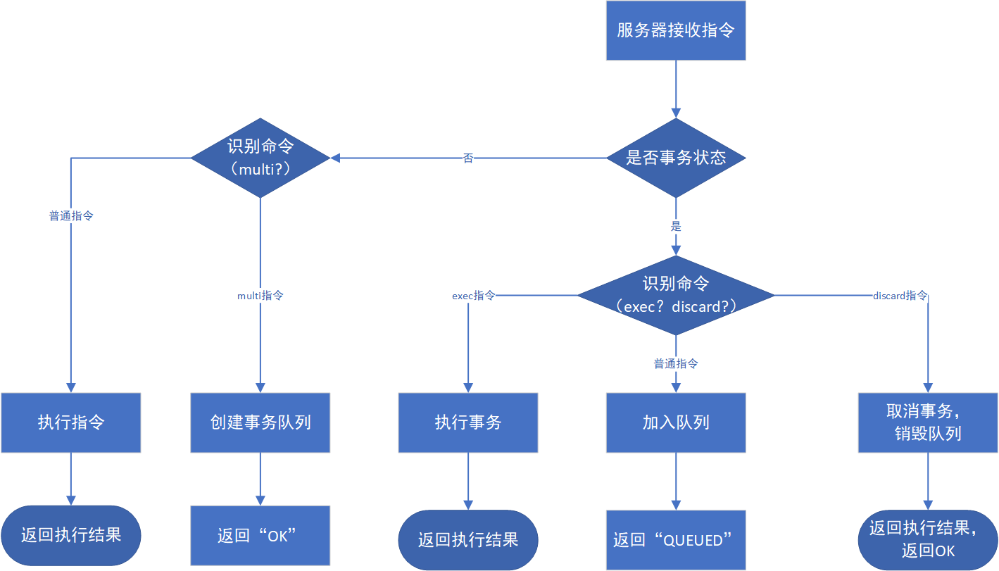

# Redis学习笔记

## 前言

博客书

版本说明

```properties

```

相关链接：

* https://www.bilibili.com/video/BV1CJ411m7Gc

## Redis6 新特性


## Redis 操作结果

①数据操作不成功的反馈与数据正常操作之间的差异

1. 表示运行结果是否成功
   * （integer）0 ----> false 失败
   * （integer）1 ----> true 成功
2. 表示运行结果值
   * （integer）3 ----> 3 
   * （integer）1 ----> 1

②数据为获取到

1. nil ----> 等同于 null

③数据最大存储量

1. 512MB

## Redis 类型操作

### String 操作

```shell
# 添加/修改数据
set key value
# 获取数据
get key
# 删除数据
del key

# 添加/修改多个数据
mset key1 value1 key2 value2 ...
# 获取多个数据
mget key1 key2 ...
# 获取数据字符个数（字符串长度）
strlen key
# 追加信息到原始信息后部（如果原始信息存在就追加，否则新建）
append key value

# 设置数值数据增加指定范围的值
# (incr key 使用key对应的value加1)
incr key
incrby key increment
incrbyfloat key increment
# 设置数值数据减少指定范围的值
decr key
decr key increment
# 备注： String 在 Redis 内部存储默认是一个字符串，当遇到增加类型操作 incr/decr 时会转换数值型进行计算。

# 设置数据具有指定的生命周期时间
setex key seconds value
psetex key milliseconds value
```

### Hash 操作

> hash 类型下的 value 只能存储字符串，不允许存储其他数据类型，不存在嵌套现象。如果数据获取不到，对应值为 nil ；
>
> 每个 hash 可以存储 2^32 -1 个键值对；
>
> hash 类型十分贴近对象的数据存储形式，并且可以灵活添加删除对象属性。但 hash 设计初衷不是为了存储大量对象而设计的，切记不可滥用，更不可以将 hash 作为对象列表使用；
>
> hgetall 操作可以获取全部属性，如果内部 field 过多，遍历整体数据效率会降低。

```shell
# 添加/修改数据
hset key field value
# 获取数据
hget key field
hgetall key
# 删除数据
hdel key field1 field2 ...

# 添加/修改多个数据
hmset key field1 value1 field2 value2 ...
# 获取多个数据
hmget key field1 field2
# 获取哈希表中字段的数据量
hlen key
# 获取哈希表中是否存在指定的字段
hexists key field

# 获取哈希表中所有的字段名或者字段值
hkeys key
hvals key
# 设置指定字段的数值数据增加指定范围的值
hincrby key field increment
hincrbyfloat key field increment
```

### List 操作

> * 数据存储需求：存储多个数据，并对数据进入存储空间的顺序进行区分；
> * 需求的存储结构：一个存储空间保存多个数据，且通过数据可以体现进入顺序；
> * list 类型：保存多个数据，底层使用双向链表存储结构实现；

```shell
# 添加/修改数据，lpush 左插入（头插入），rpush 右插入（尾插入）
lpush key ele1 ele2 ...
rpush key ele1 ele2 ...
# 获取数据，索引最后一个为 -1
lrange key startIndex stopIndex
lindex key index
llen key
# 获取并移除数据，lpop 左边出（头出），rpop 右边出（尾出）
lpop key
rpop key

# 规定时间内获取并移除数据：如果key对没有对应的值，一直等待 timeout 秒后返回；如果存在值，获取并移除数据
blpop key1 key2 ... timeout
brpop key1 key2 ... timeout

# 移除指定数据(count 删除几个， ele 要删除的元素)
lrem key count ele
```

### Set 操作

> * 存储大量的数据，在查询方面提供更高的效率；
> * 能够保存大量的数据，高效的内部存储机制，便于查询；

```shell
# 添加数据
sadd key member1 member2 ..
# 获取全部数据
smembers key
# 删除数据
srem key member1 member2 ...

# 获取集合数总量
scard key
# 判断集合中是否包含指定数据
sismember key member

# 随机获取集合中指定数量的数据
srandmember key [coount]
# 随机获取集合中的指定数据并将该数据移出集合
spop key [count]

# 求集合的交集、并集、差集（以第一个集合为基础求差集）
sinter key1 key2 ...
sunion key1 key2 ...
sdiff key1 key2 ...

# 求集合的交集、并集、差集并且存储到指定集合中（destination 表示存储的集合key）
sinterstore destination key1 key2 ...
sunionstore destination key1 key2 ...
sdiffstore destination key1 key2 ...
```

### SortedSet 操作

> 数据排序有利于数据的有效展示；
>
> 新的存储模型，可以保存可排序的数据；
>
> 在set的存储结构基础上添加可排序的字段；

```shell
# 添加(scores是float类型)
zadd key (scores是float类型) member1 score2 member2 ...
# 获取全部数据
zrange key startIndex stopIndex
zrevrange key startIndex stopIndex
# 删除数据
zrem key member1 member2 ...

# 按条件获取数据
zrangebyscore key min max 
zrevrangebyscore key max min
# 按条件删除
zremrangebyrank key startIndex stopIndex
zremrangebysocre key min max

# 获取集合数据总量
zcard key
zcount key min max
# 集合交集、并集操作(destination表示存储的集合，numkeys表示集合的个数)
zinterstore destination numkeys key1 key2 ...
zunionstore destination numkeys key1 key2 ...
```

### 通用命令

#### key 相关

* 对于 key 自身状态的相关操作，例如：删除，判定存在，获取类型等；
* 对于 key 有效性控制相关操作，例如：有效期设定，判定是否有效，有效状态的切换等；
* 对于 key 快速查询操作，例如：按指定策略查询 key；

```shell
# 删除指定的 key
del key
# 获取 key 是否存在
exists key
# 获取 key 对应值的类型
type key

# 设置key的有效期
expire key seconds
pexpire key milliseconds
expireat key timestamp
pexpireat key milliseconds-timestamp

# 获取 key 的有效时间
ttl key
pttl key

# 切换 key 从时效性转换为永久性
persist key

# 为key改名（rename 如果newkey存储会覆盖，renamex如果newkey存储不能修改）
rename key newkey
renamex key newkey
# 其他key通用操作
help @generic
```

keys 查询规则

```shell
# 查询 key
keys pattern
```

* \* ：匹配任意数量的任意字符；
* ? ：匹配一个任意字符；
* [] ：匹配一个指定字符；

#### 数据库操作

```shell
# 切换数据库
select dbIndex
# 
quit
ping
echo message
# 数据移动
move key dbIndex
# 数据清除（dbsize当前数据库的key数量，flushdb清空当前数据库数据，flushall清空所有数据库数据）
dbsize
flushdb
flushall
```

## 持久化

> RDB ：数据的快照
>
> AOF ：数据操作过程

### RDB

#### 优缺点

> 优点：
>
> 1. RDB 是一个紧凑压缩的二进制文件，存储效率较高；
> 2. RDB 内部存储的是 redis 在某个时间点的数据快照，非常适用于数据备份，全量复制等场景；
> 3. RDB 恢复数据的速度要比AOF快的多；
> 4. 应用：服务器中每 X 小时执行 bgsave 备份，并将 RDB 文件拷贝到远程机器中，用于灾难恢复。
>
> 缺点：
>
> 1. RDB 方式无论是执行指令还是利用配置，无法做到实时持久化，具有较大的可能性丢失数据；
> 2. bgsave 指令每次运行要执行 fork 操作创建子进程，要牺牲掉一些性能；
> 3. 存储数据量较大时，效率低；
> 4. 大数据量下的 IO 性能较低；

#### save

```shell
# 持久化命令，保存到 data 目录的 dump.rdb 文件中
save
```

> 注意：save 指令的执行会阻塞当前 redis 服务器，直到当前 RDB 过程完成为止，有可能会造成长时间阻塞，线上环境不建议使用；

在 redis.conf 配置文件配置

```conf
# dbfilename dump.rdb
# 设置 RDB 文件名，默认为 dump.rdb，通常设置 dump-端口号.rdb

# dir
# 设置rdb存储文件路径

# rdbcompression yes
# 设置存储时是否压缩，默认为 yes

# rdbchecksum yes
# 设置是否进行 RDB 文件格式校验，读写过程中都需要校验
```

#### bgsave

```shell
# 后台执行保存操作
bgsave
```

> bgsave 命令是针对 save 阻塞问题的优化。redis 内部所有涉及到 rdb 操作都采用 bgsave 的方式；

在 redis.conf 配置文件配置

```conf
# dbfilename dump.rdb
# 设置 RDB 文件名，默认为 dump.rdb，通常设置 dump-端口号.rdb

# dir
# 设置rdb存储文件路径

# rdbcompression yes
# 设置存储时是否压缩，默认为 yes

# rdbchecksum yes
# 设置是否进行 RDB 文件格式校验，读写过程中都需要校验

# stop-writes-on-bgsave-error yes
# 后台存储过程中如果出现错误现象，是否停止保存操作，默认为开启状态
```

#### redis 自动执行 bgsave

需要在 redis.conf 配置文件中配置

```conf
# dbfilename dump.rdb
# 设置 RDB 文件名，默认为 dump.rdb，通常设置 dump-端口号.rdb

# dir
# 设置rdb存储文件路径

# rdbcompression yes
# 设置存储时是否压缩，默认为 yes

# rdbchecksum yes
# 设置是否进行 RDB 文件格式校验，读写过程中都需要校验

# stop-writes-on-bgsave-error yes
# 后台存储过程中如果出现错误现象，是否停止保存操作，默认为开启状态

# save second changes
# 作用：满足限定时间范围内key的变化数量达到指定数量即进行持久化（save配置原理，只要对数据产生影响，并不会对新旧数据作对比）
```

#### RDB 特殊的启动形式

```shell
# 全量复制，在服务器运行过程中重启
debug reload
# 全量复制，在关闭服务器时指定保存数据
shutdown save
```

#### save 和 bgsave 差异

|     方式     | save 指令 | bgsave指令 | bgsave配置 |
| :----------: | :-------: | :--------: | :--------: |
|     读写     |   同步    |    异步    |    异步    |
|  阻塞客户端  |    是     |     否     |     否     |
| 额外内存消耗 |    否     |     是     |     是     |
|  启动新进程  |    否     |     是     |     是     |

### AOF

> AOF (Append Only File)：以独立日志的方式记录每次写命令，重启时重新执行 AOF 文件中命令达到恢复数据的目的。
>
> AOF 的主要作用是解决了数据持久化的实时性；

#### AOF 写数据的三种策略

1. always（每次）：每次写入操作均同步到 AOF 文件中，数据零误差，性能较低；
2. everysec（每秒）：每秒将缓冲区中的指令同步到 AOF 文件中，数据准确性较高，性能较高；在系统突然宕机的情况下丢失 1 秒内的数据；
3. no （系统控制）：由操作系统控制每次同步到 AOF 文件的周期，整体过程不可控；

#### AOF 功能开启配置

```conf
# 作用：是否开启 aof 持久化功能，默认为不开启
# appendonly yes|no

# 作用：配置 aof 文件名，建议配置 appendonly-端口号.aof
# appendfilename "appendonly.aof"

# 作用：配置 aof 写数据的策略
# appendsync alwsays|everysec|no


## 自动重写触发条件设置
# 自动重写的百分比
auto-aof-rewrite-percentage 100
# 自动重写的最小大小
auto-aof-rewrite-min-size 64mb
```

#### AOF 重写

随着命令的不断写入 AOF，文件会越来越大，为了解决这个问题。Redis 引入了 AOF 重写机制压缩文件体积。AOF 文件重写是将 Redis 进程内的数据转化写命令同步到新 AOF 文件的过程中。简单来说，就是将对统一数据的若干条命令执行结果转化为最终结果数据对应的指令进行记录。

#### 作用

1. 降低磁盘占用量，提高磁盘利用率；
2. 提高持久化效率，降低持久化写时间，提高 IO 性能；
3. 降低数据恢复用时，提高数据恢复效果；

#### 规则

1. 进程内已经超时的数据不在写入文件；
2. 忽略无效命令，重写时使用进行内数据直接生成，这样新的 AOF 文件只保留最终数据的写入命令；
3. 对同一数据的多条写入合并为一条命令；

#### AOF 重写工作原理



### RDB 与 AOF

|  持久化方式  |        RDB         |        AOF         |
| :----------: | :----------------: | :----------------: |
| 占用存储空间 | 小（数据级：压缩） | 大（指令级：重写） |
|   存储速度   |         慢         |         快         |
|   恢复速度   |         快         |         慢         |
|  数据安全性  |     会丢失数据     |    根据策略决定    |
|   资源消耗   |     高/重量级      |     低/轻量级      |
|  启动优先级  |         低         |         高         |

### RDB 与 AOF 的选择

1. 对数据非常敏感，建议使用默认的 AOF 持久化方案
   * AOF 持久化策略使用 everysecond ，每秒钟 fsync 一次，该策略 redis 仍可以保持很好的处理性能，当出现问题时，最有丢失 0-1 秒内的数据；
   * 注意：由于 aof 文件存储体积较大，但恢复速度较慢；
2. 数据呈现阶段有效性，建议使用 RDB 持久化方案
   * 数据可以良好的做到阶段内无丢失，且恢复速度较快，阶段数据恢复通常采用 RDB 方案；
   * 注意：利用 RDB 实现紧凑的数据持久化会使用 Redis 降的很低；
3. 综合对比
   * RDB 与 AOF 的选择实际上是在做一种权衡，每种都有利有弊；
   * 如不能承受数分钟以内的数据丢失，对业务数据非常敏感，选择使用 AOF；
   * 如能承受数分钟以内的数据丢失，但追求大数据集的回复速度，选用 RDB；
   * 灾难恢复选用 RDB；
   * 双保险策略，同时开启 RDB 和 AOF，重启后，Redis 优先使用 AOF 来恢复数据，降低丢失数据的量；

## Redis 事务

```shell
# 开启事务，设置事务的开启位置，此指令执行后，后续的所有指令均加入到事务中
multi
# 执行事务，设定事务的结束位置，同时执行事务，与 multi 成对出现，成对使用
exec
# 取消事务
discard
```

注意：加入事务的命令暂时进入任务队列中，并没有立即执行，只有执行 exec 命令才开始执行；

### 事务的工作流程



### 锁（不推荐）

基于特定条件的事务进行——锁

```shell
# 对 key 添加监视锁，在执行 exec 前如果key发生了变化，终止事务执行
watch key1 key2 ...
# 取消对所有 key 的监视
unwatch
```

### 分布式锁

```shell
# 使用 setnx 设置一个公共锁
setnx lock-key vlaue
```

利用 setnx 命令的返回值特征，有值则返回设置失败，无值则返回设置成功

* 对于返回设置成功的，拥有控制权，进行下一步的具体业务操作；操作完毕通过 del 操作释放锁；
* 对于返回设置失败的，不具有控制权，排队或者等待；

### 死锁解决方案

```shell
# 使用 expire 为锁设置过期时间（加锁和设置锁过期时间应该设置为一个事务内）
expire lock-key second
pexpire lock-key milliseconds
```

## 删除策略

Redis 是一种内存级数据库，所有的数据均存放在内存中，内存中数据可以通过 TTL 指令获取其状态

* XX ：具有时效性的数据
* -1 ： 永久有效的数据
* -2 ： 已经过期的数据 或者 被删除的数据 或者 未定义的数据


1. 定时删除：
2. 惰性删除：
3. 定期删除（周期性）：

## 配置说明

```conf
# 设置服务器以守护进程的方式运行
daemonize yes|no
# bind 127.0.0.1 允许哪些地址可以远程登录访问，以空格为分隔符
bind 127.0.0.1 192.168.8.1
# 服务器端口设置
port 6379
# 设置数据库数量
databases 16

# 日志级别
loglevel debug|verbose(默认)|notice(生产建议)|warning
# 日志记录路径/文件名
logfile "/usr/local/redis/bin/logs/redis-6379.log"

# 设置同一时间最大客户端连接数，默认无限制。（0是无限制）
maxclients 10000
# 客户端闲置等待最大时长，达到最大值后关闭连接(0是无限制)
timeout 300

# 导入并加载指定配置文件信息，用于快速创建redis公共配置较多的redis实例配置文件，便于维护
include /usr/local/redis/bin/redis.conf
```

## 高级数据类型

* Bitmaps
* HyperLogLog
* GEO

### bitmaps

```shell
# 获取指定key对应偏移量上的bit值
getbit key offset
# 设置指定key对应偏移量闪的bit值，value只能是0或者1
setbit key offset value

# 对指定key按位进行交、并、非、异或操作，并将结果保存在 destKey 中。（op：and、or、not、xor）
bitop op destKey key1 key2 ...
# 统计指定key中1的数量
bitcount key startOffset endOffset
```

### HyperLogLog

> 用于基数统计，即统计不重复的数据的数量；只记录数量而不是具体数据；
>
> 核心是基数估算算法，最终值存在一定误差，误差范围：带有0.81%标准错误的近似值；
>
> 耗空间极小，每个 HyperLogLog 占用最多12k的内存；
>
> HyperLogLog 合并后，直接占用 12K 内存；
>
> LogLog算法
>
> HyperLogLog算法

```shell
# 添加数据
pfadd key ele1 ele2 ...
# 统计数据
pfcount key1 key2 ...
# 合并数据
pfmerge destKey sourceKey1 sourceKey2 ...
```

### GEO

> 地理位置的计算

```shell
# 添加坐标点
geoadd key longitude1 latitude1 member1 longitude2 latitude2 member2 ...
# 获取坐标点
geopos key member1 member2 ...
# 计算坐标点距离(m米，km千米)
geodist key member1 member2 [m|km|ft|mi]

# 根据坐标求范围内的数据（radius：半径值）
georadius key longitude latitude radius m|km|ft|mi [WITHCOORD] [WITHDIST] [WITHHASH] [COUNT count] [ASC|DESC] [STORE key] [STOREDIST key]
# 根据点求范围内数据
georadiusbymember key member radius m|km|ft|mi [WITHCOORD] [WITHDIST] [WITHHASH] [COUNT count] [ASC|DESC] [STORE key] [STOREDIST key]
# 获取指定定对应的坐标hash值
geohash key member [member ...]
```


