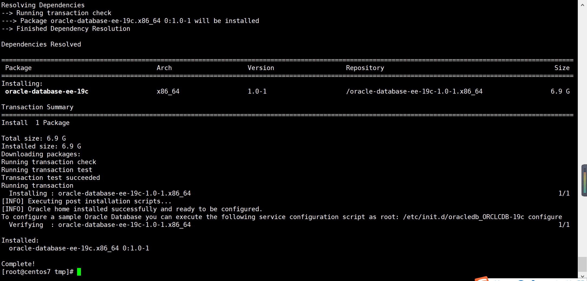
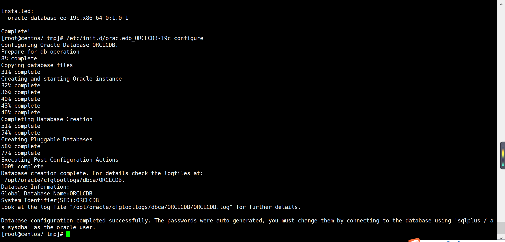
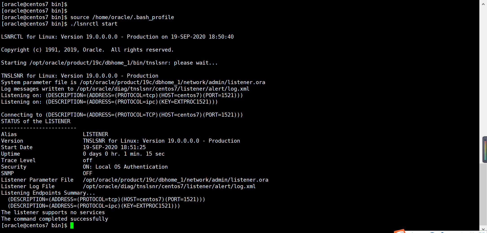
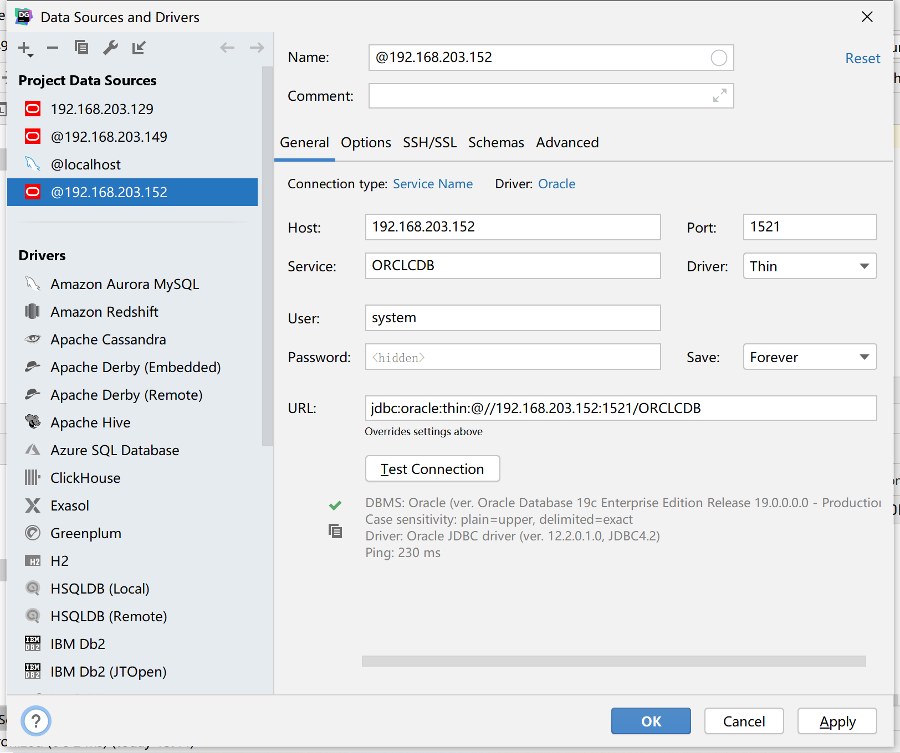

# CentOS7安装Oracle

## 前言

版本说明

```properties
oracle-database-ee=19c-1.0-1.x86_64.rpm
```

相关链接：

* oracle 下载地址：https://www.oracle.com/database/technologies/oracle-database-software-downloads.html
* 官方安装教程：https://docs.oracle.com/en/database/oracle/oracle-database/19/ladbi/running-rpm-packages-to-install-oracle-database.html#GUID-BB7C11E3-D385-4A2F-9EAF-75F4F0AACF02
* compat-libstdc++-33 下载地址：http://www.rpmfind.net/linux/rpm2html/search.php?query=compat-libstdc++-33
* compat-libcap1 下载地址：http://rpmfind.net/linux/RPM/centos/7.8.2003/x86_64/Packages/compat-libcap1-1.10-7.el7.x86_64.html

## 安装

### 前置安装

* compat-libstdc++-33 下载地址：http://www.rpmfind.net/linux/rpm2html/search.php?query=compat-libstdc++-33
* compat-libcap1 下载地址：http://rpmfind.net/linux/RPM/centos/7.8.2003/x86_64/Packages/compat-libcap1-1.10-7.el7.x86_64.html

```shell
curl -o  compat-libstdc++-33-3.2.3-72.el7.i686.rpm http://www.rpmfind.net/linux/centos/7.8.2003/os/x86_64/Packages/compat-libstdc++-33-3.2.3-72.el7.i686.rpm
curl -o compat-libcap1-1.10-7.el7.x86_64.rpm  http://rpmfind.net/linux/centos/7.8.2003/os/x86_64/Packages/compat-libcap1-1.10-7.el7.x86_64.rpm
yum localinstall -y compat-libcap1-1.10-7.el7.x86_64.rpm
yum localinstall -y compat-libstdc++-33-3.2.3-72.el7.i686.rpm
```

### Oracle 预安装

* oracle-database-preinstall 下载地址：https://yum.oracle.com/repo/OracleLinux/OL7/latest/x86_64/

打开下载网址，搜索 `oracle-database-preinstall` 并下载

```shell
curl -o oracle-database-preinstall-19c-1.0-1.el7.x86_64.rpm https://yum.oracle.com/repo/OracleLinux/OL7/latest/x86_64/getPackage/oracle-database-preinstall-19c-1.0-1.el7.x86_64.rpm
yum -y localinstall oracle-database-preinstall-19c-1.0-1.el7.x86_64.rpm
```

### 安装 Oracle

* oracle 下载地址：https://www.oracle.com/database/technologies/oracle-database-software-downloads.html

下载 oracle 安装后，上传到 `temp` 目录下，执行操作

```shell
cd /temp
yum -y localinstall oracle-database-ee-19c-1.0-1.x86_64.rpm
```



### 初始化

```shell
# 注意需要很长的时间创建 oracle 实例
/etc/init.d/oracledb_ORCLCDB-19c configure
```



### 配置Oracle环境

编辑 `/home/oracle/.bash_profile`  配置文件，添加如下内容，

重新加载配置文件（`source /home/oracle/.bash_profile`）

```
export  ORACLE_BASE=/opt/oracle
export  ORACLE_HOME=/opt/oracle/product/19c/dbhome_1
export  ORACLE_SID=ORCLCDB
export  PATH=$ORACLE_HOME/bin:$PATH:$HOME/.local/bin:$HOME/bin
export  LD_LIBRARY_PATH=$ORACLE_HOME/lib:/usr/lib
export  NLS_LANG=AMERICAN_AMERICA.UTF8 
```

修改 oracle 用户的密码

```shell
passwd oracle
```

切换 oracle 用户登录 Oracle 数据库

```shell
su oracle
sqlplus / as sysdba
```

登录用户名选择：`sys as sysdba` ，密码：`change_on_install`

修改 `system` 密码

```sql
SQL> password system
```

### 启动1521端口监听

使用 oracle 用户，启动1521端口监听

```shell
su oracle
# 进入 $ORACLE_HOME/bin 目录下
cd /opt/oracle/product/19c/dbhome_1/bin
# 重新加载配置
source /home/oracle/.bash_profile
# 启动1521端口监听
./lsnrctl start

# 命令
./lsnrctl stop
./lsnrctl start
./lsnrctl status
```



### 连接测试

使用 DataGrip 连接，`service_name=ORCLCDB` ，`User=system` ，密码是自己设置的，如图：



