# Oracle数据库下载与安装（Windows）

## 前言

版本说明

```properties
oracle=19.3
windows=10
linux.centos=8
```

相关链接：

* Oracle 官网：https://www.oracle.com/
* Oracle 数据库地址： https://www.oracle.com/database/technologies/
* Oracle 官方安装教程：https://apexapps.oracle.com/pls/apex/f?p=44785:52:15605902940550:SET_SESSION_SCREEN_READER_ON

## 安装

### 解压并安装

将下载的 Oracle ZIP 安装包进行解压，双击 setup ，开始进行安装

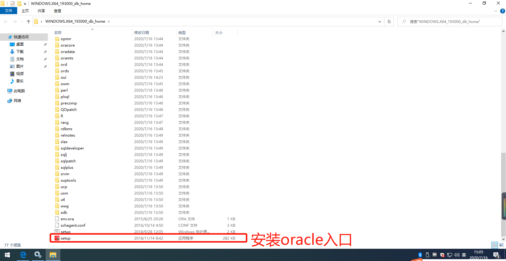

### 安装时的配置

选择创建并配置单实例数据库

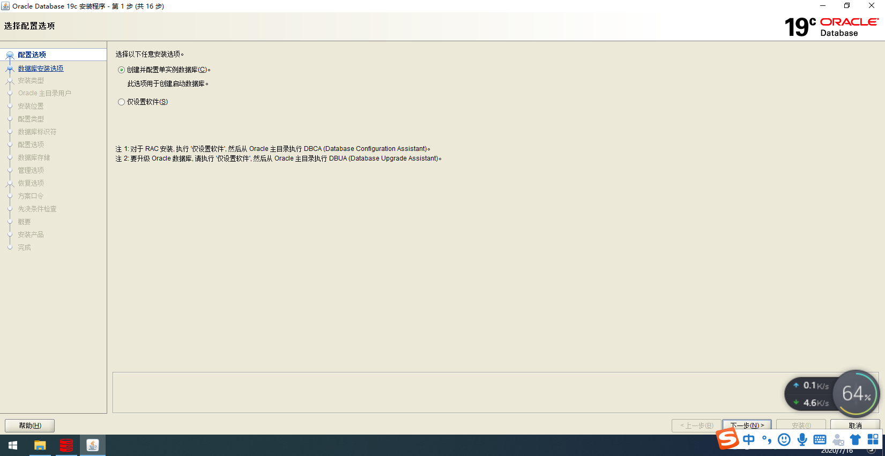

选择桌面类或者服务器类（示例选择桌面类）

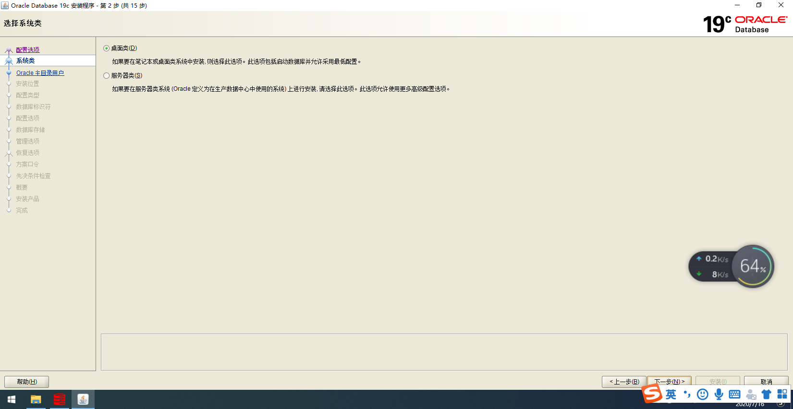

选择账户配置（示例选择虚拟账户）

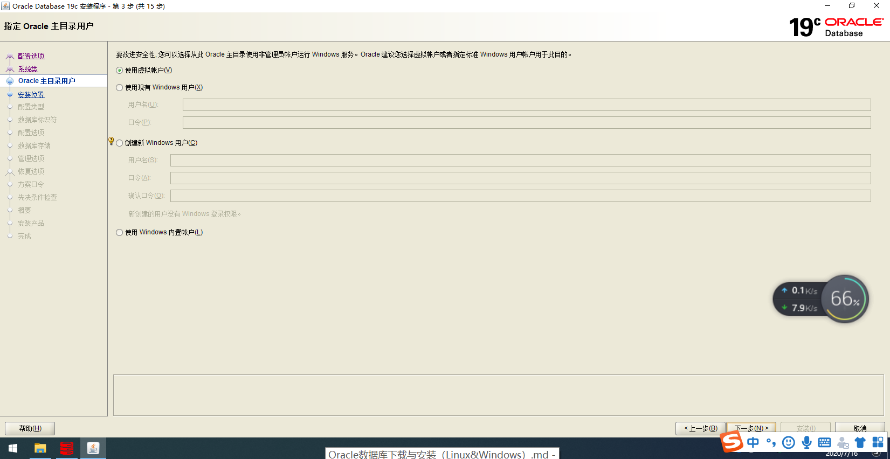

选择 oracle 安装目录和数据目录，并配置全局数据库名称（示例：orcl）和口令

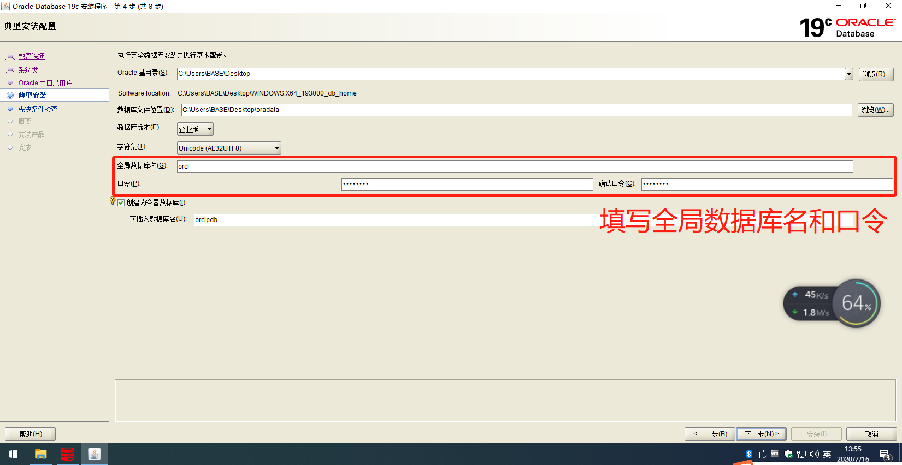

点击安装（进行安装需要等待很长一段时间）

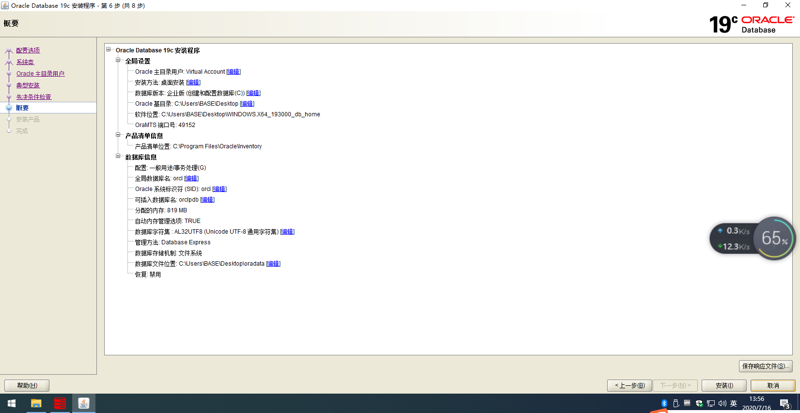

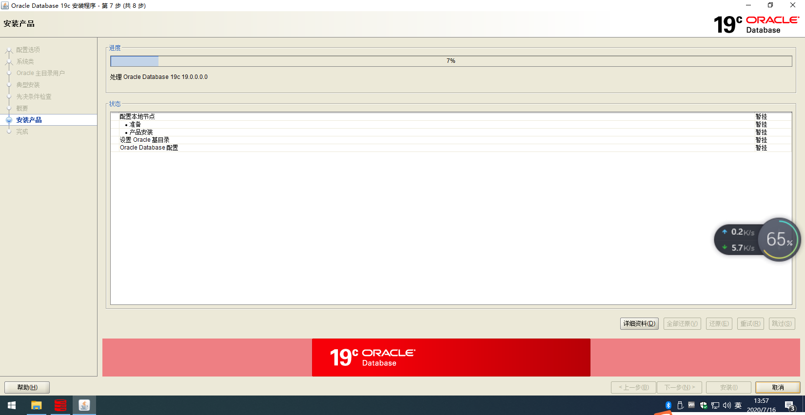

安装完成

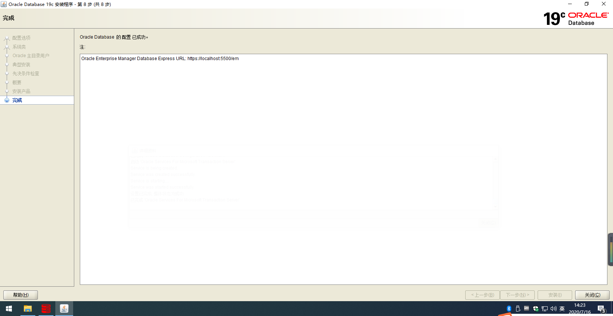

### 访问测试

注意：必须访问 https://localhost:5500/em 才能访问成功，HTTPS 协议，Username 是 `sys` ，密码是安装过程中设置的口令；Container Name 不用填写；

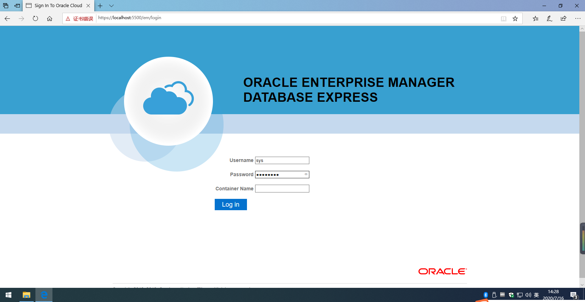

登录进去

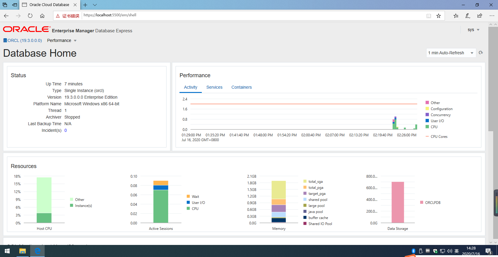

### 使用 DataGrip 连接

打开 `Net Configuration Assistant` ，选择 `监听程序配置` 

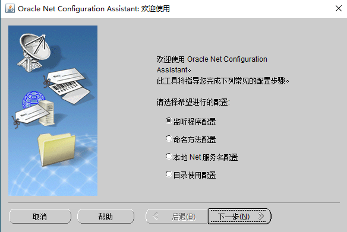

下一步选择删除，点击下一步退回第一步，选择添加，一直默认设置下一步即可，最后重启 Oracle 服务

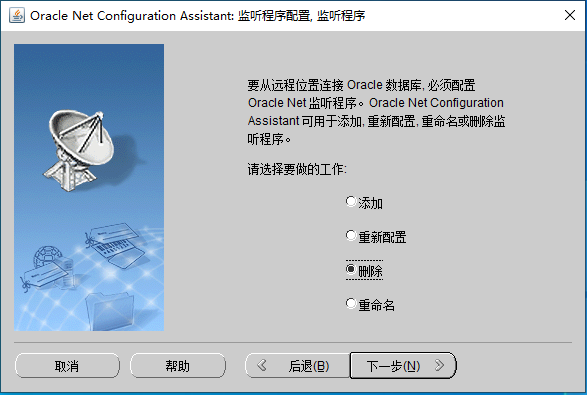

解决 `应当以 SYSDBA 身份或 SYSOPER 身份建立 SYS 连接` 问题

问题如下

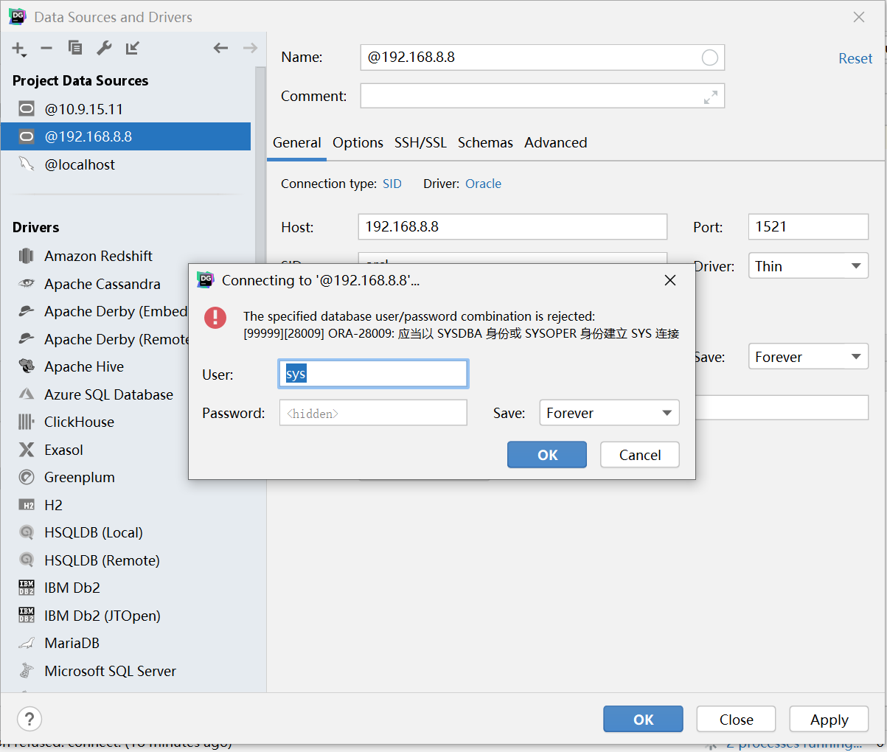

解决方案

将 Advanced 中 `internal_logon` 的值设置为 `sysdba`

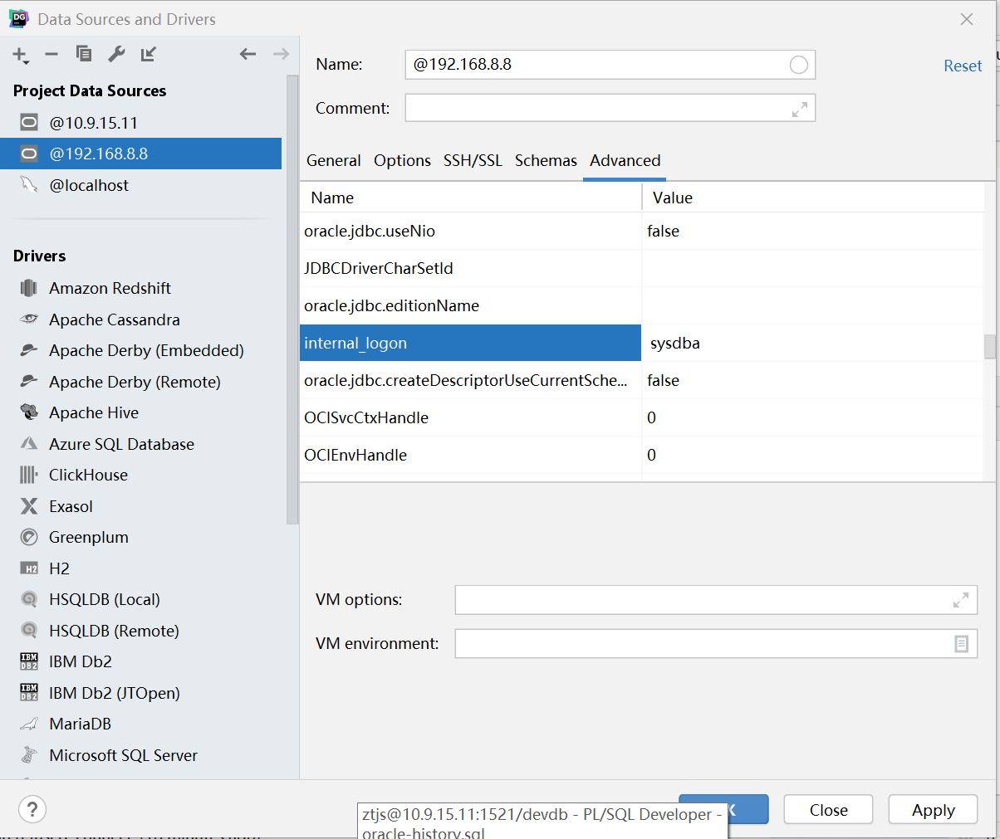

连接测试

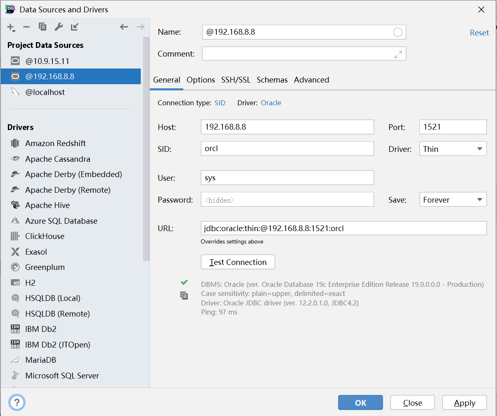


