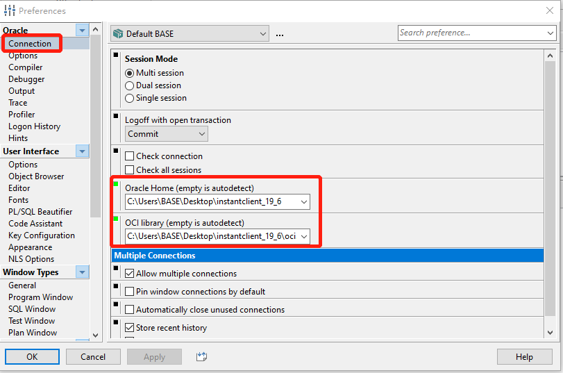
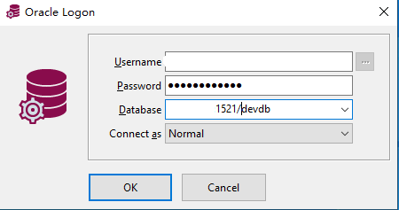
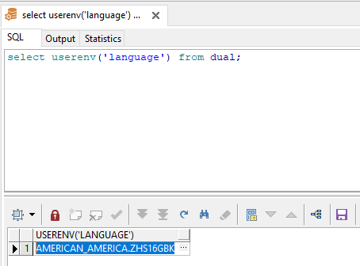
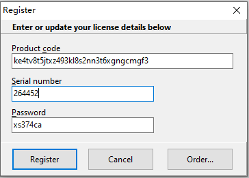
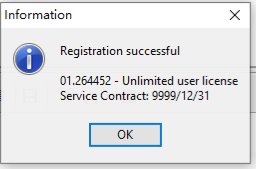
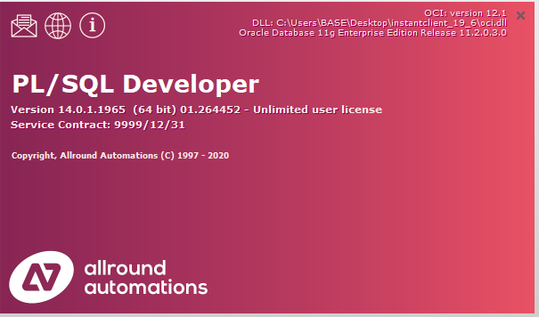

# PL/SQL 官方下载及安装

## 前言

版本说明

```properties
pl/sql=14.0.1.1965
```

相关链接：

* PL/SQL 官网：https://www.allroundautomations.com/
* PL/SQL 官方介绍：https://www.allroundautomations.com/products/pl-sql-developer/
* PL/SQL 官方下载链接：https://www.allroundautomations.com/try-it-free/
* Oracle Instant 官方下载地址：https://www.oracle.com/database/technologies/instant-client/downloads.html

## 下载并配置Oracle Instant Client

Oracle Instant 官方下载地址：https://www.oracle.com/database/technologies/instant-client/downloads.html

下载完后解压到本地目录，在主目录下添加两个文件：

**sqlnet.ora**，内容如下：

```
SQLNET.AUTHENTICATION_SERVICES= (NTS)
NAMES.DIRECTORY_PATH= (TNSNAMES, EZCONNECT)
```

**tnsnames.ora**，配置oracle链接，信息内容如下：

```
# 一般公司的前辈都会提供的
# 可配置多个本地实例。如下：
本地实例名 =
  (DESCRIPTION =
    (ADDRESS = (PROTOCOL = TCP)(HOST = 远程数据库IP地址)(PORT = 远程服务器端口号))
    (CONNECT_DATA =
      (SERVER = DEDICATED)
      (SERVICE_NAME = 远程数据库服务名)
    )
  )
```

配置 Windows 系统环境变量：

配置 Oracle Instant Client 的路径

```
变量名：TNS_ADMIN
变量值：C:\Users\BASE\Desktop\instantclient_19_6
```

## 安装plsql并配置oracle的连接参数

PL/SQL 官方下载链接：https://www.allroundautomations.com/try-it-free/

安装完成后，打开 PL/SQL，进入路径：Configure -> Preferences... -> Connection，配置 Oralce home 和 OCI library。

```
Oralce home：C:\Users\BASE\Desktop\instantclient_19_6
OCI library：C:\Users\BASE\Desktop\instantclient_19_6\oci.dll
```



## 重启 PL/SQL 配置 Oracle 字符集

重启 PL/SQL 连接远程的 Oracle 数据库



通过下面语句查询 Oracle 服务器内部字符集

```shell
select userenv('language') from dual;
```



配置 Oracle 客户端所在环境的字符集，使其与 Oracle 服务器内部字符集配置保持一致防止乱码，配置 Windows 系统环境变量：

```
 变量名：NLS_LANG
 变量值：AMERICAN_AMERICA.ZHS16GBK
```

## PL/SQL 破解

点击 Help -> Register

```
product code: ke4tv8t5jtxz493kl8s2nn3t6xgngcmgf3
serial Number: 264452
password: xs374ca
```

### 输入



### 破解成功



### 测试

