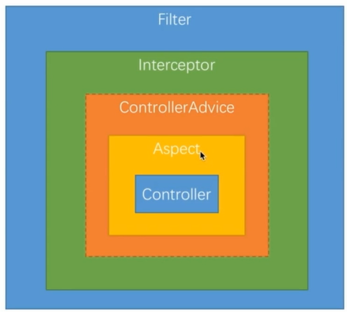

# SpringBoot三种拦截机制

## 前言

博客书

版本说明

```properties
platform-bom=Cairo-SR7
```

相关链接

* spring-boot-start-aop maven ：https://mvnrepository.com/artifact/org.springframework.boot/spring-boot-starter-aop
* execution 表达式参考：https://docs.spring.io/spring/docs/5.2.1.RELEASE/spring-framework-reference/core.html#aop-pointcuts-examples

## 三种拦截机制顺序

`FIlter ——> Intercepto(preHandle) ——> Aspect ——> Intercepto(postHandle) ——> Intercepto(afterCompletion)`



## 三种拦截机制特点

* Filter ： 能够拿到原始的 http 请求和响应的信息，但是拿不到真正处理请求方法的信息
* Interceptor ： 能够拿到原始的 http 请求和响应、真正处理请求方法的信息，但是拿不到真实请求的数据
* Aspect ： 能够拿到真实请求的数据，拿不到原始的 http 请求和响应

## 实战演练

### Filter

#### 一、自定义 Filter

> 自定义 Filter 加入到 SpringBoot 过滤器链

##### Filter 类

```java
package top.simba1949.filter;

import org.springframework.core.annotation.Order;

import javax.servlet.*;
import javax.servlet.annotation.WebFilter;
import java.io.IOException;

/**
 * @Order(2) 配置多个过滤器的执行顺序，数值越小的过滤器优先执行
 * @WebFilter(urlPatterns = "/filter/*", filterName = "appFilter") 配置拦截 url
 * urlPatterns 配置规则只能使用一个 * ，否则会失效
 *
 * @Author Theodore
 * @Date 2019/12/2 21:45
 */
@Order(1)
@WebFilter(urlPatterns = "/*", filterName = "filter")
public class MyFilter implements Filter {
    /**
     * 初始化
     * @param filterConfig
     * @throws ServletException
     */
    @Override
    public void init(FilterConfig filterConfig) throws ServletException {
        System.err.println("init filter");
    }

    /**
     * 过滤逻辑
     * @param request
     * @param response
     * @param chain
     * @throws IOException
     * @throws ServletException
     */
    @Override
    public void doFilter(ServletRequest request, ServletResponse response, FilterChain chain) throws IOException, ServletException {
        System.err.println("doFilter filter");
        chain.doFilter(request, response);
    }

    /**
     * 销毁
     */
    @Override
    public void destroy() {
        System.err.println("destroy filter");
    }
}
```

##### 扫描 filter，添加到 SpringBoot 过滤器链中

```java
package top.simba1949;

import org.springframework.boot.SpringApplication;
import org.springframework.boot.autoconfigure.SpringBootApplication;
import org.springframework.boot.web.servlet.ServletComponentScan;

/**
 * @ServletComponentScan 可以扫描 servlet、 filter、 listener 三大组件
 *
 * @Author Theodore
 * @Date 2019/11/20 11:30
 */
@SpringBootApplication
@ServletComponentScan(basePackages = "top.simba1949.filter")
public class Application {
    public static void main(String[] args) {
        SpringApplication.run(Application.class, args);
    }
}
```

#### 二、第三方 Filter

> 第三方 Filter 加入到 SpingBoot 过滤器链

##### 假设第三方过滤器 ThirdFilter

```java
package top.simba1949.filter;

import javax.servlet.*;
import java.io.IOException;

/**
 * @Author Theodore
 * @Date 2019/12/2 21:59
 */
public class ThirdFilter implements Filter {

    @Override
    public void init(FilterConfig filterConfig) throws ServletException {
        System.err.println("init ThirdFilter");
    }

    @Override
    public void doFilter(ServletRequest request, ServletResponse response, FilterChain chain) throws IOException, ServletException {
        System.err.println("doFilter ThirdFilter");
        chain.doFilter(request, response);
    }

    @Override
    public void destroy() {
        System.err.println("destroy ThirdFilter");
    }
}
```

##### 添加地方过滤器配置项

```java
package top.simba1949.configure;

import org.springframework.boot.web.servlet.FilterRegistrationBean;
import org.springframework.context.annotation.Bean;
import org.springframework.context.annotation.Configuration;
import top.simba1949.filter.ThirdFilter;

import java.util.ArrayList;
import java.util.List;

/**
 * @Author Theodore
 * @Date 2019/12/2 22:02
 */
@Configuration
public class FilterConfig {

    @Bean
    public FilterRegistrationBean thirdFilter(){
        // 第三方过滤器
        ThirdFilter thirdFilter = new ThirdFilter();

        // 添加过滤url
        List<String> urls = new ArrayList<>();
        urls.add("/*");

        // springboot 过滤器链
        FilterRegistrationBean filterRegistrationBean = new FilterRegistrationBean();
        filterRegistrationBean.setFilter(thirdFilter);
        filterRegistrationBean.setUrlPatterns(urls);

        return filterRegistrationBean;
    }
}
```

### Interceptor 

#### Interceptor 类

```java
package top.simba1949.interceptor;

import org.springframework.web.servlet.HandlerInterceptor;
import org.springframework.web.servlet.ModelAndView;

import javax.servlet.http.HttpServletRequest;
import javax.servlet.http.HttpServletResponse;

/**
 * 自定义拦截器需要实现 HandlerInterceptor 接口，根据业务重写下面方法
 *
 * @Author Theodore
 * @Date 2019/12/2 22:11
 */
public class MyInterceptor implements HandlerInterceptor {
    /**
     * 在业务处理器处理请求之前被调用。预处理，可以进行编码、安全控制、权限校验等处理；
     * @param request
     * @param response
     * @param handler
     * @return
     * @throws Exception
     */
    @Override
    public boolean preHandle(HttpServletRequest request, HttpServletResponse response, Object handler) throws Exception {
        System.err.println("preHandle");
        return true;
    }

    /**
     * 在业务处理器处理请求执行完成后，生成视图之前执行。
     * 后处理（调用了Service并返回ModelAndView，但未进行页面渲染），有机会修改ModelAndView
     * @param request
     * @param response
     * @param handler
     * @param modelAndView
     * @throws Exception
     */
    @Override
    public void postHandle(HttpServletRequest request, HttpServletResponse response, Object handler, ModelAndView modelAndView) throws Exception {
        System.err.println("postHandle");
    }

    /**
     * 在 DispatcherServlet 完全处理完请求后被调用，可用于清理资源等。返回处理（已经渲染了页面）；
     * @param request
     * @param response
     * @param handler
     * @param ex
     * @throws Exception
     */
    @Override
    public void afterCompletion(HttpServletRequest request, HttpServletResponse response, Object handler, Exception ex) throws Exception {
        System.err.println("afterCompletion");
    }
}
```

#### 注册 Interceptor

```java
package top.simba1949.configure;

import org.springframework.context.annotation.Configuration;
import org.springframework.web.servlet.config.annotation.InterceptorRegistry;
import org.springframework.web.servlet.config.annotation.WebMvcConfigurer;
import top.simba1949.interceptor.MyInterceptor;

/**
 * @Author Theodore
 * @Date 2019/12/2 22:16
 */
@Configuration
public class InterceptorConfig implements WebMvcConfigurer {

    @Override
    public void addInterceptors(InterceptorRegistry registry) {
        // 注册拦截器，配置拦截器需要拦截的 url
        registry.addInterceptor(new MyInterceptor()).addPathPatterns("/**");
    }
}
```

### Aspect

#### SpringAop

切片（类）

* 切入点（注解）
  1. 在哪些方法上起作用
  2. 在什么时候起作用
* 增强（方法）：起作用时执行的业务逻辑

```java
package top.simba1949.aspect;

import org.aspectj.lang.ProceedingJoinPoint;
import org.aspectj.lang.annotation.Around;
import org.aspectj.lang.annotation.Aspect;
import org.springframework.stereotype.Component;

/**
 * @Author Theodore
 * @Date 2019/12/2 22:25
 */
@Aspect
@Component
public class MyAspect {
    /**
     * 第一* 表示返回值，第二个*表示包，第三个*表示方法，.. 表示参数
     * execution(* *.*(..))
     * 表达式参考：https://docs.spring.io/spring/docs/5.2.1.RELEASE/spring-framework-reference/core.html#aop-pointcuts-examples
     */
    @Around("execution(* top.simba1949.controller.PersonController.*(..))")
    public Object handleControllerMethod(ProceedingJoinPoint proceedingJoinPoint) throws Throwable {
        System.err.println("proceedingJoinPoint before");

        // 调用被拦截的方法
        Object result = proceedingJoinPoint.proceed();

        System.err.println("proceedingJoinPoint after");

        return result;
    }
}
```

