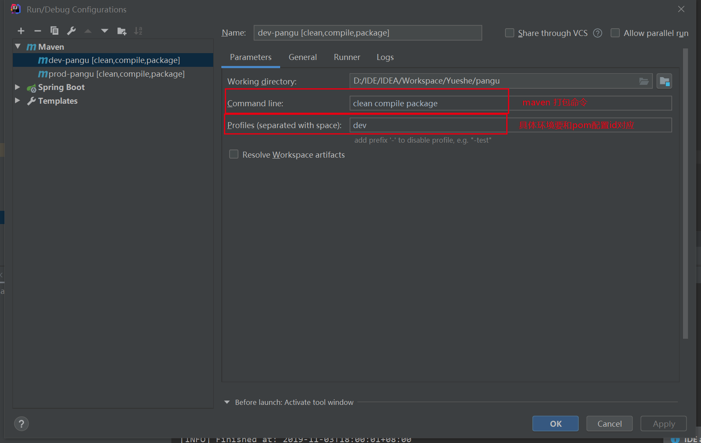
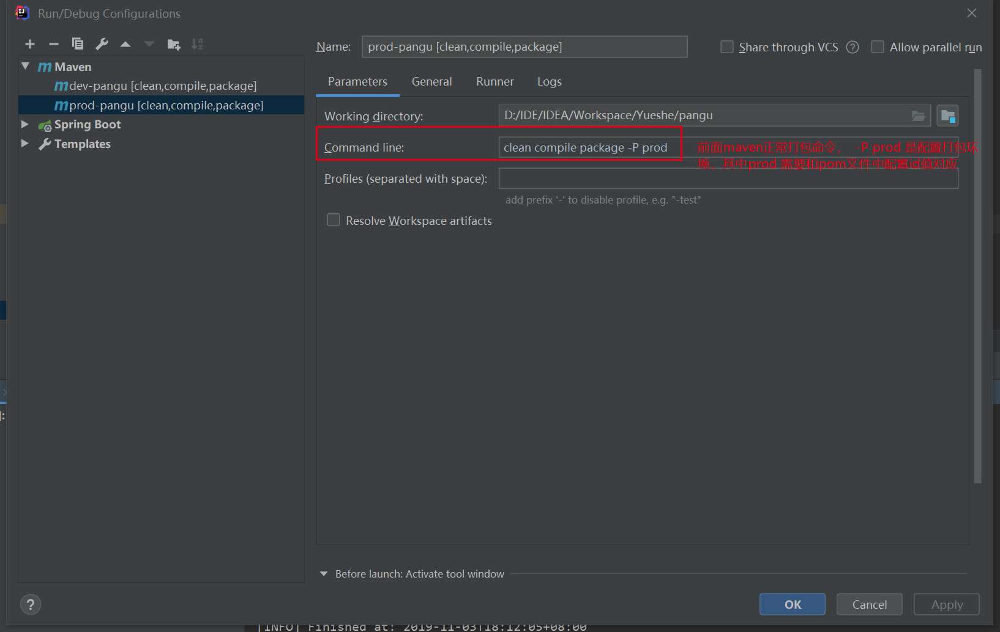

# Springboot 项使用 profile 完成不同环境的 maven 打包

## 前言

版本说明

```properties
springboot=2.2.0.RELEASE
maven=3.6.1
```

## 配置

### pom.xml （关键配置）

```xml
<!--IDEA是不会编译src的java目录的文件，如果需要读取，则需要手动指定哪些配置文件需要读取-->
<resources>
    <resource>
        <directory>src/main/java</directory>
        <includes>
            <include>**/*.xml</include>
        </includes>
    </resource>
    <resource>
        <directory>src/main/resources</directory>
        <includes>
            <include>**/*</include>
        </includes>
        <!--开启filtering功能，不开启无法完成多环境打包-->
        <filtering>true</filtering>
    </resource>
</resources>
</build>
<profiles>
    <profile>
        <!--id唯一-->
        <id>dev</id>
        <properties>
            <!-- 环境标识，需要与配置文件的名称相对应 -->
            <activatedProperties>dev</activatedProperties>
        </properties>
        <activation>
            <!-- 默认环境 -->
            <activeByDefault>true</activeByDefault>
        </activation>
    </profile>
    <profile>
        <id>test</id>
        <properties>
            <activatedProperties>test</activatedProperties>
        </properties>
    </profile>
    <profile>
        <id>prod</id>
        <properties>
            <activatedProperties>prod</activatedProperties>
        </properties>
    </profile>
</profiles>
```

### springboot 配置文件

需要在 springboot 项目中配合多环境文件

* application.yml
* application-dev.yml
* application-test.yml
* application-prod.yml

其中 application.yml 配置信息如下，其他配合信息只需要配置关于项目中需要的配置即可

```yaml
spring:
  profiles:
    active: @activatedProperties@
```

### maven 运行

运行 maven 打包命令

```
# clean compile package -P 'pom中环境对应的id值'
clean compile package -P prod
```

#### 第一种方式



#### 第二种方式

